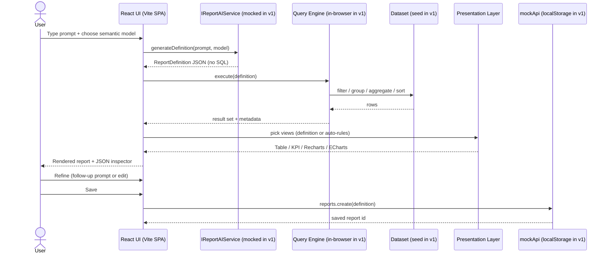
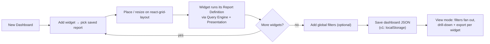
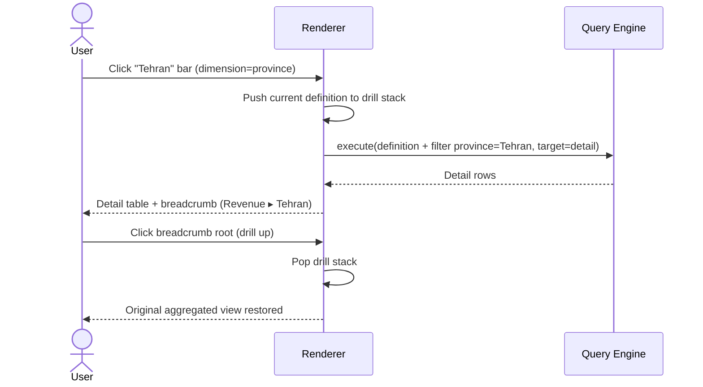
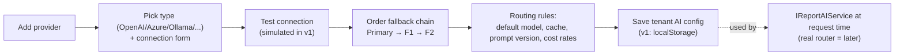
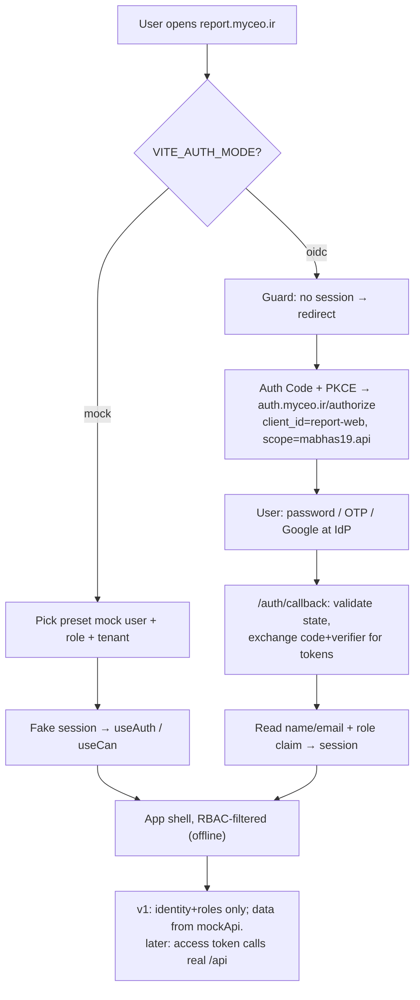
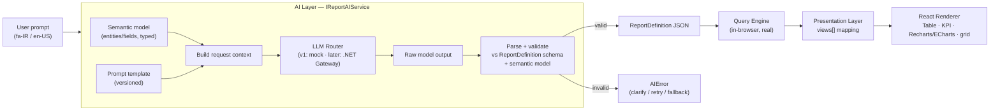
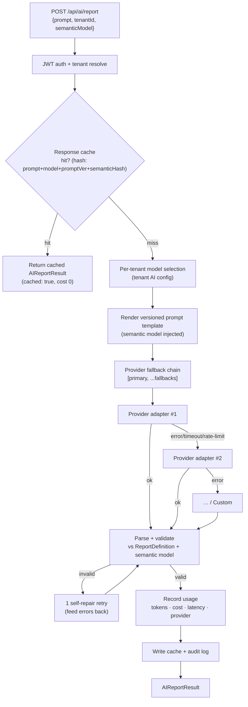

# AI-Powered Reporting & Analytics Platform - Design (v1)

> **Status:** Draft for review  •  **Date:** 2026-06-22  •  **Service:** report.myceo.ir  •  **Location:** `report-web/` (monorepo)

## 0. Overview, v1 scope & key decisions

**What this is.** An AI-native, multi-tenant reporting & analytics platform. The user asks in natural language; the AI returns a structured **Report Definition JSON**; a query engine runs it; the UI renders tables, charts, KPIs, and dashboards. The AI never writes SQL. It replaces tools like Stimulsoft / Telerik Reporting / FastReport and is domain-agnostic.

**The spine (pipeline).**

```
Prompt -> AI Layer (mock, swappable) -> Report Definition JSON
       -> Query Engine -> Presentation Layer -> React Renderer
```

**v1 = frontend prototype (this build).**
- React + Vite (NOT Next.js), in folder `report-web/`, served at report.myceo.ir.
- Mock data. A REAL in-browser query engine computes over bundled sample datasets; the AI brain is mocked behind `IReportAIService`.
- Reuses the GLOBAL OIDC auth (new public client `report-web`, PKCE) with a dev mock-user toggle.
- All main user + admin screens are built.
- Backend (AI Gateway, Query Engine, Semantic Layer service, real persistence, multi-tenant, full RBAC) is DESIGNED here but built in later phases.

**Key decisions (agreed).**

| Topic | Decision |
|---|---|
| Location | `report-web/` folder in this monorepo |
| Language | Persian (RTL) default + English (i18n) |
| State | Zustand + TanStack Query |
| Screens | all main screens |
| Mock realism | real in-browser query engine + mock AI (approach B) |
| Auth | reuse global OIDC (`report-web` client) + dev mock toggle |
| Framework | React 19 + Vite (no Next.js) |

**Ant Design rule.** Ant Design only for admin/system UI + tables/cards/forms + report library. Charts = Recharts/ECharts; dashboard layout = react-grid-layout.

## Table of contents

1. [Product Vision](#1-vision)
2. [Information Architecture](#2-ia)
3. [UI Screens (Admin + User + Dashboard)](#3-screens)
4. [User Flows](#4-flows)
5. [Report Definition JSON Spec](#5-reportdef)
6. [Semantic Layer Design](#6-semantic)
7. [AI Architecture (multi-provider)](#7-ai)
8. [Frontend Architecture (React + Vite + Antd + Charts)](#8-frontend)
9. [Backend Architecture (.NET) - later phases](#9-backend)
10. [RBAC Matrix](#10-rbac)
11. [Multi-tenant model](#11-tenant)
12. [Deployment Architecture](#12-deploy)
13. [Roadmap (v1, v2, v3)](#13-roadmap)


---

<a id="1-vision"></a>
## 1. Product Vision

### 1.1 Overview

The **AI-Powered Reporting & Analytics Platform** (codename: the *report app*, hosted at `report.myceo.ir`) is an AI-native, multi-tenant business-intelligence and reporting product. A user describes what they want to see in plain language — *"درآمد ماهانه به تفکیک استان را نشان بده"* ("Show monthly revenue by province") — and the platform returns a real, correct, interactive report: tables, KPI cards, charts, and dashboards.

The defining architectural commitment is that **the AI never writes SQL and never touches the raw database**. Every natural-language request is compiled into a structured, validated **Report Definition JSON** against a typed **Semantic Layer**. A deterministic Query Engine executes that definition; a Presentation Layer maps results to React components. AI is the *author of intent*, not the *executor of queries*.

```
Natural-language prompt
        │
        ▼
   AI Layer  ──►  Report Definition (JSON)  ──►  Query Engine  ──►  Presentation Layer  ──►  React Renderer
 (semantic model,                (validated,           (filter/group/             (views[] →            (Table / KPI /
  no raw schema)                  versionable)          aggregate/sort,            component mapping)    Charts / Dashboard)
                                                        calc fields, drill)
```

> **v1 vs later.** v1 ships this entire pipeline as a **high-fidelity frontend prototype with mock data**: a *real* in-browser Query Engine runs over bundled sample datasets (Approach "B"), and the AI brain is *mocked* behind a clean, swappable `IReportAIService` interface. No new backend is built in v1. The vision below describes the full product; each subsequent design section marks what is built now vs. designed for later.

---

### 1.2 The pain with legacy reporting tools

The incumbent stack in this market — **Stimulsoft, Telerik Reporting, FastReport** — was built for a pre-AI, pre-self-service era. They are *banded report designers*: pixel-perfect, print-first, developer-and-designer-bound. Their structural problems are the reason this product exists.

| Pain point | Stimulsoft / Telerik / FastReport reality | What it costs the customer |
|---|---|---|
| **Developer/designer bottleneck** | Every report is hand-built in a desktop WYSIWYG band designer; business users file tickets and wait | Reporting backlog; analysts can't self-serve; weeks of lead time per report |
| **Raw SQL / dataset coupling** | Reports bind directly to SQL queries, stored procs, or raw datasets | Schema changes silently break reports; no shared definition of a "metric"; logic duplicated across hundreds of reports |
| **No AI, no natural language** | Zero conversational authoring; the "intelligence" is the human designer | Cannot meet 2026 buyer expectations set by Notion AI / Copilot |
| **Print-era output model** | Optimized for paginated PDF/RDL bands; interactivity (drill-down, cross-filter, live dashboards) is bolted on or absent | Static reports in a world that expects interactive, explorable analytics |
| **Per-developer / per-core licensing** | Commercial, seat- or deployment-priced, often .NET-bound | High recurring cost; vendor lock-in; awkward in modern web/multi-tenant SaaS |
| **Weak multi-tenancy & governance** | Designed for a single app's reports, not a tenant-isolated SaaS with per-tenant data sources, branding, quotas, and audit | Hard to operate as a hosted product; no first-class cost/usage/audit story |
| **No semantic governance** | No typed semantic model; "revenue" means whatever each report's SQL says | Inconsistent numbers across reports; no single source of truth for measures/dimensions |

The summary: legacy tools make a **human** translate a business question into a **query and a layout**, one report at a time, with the metric logic scattered across SQL. We make the **AI** translate the business question into a **governed, structured definition** against a **shared semantic model** — instantly, for anyone, in any domain.

---

### 1.3 The AI-native differentiator

This is not "a report tool with a chatbot bolted on." The AI is wired into a disciplined, auditable pipeline that makes its output **safe, correct, and governable**.

**1. Structured JSON analytics layer (not free text, not raw SQL).**
The AI's only job is: prompt → **Report Definition JSON**. That JSON is the single source of truth for columns, filters, sorting, grouping, aggregations, calculated fields, drill-down, multi-output rendering, and a presentation block. Because the contract is structured, every downstream stage (query, render, export to PDF/Excel/CSV/JSON) is deterministic and reproducible.

**2. No raw AI SQL — the mandatory Semantic Layer.**
The AI **never sees or writes against the physical database schema**. It operates only on a semantic model of typed entities and fields (`string` / `number` / `dimension` / `measure` / `date`). This means:
- The AI cannot hallucinate table/column names or emit a destructive/malformed query — it can only reference fields that exist in the model.
- "Revenue" is defined once, as a governed measure, and every report agrees.
- The same prompt is portable across **any domain** (ERP, CRM, accounting, construction, finance, logistics, government) — you swap the semantic model, not the product.
- Security and row/field-level access are enforced at the semantic boundary, not left to whatever SQL the AI happened to write.

**3. Deterministic execution + auto-visualization.**
A real Query Engine executes the definition; presentation is chosen by explicit rules, not vibes:

| Data shape | Chosen view |
|---|---|
| Time series | Line chart |
| Categorical comparison | Bar chart |
| Distribution / share-of-whole | Pie chart |
| Single headline number(s) | KPI card(s) |
| Large flat result set | Table |
| Complex / multi-series analytics | ECharts (advanced) |

**4. Swappable, multi-provider AI orchestration (designed-for-later).**
The AI layer is an interface, not a vendor. The full design supports OpenAI, Azure OpenAI, Ollama, DeepSeek, GLM, Claude, Gemini, OpenRouter, and custom providers, with per-tenant model selection, fallback routing, cost & token tracking, prompt versioning, and response caching.

> **v1 vs later.** In v1 the `IReportAIService` is **mocked** (example-prompt matching + simple rules) so the prototype runs fully offline and deterministically. The *contract* (prompt → Report Definition) and the multi-provider router are designed now and implemented against real providers later — swapping the mock for a real backend should not change a single consumer of the interface.

---

### 1.4 Target users and domains

The product is **domain-agnostic by construction** (the semantic layer is the only domain-specific artifact), and it serves the full spectrum from non-technical asker to platform operator.

**User personas → RBAC roles** (designed in full; v1 demonstrates the screens for each):

| Persona | Role | What they do |
|---|---|---|
| Platform operator | **Super Admin** | Operate the whole platform across all tenants |
| Customer org admin | **Tenant Admin** | Manage their tenant: users, branding, data sources, quotas |
| AI/cost owner | **AI Manager** | Configure AI providers, models, prompts; watch cost & usage |
| Analyst / report author | **Report Designer** | Author and refine Report Definitions (NL + manual editing) |
| Dashboard builder | **Dashboard Designer** | Assemble drag-and-drop dashboards from report widgets |
| Heavy business user | **Power User** | Ask questions, drill down, export, build personal views |
| Consumer | **Viewer** | Read dashboards/reports, execute and export within permission |

**Target domains** (each is just a different semantic model over the same engine): **ERP, CRM, accounting, construction, finance, logistics, government**. The headline win is a non-technical user in any of these domains getting a correct, interactive report from a sentence — with no SQL, no ticket, and no analyst in the loop.

> The default UI language is **Persian (RTL)**, with English (LTR) as a first-class secondary — a deliberate fit for the Iranian enterprise/government market the legacy tools serve poorly.

---

### 1.5 Core value propositions

1. **Ask, don't build.** A sentence becomes a working, interactive report in seconds — no SQL, no band designer, no ticket queue.
2. **Trustworthy by design.** Governed structured JSON + a mandatory semantic layer mean numbers are consistent, queries are safe, and no AI ever writes raw SQL.
3. **One platform, every domain.** Swap the semantic model, not the product — the same engine serves ERP, finance, logistics, government, and more.
4. **Self-service that doesn't sacrifice governance.** Viewers and power users explore freely, while RBAC, multi-tenancy, quotas, and audit keep the organization in control.
5. **AI you own, not AI you rent blindly.** Multi-provider orchestration with per-tenant model choice, fallback, caching, and full cost/token tracking — including on-prem/Ollama for data-sensitive tenants.
6. **JSON as the single source of truth.** The Report Definition drives the screen *and* every export (PDF, Excel, CSV, JSON) — define once, render and export consistently everywhere.
7. **A clean migration off legacy licensing.** A modern, web-native, multi-tenant replacement for Stimulsoft / Telerik / FastReport, free of per-developer/per-core licensing and desktop-designer lock-in.

---

### 1.6 Positioning vs. Power BI / Metabase / Retool / Notion AI

We sit at the intersection these four only partially cover: **AI-native authoring + governed semantic layer + embeddable multi-tenant SaaS, with first-class Persian/RTL**.

| Product | Their strength | Their gap (our wedge) |
|---|---|---|
| **Power BI** | Mature visuals, deep modeling, enterprise scale | Heavy desktop authoring, steep learning curve, AI ("Copilot/Q&A") is an add-on not the core; weak as an *embedded, multi-tenant, AI-first* SaaS; poor RTL/Persian fit | 
| **Metabase** | Easy self-service, open-source, good "ask a question" UX | Question-builder/SQL still center stage; no governed prompt→JSON→semantic pipeline; limited AI authoring; basic dashboarding | 
| **Retool** | Fast internal-tool/app building, flexible | An *app builder*, not an analytics product — you assemble queries and components by hand; not AI-native reporting; no semantic-measure governance | 
| **Notion AI** | Best-in-class conversational/document AI feel | Not a real BI/query engine — no semantic layer, no aggregation/drill-down over real datasets, no multi-tenant data-source governance or export engine | 

**Our distinct position:** *the conversational ease of Notion AI, executed through a real BI query engine like Power BI/Metabase, governed by a mandatory semantic layer none of them mandate, delivered as an embeddable multi-tenant SaaS with multi-provider AI and native Persian/RTL.* We are AI-native at the **core** (the AI authors the governed definition), not AI-as-a-feature; and we are domain-agnostic via the semantic model rather than tied to one vendor's data world.

---

### 1.7 North-star statement & high-level goals

> **North-star:** *Anyone, in any business domain, gets a correct, interactive, exportable report from a single sentence — with the AI authoring governed structure, never raw SQL.*

**High-level goals**

| # | Goal | Success looks like | v1 vs later |
|---|---|---|---|
| G1 | **NL → governed report** | A plain-language prompt reliably produces a valid Report Definition and a correct rendered result | **v1**: mocked AI + real in-browser engine over sample data; **later**: real multi-provider AI + backend execution |
| G2 | **No raw AI SQL, ever** | 100% of AI operations go through the typed semantic layer; AI cannot reference non-modeled fields | **v1**: semantic model + validation enforced in the prototype; **later**: enforced server-side too |
| G3 | **Domain-agnostic** | New domain = new semantic model, zero engine changes | **v1**: ≥1 sample semantic model + datasets; **later**: tenant-managed models & data sources |
| G4 | **Real interactive analytics** | Filter/group/aggregate/sort/calculated-fields/drill-down all work, with auto-visualization | **v1**: fully working in-browser (Approach B); **later**: same contract, server-side at scale |
| G5 | **Compose into dashboards** | Drag-and-drop dashboards where each widget binds to a Report Definition | **v1**: built with react-grid-layout over mock data; **later**: persisted, shared, permissioned |
| G6 | **Governed multi-tenant SaaS** | RBAC (7 roles), tenant isolation, branding, quotas | **v1**: all admin + user screens built against mockApi; **later**: real backend isolation & quota enforcement |
| G7 | **Multi-provider, cost-aware AI** | Per-tenant model selection, fallback, caching, cost/token tracking | **v1**: `IReportAIService` interface + mock; **later**: real orchestration & cost dashboards |
| G8 | **JSON-driven export** | PDF / Excel / CSV / JSON all derived from the same Report Definition | **v1**: CSV and JSON are **fully real** (generated client-side from the Report Definition result); **PDF and Excel are deferred to v2** (shown in the export menu but disabled with a "v2" tag); **v2/later**: server export engine adds real PDF + Excel |
| G9 | **Swap-ready architecture** | Replacing mock with real backend changes only the fetcher, not consumers | **v1**: mockApi behind TanStack Query hooks with future-real signatures; **later**: real API behind identical hooks |
| G10 | **Persian/RTL-first, reuse global auth** | RTL-correct UI; sign-in via the existing OIDC IdP | **v1**: react-i18next fa/en + AntD RTL `ConfigProvider`; `report-web` PKCE client against `auth.myceo.ir` + dev mock-user toggle; **later**: full RBAC mapping & tenant claims |

> **Engineering guardrails carried from the agreed stack.** React 19 + TypeScript + Vite (never Next.js) with React Router v7; Ant Design **only** for admin/system UI, tables, cards, forms, and the report library; **charts = Recharts/ECharts and dashboard layout = react-grid-layout — Ant Design is never used for chart rendering or dashboard layout**; state via Zustand + TanStack Query; i18n via react-i18next (fa-IR default/RTL, en-US LTR).

---

<a id="2-ia"></a>
## 2. Information Architecture

### 2.1 Overview

This section defines the **Information Architecture (IA)** of the new AI-Powered Reporting & Analytics Platform that lives at `report.myceo.ir`, in the monorepo folder `report-web/`. It covers the full route tree (React Router v7), the navigation model, the top-level entities and their relationships, and a complete `path -> screen -> required role` table.

The app is **multi-tenant** and **RBAC-driven**. The IA is the same in v1 and later — what changes is the *data source* behind each screen, not the screen graph itself.

> **v1 vs later (global note).** In **v1** every route below is **built as a real screen** in the frontend prototype. Data is served by the `mockApi` layer (localStorage + seed data) behind TanStack Query, and the in-browser Query Engine computes real tables/charts/KPIs. RBAC is enforced **client-side** (route guards + a mock-user role switcher). In **later phases** the exact same route tree is kept; the `mockApi` fetchers are swapped for the real backend, and route guards are backed by real OIDC claims from `auth.myceo.ir` (no route renames, no re-layout).

---

### 2.2 Three IA zones

The sitemap is split into three top-level zones, each with its own layout shell:

| Zone | Path prefix | Layout shell | Audience | Auth |
|---|---|---|---|---|
| **Public / Auth** | `/login`, `/auth/*` | minimal, centered, no chrome | unauthenticated | none |
| **User Area (Workspace)** | `/` (app root after login) | sidebar + topbar (tenant-scoped) | every authenticated tenant user | OIDC session + tenant |
| **Admin Area** | `/admin/*` | admin sidebar + topbar | Tenant Admin / AI Manager / Super Admin | role-gated |

The **User Area** is the day-to-day product (ask AI, build reports, build dashboards, browse the library). The **Admin Area** is governance/configuration (data sources, semantic models, AI providers, users, tenants, audit). They are separated because they answer different questions ("what can I see?" vs "what can the org do?") and map cleanly onto distinct role sets.

---

### 2.3 Full sitemap / route tree (React Router v7)

Routes use React Router v7 **nested routes + layout routes**. `RootLayout` holds the global providers (ConfigProvider RTL/LTR, i18n, TanStack Query, Zustand, theme). Guard wrappers (`<RequireAuth>`, `<RequireTenant>`, `<RequireRole>`) are layout routes that render `<Outlet />` when allowed and redirect otherwise.

```text
/  (RootLayout — providers, i18n, RTL/LTR, theme)
│
├── /login                         → LoginScreen            [public]  (redirect to auth.myceo.ir OIDC; dev mock-user toggle)
├── /auth/callback                 → OidcCallback           [public]  (PKCE code exchange → session)
├── /auth/logout                   → LogoutScreen           [public]
│
├── <RequireAuth> + <RequireTenant>   (AppLayout — sidebar + topbar, tenant switcher)
│   │
│   ├── /                          → HomeRedirect           → /ask    (default landing)
│   │
│   ├── ── Ask AI ──────────────────────────────────────────────────────────────
│   ├── /ask                       → AskAIScreen            [Viewer+]  NL prompt → ReportDefinition (live preview)
│   ├── /ask/:threadId             → AskAIThread            [Viewer+]  saved AI conversation / report draft
│   │
│   ├── ── Reports ─────────────────────────────────────────────────────────────
│   ├── /reports                   → ReportLibrary          [Viewer+]  antd Table/Card grid of saved reports
│   ├── /reports/new               → ReportDesigner (new)   [Report Designer+]
│   ├── /reports/:reportId         → ReportViewer           [Viewer+]  run + render views[]; export
│   ├── /reports/:reportId/edit    → ReportDesigner (edit)  [Report Designer+]
│   ├── /reports/:reportId/run     → ReportRunResult        [Execute Reports]  (deep-linkable run w/ params)
│   ├── /reports/:reportId/history → ReportRunHistory       [Viewer+]
│   │
│   ├── ── Dashboards ──────────────────────────────────────────────────────────
│   ├── /dashboards                → DashboardLibrary       [Viewer+]
│   ├── /dashboards/new            → DashboardBuilder (new) [Dashboard Designer+]
│   ├── /dashboards/:dashId        → DashboardViewer        [Viewer+]  react-grid-layout render (read mode)
│   ├── /dashboards/:dashId/edit   → DashboardBuilder       [Dashboard Designer+]  drag-drop, widget binding
│   │
│   ├── ── Data (read-only explore) ────────────────────────────────────────────
│   ├── /data                      → DataCatalog            [Power User+]  browse semantic entities/fields
│   ├── /data/:modelId             → SemanticModelExplorer  [Power User+]  fields, types, sample preview
│   │
│   ├── ── Exports ─────────────────────────────────────────────────────────────
│   ├── /exports                   → ExportCenter           [Export Data]  PDF/Excel/CSV/JSON job list + download
│   │
│   ├── ── Personal ────────────────────────────────────────────────────────────
│   ├── /profile                   → UserProfile            [Viewer+]
│   ├── /settings                  → UserPreferences        [Viewer+]  theme, language (fa/en), defaults
│   └── /favorites                 → Favorites              [Viewer+]  pinned reports/dashboards
│
├── <RequireAuth> + <RequireRole(admin-set)>   (AdminLayout — admin sidebar + topbar)
│   │
│   ├── /admin                     → AdminOverview          [Tenant Admin+]  tenant health, quota, AI cost summary
│   │
│   ├── ── Access ──────────────────────────────────────────────────────────────
│   ├── /admin/users               → UserList               [Manage Users]
│   ├── /admin/users/:userId       → UserDetail             [Manage Users]  assign roles, status
│   ├── /admin/roles               → RoleMatrix             [Tenant Admin+]  role → permission matrix (read/edit)
│   │
│   ├── ── Data & Semantics ────────────────────────────────────────────────────
│   ├── /admin/data-sources        → DataSourceList         [Manage Data Sources]
│   ├── /admin/data-sources/new    → DataSourceWizard       [Manage Data Sources]
│   ├── /admin/data-sources/:id    → DataSourceDetail       [Manage Data Sources]  connection, test, status
│   ├── /admin/semantic-models     → SemanticModelList      [Manage Data Sources]
│   ├── /admin/semantic-models/new → SemanticModelEditor    [Manage Data Sources]
│   ├── /admin/semantic-models/:id → SemanticModelEditor    [Manage Data Sources]  entities/fields, type tagging
│   │
│   ├── ── AI ──────────────────────────────────────────────────────────────────
│   ├── /admin/ai/providers        → AIProviderList         [Manage AI Providers]  OpenAI/Azure/Ollama/Claude/…
│   ├── /admin/ai/providers/:id    → AIProviderDetail       [Manage AI Providers]  keys, model, test
│   ├── /admin/ai/routing          → AIRoutingRules         [Manage AI Providers]  per-tenant model + fallback chain
│   ├── /admin/ai/prompts          → PromptVersions         [AI Manager+]          prompt templates + versioning
│   ├── /admin/ai/usage            → AIUsageCost            [AI Manager+]          token usage + cost per tenant
│   │
│   ├── ── Tenant ──────────────────────────────────────────────────────────────
│   ├── /admin/tenant              → TenantSettings         [Tenant Admin+]  branding, defaults, locale
│   ├── /admin/tenant/quota        → QuotaManagement        [Tenant Admin+]  limits per tenant
│   │
│   ├── ── Governance ──────────────────────────────────────────────────────────
│   ├── /admin/audit               → AuditLog               [View Audit Logs]  AI requests, runs, exports, activity
│   ├── /admin/audit/:eventId      → AuditEventDetail       [View Audit Logs]
│   │
│   └── ── Super Admin only ─────────────────────────────────────────────────────
│       ├── /admin/tenants         → TenantList             [Super Admin]   cross-tenant
│       ├── /admin/tenants/new     → TenantCreate           [Super Admin]
│       └── /admin/tenants/:id     → TenantDetail           [Super Admin]   provision, suspend, isolate
│
├── /403                           → ForbiddenScreen        [public]  (role guard fallthrough)
└── *                              → NotFoundScreen         [public]
```

**Notes on routing mechanics**

- **i18n & RTL are not in the path.** Unlike the existing Next.js web app (which uses `/[locale]`), this Vite app keeps locale **out of the URL**: it is a runtime setting (react-i18next) wired into `ConfigProvider direction={'rtl'|'ltr'}`. Default is **fa-IR (RTL)**; en-US (LTR) is a toggle. This avoids duplicating every route under a locale segment.
- **Tenant is not in the path** either — it comes from the OIDC session / mock-user. `<RequireTenant>` ensures a tenant context exists; the topbar **tenant switcher** (Super Admin / multi-tenant users) updates the active tenant in Zustand, and TanStack Query keys are tenant-scoped so the cache invalidates on switch.
- Editor routes (`/reports/:id/edit`, `/dashboards/:id/edit`) are **separate routes** from viewers so the URL is the source of truth for "edit vs view" and the back button behaves correctly. The Report Designer and Dashboard Builder are heavy, lazy-loaded route chunks.

---

### 2.4 Navigation model

Two distinct sidebars, one per zone. Both are collapsible, RTL-aware (icons + label flip side in fa), and driven by the **permission set of the current role** — items the user cannot access are hidden, not just disabled.

#### User Area sidebar (grouped)

| Group | Items (route) | Visible to |
|---|---|---|
| **(primary)** | Ask AI (`/ask`) | Viewer+ |
| **Content** | Reports (`/reports`), Dashboards (`/dashboards`), Favorites (`/favorites`) | Viewer+ |
| **Data** | Data Catalog (`/data`) | Power User+ |
| **Output** | Exports (`/exports`) | Export Data |
| **(footer)** | Profile (`/profile`), Settings (`/settings`), **Admin →** (`/admin`, only if any admin role) | self / admin |

Top bar (User Area): tenant switcher · global "Ask AI" command box · language toggle (fa/en) · theme toggle · notifications · user menu. The **command box** is the signature element — it is a persistent NL entry point that routes to `/ask` with the prompt prefilled.

#### Admin Area sidebar (grouped)

| Group | Items (route) | Visible to |
|---|---|---|
| **(primary)** | Overview (`/admin`) | Tenant Admin+ |
| **Access** | Users (`/admin/users`), Roles (`/admin/roles`) | Manage Users / Tenant Admin+ |
| **Data & Semantics** | Data Sources (`/admin/data-sources`), Semantic Models (`/admin/semantic-models`) | Manage Data Sources |
| **AI** | Providers (`/admin/ai/providers`), Routing (`/admin/ai/routing`), Prompts (`/admin/ai/prompts`), Usage & Cost (`/admin/ai/usage`) | Manage AI Providers / AI Manager+ |
| **Tenant** | Settings (`/admin/tenant`), Quota (`/admin/tenant/quota`) | Tenant Admin+ |
| **Governance** | Audit Log (`/admin/audit`) | View Audit Logs |
| **Platform** | Tenants (`/admin/tenants`) | **Super Admin only** |
| **(footer)** | ← Back to Workspace (`/`) | all |

> The Admin sidebar uses **Ant Design** components (Menu, Layout) — admin/system UI is explicitly the AntD zone. Note the **STRICT RULE** still holds everywhere: even on `/admin/ai/usage`, the cost charts render with **Recharts/ECharts**, never AntD.

---

### 2.5 Top-level entities & relationships

The whole product is built around a small set of entities. Everything a user does is "produce or consume a **ReportDefinition**, scoped to a **Tenant**, computed against a **SemanticModel**."

| Entity | What it is | Key fields (conceptual) |
|---|---|---|
| **Tenant** | Isolation boundary; owns all other data | `id, name, branding, locale, quota, status` |
| **User** | A person within a tenant | `id, tenantId, name, email, status` |
| **Role** | Named permission bundle assigned to a user | `name, permissions[]` |
| **DataSource** | A configured connection (later: real DB; v1: a bundled sample dataset) | `id, tenantId, type, status` |
| **SemanticModel** | **Mandatory** typed model over a DataSource: entities + fields (`string`/`number`/`dimension`/`measure`/`date`) | `id, dataSourceId, entities[], fields[]` |
| **ReportDefinition** | The portable JSON contract: columns, filters, sorting, grouping, aggregations, calculated fields, drill-down, + `presentation.views[]` | `id, tenantId, semanticModelId, query{}, presentation{}` |
| **Dashboard** | A grid of widgets, each bound to a ReportDefinition | `id, tenantId, layout[], widgets[]` |
| **AIProvider** | A configured model provider (OpenAI, Azure, Ollama, Claude, …) | `id, tenantId, type, model, status` |
| **AIRoutingRule** | Per-tenant model selection + fallback chain | `tenantId, primary, fallbacks[], caching` |
| **AuditEvent** | Immutable record of an action | `id, tenantId, actorId, type, cost?, tokens?, ts` |
| **ExportJob** | A render of a ReportDefinition to PDF/Excel/CSV/JSON | `id, reportId, format, status, url` |

**Relationship map**

```text
Tenant ─┬─< User ─< (assigned) Role ──< Permission
        │
        ├─< DataSource ─1:1─ SemanticModel ──< Entity ──< Field {type}
        │                          │
        │                          ▲ (every AI op & query binds here, never raw schema)
        │                          │
        ├─< ReportDefinition ──────┘
        │        │  └─< presentation.views[] {Table | KPI | Chart | Widget}
        │        ├─< ReportRun ──< ExportJob {pdf|excel|csv|json}
        │        └──< (bound by) Dashboard.widget ──> ReportDefinition
        │
        ├─< Dashboard ──< Widget ──(binds)──> ReportDefinition
        │
        ├─< AIProvider  ──< AIRoutingRule (primary + fallbacks)
        │        └── consumed by: Ask AI → ReportDefinition
        │
        └─< AuditEvent  (records: AI request, report run, export, login, config change)
```

**Cardinality cheatsheet**

- A **Tenant** has many of everything; **nothing is shared across tenants** (Super Admin operates above tenants).
- A **DataSource** has exactly **one SemanticModel** (the typed view that AI/query are allowed to touch).
- A **ReportDefinition** references **one SemanticModel** and contains its `presentation.views[]` inline.
- A **Dashboard** widget binds to **one ReportDefinition**; one ReportDefinition can power **many** widgets.
- **Ask AI** produces a ReportDefinition using the SemanticModel + the tenant's AIRoutingRule; it never sees raw DB schema and never emits SQL.

> **v1 vs later.** In v1 these entities exist as **TypeScript types + seed records in `mockApi`** (one or two seeded tenants, a seeded SemanticModel over the bundled sample datasets, a few seeded reports/dashboards, mock AIProviders). The relationships above are honored by the mock so the swap to a real backend is a fetcher change, not a model change. `DataSource` in v1 = a bundled in-browser dataset; later = a real connection.

---

### 2.6 Route table: path → screen → required role

Roles (least → most privileged): **Viewer < Power User < Report Designer / Dashboard Designer < AI Manager < Tenant Admin < Super Admin**. "Designer" roles are siblings (one for reports, one for dashboards). "**X+**" = role X or any higher/admin role. Permission names in brackets map to the RBAC permission list and are the *real* gate; roles are the typical holders.

**Public / Auth**

| Path | Screen | Required role / permission |
|---|---|---|
| `/login` | LoginScreen | Public |
| `/auth/callback` | OidcCallback | Public |
| `/auth/logout` | LogoutScreen | Public |
| `/403` | ForbiddenScreen | Public |
| `*` | NotFoundScreen | Public |

**User Area** (all require: authenticated + tenant context)

| Path | Screen | Required role / permission |
|---|---|---|
| `/` | HomeRedirect → `/ask` | Viewer+ |
| `/ask` | AskAIScreen | Viewer+ |
| `/ask/:threadId` | AskAIThread | Viewer+ |
| `/reports` | ReportLibrary | Viewer+ [Execute Reports to run] |
| `/reports/new` | ReportDesigner (new) | Report Designer+ [Create Reports] |
| `/reports/:reportId` | ReportViewer | Viewer+ |
| `/reports/:reportId/edit` | ReportDesigner (edit) | Report Designer+ [Edit Reports] |
| `/reports/:reportId/run` | ReportRunResult | [Execute Reports] |
| `/reports/:reportId/history` | ReportRunHistory | Viewer+ |
| `/dashboards` | DashboardLibrary | Viewer+ |
| `/dashboards/new` | DashboardBuilder (new) | Dashboard Designer+ [Create Reports] |
| `/dashboards/:dashId` | DashboardViewer | Viewer+ |
| `/dashboards/:dashId/edit` | DashboardBuilder | Dashboard Designer+ [Edit Reports] |
| `/data` | DataCatalog | Power User+ |
| `/data/:modelId` | SemanticModelExplorer | Power User+ |
| `/exports` | ExportCenter | [Export Data] |
| `/profile` | UserProfile | Viewer+ (self) |
| `/settings` | UserPreferences | Viewer+ (self) |
| `/favorites` | Favorites | Viewer+ |

**Admin Area** (all require: authenticated + the bracketed permission)

| Path | Screen | Required role / permission |
|---|---|---|
| `/admin` | AdminOverview | Tenant Admin+ |
| `/admin/users` | UserList | [Manage Users] |
| `/admin/users/:userId` | UserDetail | [Manage Users] |
| `/admin/roles` | RoleMatrix | Tenant Admin+ |
| `/admin/data-sources` | DataSourceList | [Manage Data Sources] |
| `/admin/data-sources/new` | DataSourceWizard | [Manage Data Sources] |
| `/admin/data-sources/:id` | DataSourceDetail | [Manage Data Sources] |
| `/admin/semantic-models` | SemanticModelList | [Manage Data Sources] |
| `/admin/semantic-models/new` | SemanticModelEditor (new) | [Manage Data Sources] |
| `/admin/semantic-models/:id` | SemanticModelEditor (edit) | [Manage Data Sources] |
| `/admin/ai/providers` | AIProviderList | [Manage AI Providers] |
| `/admin/ai/providers/:id` | AIProviderDetail | [Manage AI Providers] |
| `/admin/ai/routing` | AIRoutingRules | [Manage AI Providers] |
| `/admin/ai/prompts` | PromptVersions | AI Manager+ |
| `/admin/ai/usage` | AIUsageCost | AI Manager+ |
| `/admin/tenant` | TenantSettings | Tenant Admin+ |
| `/admin/tenant/quota` | QuotaManagement | Tenant Admin+ |
| `/admin/audit` | AuditLog | [View Audit Logs] |
| `/admin/audit/:eventId` | AuditEventDetail | [View Audit Logs] |
| `/admin/tenants` | TenantList | **Super Admin** |
| `/admin/tenants/new` | TenantCreate | **Super Admin** |
| `/admin/tenants/:id` | TenantDetail | **Super Admin** |

---

### 2.7 Guard & role enforcement (v1 vs later)

Route guards are React Router **layout routes** that read the current identity from a single `useAuth()` hook:

```ts
// guard contract — identical signature in v1 and later
interface SessionUser {
  id: string;
  tenantId: string | null;
  roles: Role[];          // ['Viewer'] ... ['SuperAdmin']
  permissions: Permission[]; // derived from roles
}

// <RequireRole allow={['ReportDesigner','TenantAdmin','SuperAdmin']}> renders <Outlet/> or <Navigate to="/403"/>
// <RequirePermission need="ManageAIProviders"> is the finer-grained variant used on /admin/ai/*
```

| Concern | v1 (prototype, mock) | Later (real backend) |
|---|---|---|
| Identity source | mock-user store (dev role switcher) **or** real OIDC `report-web` PKCE login | OIDC `report-web` token from `auth.myceo.ir`, claims `role` |
| Tenant context | seeded tenant(s) in `mockApi`, switcher in Zustand | tenant claim / tenant-membership API |
| Role/permission gate | client-side guards (above) — UX only | client guards for UX **+** server authorization as source of truth |
| Hidden nav items | computed from mock role | computed from token claims |

> Because v1 enforces RBAC only on the client, it is a **UX correctness** mechanism (don't show what you can't use), not a security boundary — the real authorization boundary arrives with the backend. The route tree, guard wrappers, and `useAuth()` contract are designed so this upgrade is drop-in.

---

### 2.8 Relevant existing-codebase paths (for consistency)

The new app reuses **conventions** (not code) from the existing Next.js web app. For reference when wiring auth and route-group separation:

- `D:\projects\mabhas19App\mabhas19\web\src\middleware.ts` — the existing cookie-presence + role-gate pattern (admin gated separately) that the Vite guards mirror conceptually.
- `D:\projects\mabhas19App\mabhas19\web\src\app\[locale]\(dashboard)\layout.tsx` and `\(dashboard)\admin\layout.tsx` — the existing dashboard-vs-admin layout split that maps to our **AppLayout vs AdminLayout** zones.
- `D:\projects\mabhas19App\mabhas19\web\src\auth.config.ts` (and `D:\projects\mabhas19App\mabhas19\web\src\auth.ts`) — the existing Auth.js OIDC client config against `auth.myceo.ir`; the new `report-web` registers as a **separate public OIDC client** (PKCE) with scope `mabhas19.api`.
- New code lives in `D:\projects\mabhas19App\mabhas19\report-web\` (does not exist yet; created for this product).

---

<a id="3-screens"></a>
## 3. UI Screens (Admin + User + Dashboard)

This section specifies every primary screen of the AI-Powered Reporting & Analytics Platform (`report-web/`, React 19 + Vite, RTL/`fa-IR` default). Each spec marks **what is BUILT IN v1** (high-fidelity prototype over mock data) vs **DESIGNED FOR LATER** (real backend / later phases).

> **Strict-rule reminder applied throughout:** Ant Design 5 is used **only** for app chrome, tables, cards, forms, the Report Library and the entire Admin Panel. **Charts are never Ant Design** — basic charts use **Recharts**, advanced BI uses **Apache ECharts**. **Dashboard layout is never Ant Design** — it uses **react-grid-layout**. Animation is **Framer Motion**.

### 3.0 Shared shell, conventions & RBAC matrix

All screens render inside one app shell so the per-screen specs below only describe their content area.

**App shell (all Ant Design):** collapsible left `Sider` nav (becomes the right-side rail under RTL via `ConfigProvider direction="rtl"`), top `Layout.Header` with global prompt-launcher button, tenant switcher (`Select`), locale toggle (fa/en), theme toggle, and user `Dropdown`. Nav items are filtered by the current user's permissions (see matrix). The shell, every `Table`/`Card`/`Form`/`Modal`/`Drawer`, and all admin screens are Ant Design; the shell never renders a chart or a grid layout itself.

**Cross-cutting state conventions (apply to every screen):**

| State | v1 behavior | Implementation |
|---|---|---|
| **Loading** | Ant Design `Skeleton`/`Spin`; charts show a shimmer placeholder block (NOT an antd table skeleton inside a chart). | TanStack Query `isLoading`; mock fetchers add a 150–400 ms artificial delay so spinners are visible. |
| **Empty** | Ant Design `Empty` with an illustration + a primary CTA ("Ask AI", "Create dashboard", "Add provider"). | Query returns `[]`. |
| **Error** | Ant Design `Result status="error"` (full-page) or inline `Alert type="error"` (within a card) + Retry. | `isError`; mock layer can be toggled to throw via a dev flag. |
| **Permission-denied** | Ant Design `Result status="403"`; nav item hidden when permission absent. | RBAC guard component reading the Zustand auth slice. |
| **RTL/i18n** | Mirrored layout, Persian digits in numeric cells, Jalali date display. | `react-i18next` + `ConfigProvider direction` + a `fa-IR` antd locale; ECharts/Recharts receive pre-formatted Persian strings. |

**RBAC role → screen access matrix** (roles: Super Admin, Tenant Admin, AI Manager, Report Designer, Dashboard Designer, Power User, Viewer). v1 enforces this **client-side** (route guards + nav filtering driven by the mock user's role); later phases re-check server-side. **This matrix is derived from the §10 permission matrix (§10.4) — §10 is authoritative; if the two ever diverge, §10 wins.**

| Screen | Super Admin | Tenant Admin | AI Manager | Report Designer | Dashboard Designer | Power User | Viewer |
|---|---|---|---|---|---|---|---|
| Ask-AI builder | ✓ | ✓ | ✓ (execute-only) | ✓ (create/edit) | ✓ (incl. embedded widget mini-flow) | ✓ (execute, save own) | ✗ (run-only via viewer) |
| Report viewer | ✓ | ✓ | ✓ | ✓ | ✓ | ✓ | ✓ |
| Report library | ✓ | ✓ | ✓ (run-only) | ✓ (manage) | ✓ | ✓ (run/export) | ✓ (run-only) |
| Dashboard list | ✓ | ✓ | ✓ | ✓ | ✓ | ✓ | ✓ |
| Dashboard builder | ✓ | ✓ | ✗ | ✓ | ✓ | ✗ | ✗ |
| Admin · AI Providers | ✓ | ✓ | ✓ | ✗ | ✗ | ✗ | ✗ |
| Admin · Users & Roles | ✓ | ✓ (own tenant) | ✗ | ✗ | ✗ | ✗ | ✗ |
| Admin · Data Sources | ✓ | ✓ | ✗ | ✗ | ✗ | ✗ | ✗ |
| Admin · Audit Logs | ✓ | ✓ (own tenant) | ✓ (AI logs only) | ✗ | ✗ | ✗ | ✗ |
| Admin · Tenant & Branding | ✓ (all tenants) | ✓ (own tenant) | ✗ | ✗ | ✗ | ✗ | ✗ |
| Admin · System Settings | ✓ | ✗ | ✗ | ✗ | ✗ | ✗ | ✗ |

Permissions referenced below map to the product permission set: Create/Edit/Delete Reports, Execute Reports, Export Data, Manage AI Providers, Manage Data Sources, Manage Users, View Audit Logs.

**Two role specifics (kept identical to §10):**

- **Dashboard Designer** holds `reports:write` **scoped to dashboards + widget wiring** (not org report deletion) and **may invoke the embedded Ask-AI mini-flow** when creating a widget (the "Ask AI to create a widget" affordance in §3.5). It also has `reports:execute` and `data:export`.
- **AI Manager** is an **execute-only consumer for reports** (`reports:execute`) plus `ai:manage` + `audit:read`. It has **no `reports:write`** (cannot author reports) and **no `data:export`** — it manages the AI layer, not report content.

---

## USER SCREENS

### 3.1 Ask-AI Builder — `/ask` (the flagship screen)

**Purpose.** The natural-language entry point and core differentiator. The user types intent in Persian/English ("درآمد ماهانه به تفکیک استان را نشان بده" / "Show monthly revenue by province"); the system produces a **Report Definition JSON** via the mocked `IReportAIService`, the **in-browser Query Engine** executes it against a bundled semantic-model dataset, and the result auto-renders. The AI **never** shows or writes SQL — only the semantic model and the Report Definition are visible.

**Layout.** Two-pane, conversation-on-the-left / canvas-on-the-right (mirrored for RTL). A centered "hero" prompt state on first load that animates up into the two-pane working state once a prompt is submitted (Framer Motion `layout` transition).

**Key components & which library:**

| Component | Library | Notes |
|---|---|---|
| Prompt box (multiline, send on Ctrl/Cmd+Enter) | **Ant Design** `Input.TextArea` + `Button` | Autosize, send icon, voice-input affordance (stub). |
| Example prompt **chips** | **Ant Design** `Tag`/`Button` row | 5–7 seeded prompts ("فروش هر استان", "روند درآمد ۱۲ ماه", "۱۰ مشتری برتر"); click fills + submits. Sourced from the mock AI's example library. |
| Semantic-model picker | **Ant Design** `Select` / `Cascader` | Choose entity scope (Sales, Inventory…) so the mock AI resolves fields against the right semantic model, never raw schema. |
| "Thinking" indicator | **Framer Motion** + antd `Spin` | Staged shimmer: "Understanding…" → "Resolving fields…" → "Building report…" to sell the AI feel. |
| **Animated Report Definition JSON reveal** | **Framer Motion** + a syntax-highlighted code block | Collapsible "Report Definition" panel. On generation, lines stagger-in (`staggerChildren`), the changed keys (columns/filters/aggregations) briefly highlight, then it collapses to a compact summary chip. Read-only in v1 with a "Copy JSON" and a peek/expand toggle. |
| Auto-rendered **result** | **Recharts / ECharts / Ant Design Table / Ant Design Card** (chosen by auto-viz rules) | The presentation block of the Report Definition drives this — table → antd `Table`, KPI → antd `Card`, time series → Recharts `LineChart`, categories → Recharts `BarChart`, distribution → Recharts `PieChart`, complex/large analytics → ECharts. |
| **View switcher** | **Ant Design** `Segmented` / `Radio.Group` | Toggle Table / Bar / Line / Pie / KPI / ECharts-advanced. Switching only changes `presentation.views[].type`; the query result is reused (no recompute). Disallowed combos are disabled (e.g. Pie when >1 measure). |
| Refine / follow-up bar | **Ant Design** `Input` | "make it a bar chart", "only last quarter", "group by city instead" → mock AI patches the existing Report Definition (diff-applied, re-animates changed keys). |
| **Drill-down** | Recharts/ECharts click events → re-query | Clicking a bar/slice/row pushes a drill level (e.g. province → city); Query Engine re-groups; an antd `Breadcrumb` shows the drill path with back navigation. |
| **Save-to-library** | **Ant Design** `Modal` + `Form` | Name, description, folder, tags, visibility (private/tenant). Persists the Report Definition to mock storage. |
| **Export menu** | **Ant Design** `Dropdown` | In v1, **CSV and JSON are fully real** — generated client-side from the Report Definition result (rows + columns). **PDF and Excel are deferred to v2**: the menu shows them but disabled with a "v2" tag. |

**Main interactions / flow.**
1. User submits a prompt (typed or chip).
2. Staged "thinking" animation runs; mock `IReportAIService.generate(prompt, semanticModel)` returns a `ReportDefinition`.
3. The **Report Definition JSON panel reveals with Framer Motion stagger**, then the result renders per the auto-viz rule for that shape.
4. User refines via follow-ups (definition is patched & re-animated), switches views, or drills down.
5. User saves to library and/or exports.

**Empty / loading / error states.**
- **Empty (initial):** centered hero with the prompt box, example chips, and a one-line "AI never writes SQL — it uses your semantic model" reassurance.
- **Loading:** staged thinking indicator (prompt → definition), then a chart-shaped shimmer over the canvas while the Query Engine computes.
- **Error — AI can't map intent:** antd `Alert` "نتوانستم این درخواست را به مدل معنایی نگاشت کنم" with suggested rephrasings + the closest example chips (mock AI returns a `needsClarification` result).
- **Error — empty result set:** antd `Empty` "no rows match" with a "relax filters" shortcut that edits the definition.

**Roles.** Super Admin, Tenant Admin, Report Designer (full create/edit), Dashboard Designer (incl. the embedded widget mini-flow in §3.5), Power User (run + save own). **AI Manager can run/preview here but cannot save** (execute-only, no `reports:write` — see §10). Viewer has no Ask-AI access (run-only via library).

**v1 vs later.** v1 = real Query Engine + **mocked** AI (`IReportAIService` rule/example based) + client-side export. Later = swap `IReportAIService` for the multi-provider AI Orchestration layer (OpenAI/Azure/Ollama/DeepSeek/GLM/Claude/Gemini/OpenRouter/Custom) with per-tenant model routing, fallback, prompt versioning, token/cost tracking, and response caching — **the screen contract is unchanged because it only depends on `IReportAIService` and the Report Definition.**

---

### 3.2 Report Viewer — `/reports/:id`

**Purpose.** Read-and-run a saved report at full fidelity without the AI authoring affordances.

**Key components & library.** Header with title/description and metadata (antd `Page header`/`Descriptions`); a **filter bar** bound to the definition's `filters` (antd `Select`/`DatePicker`/`Slider`); the rendered output (**Recharts/ECharts** for charts, **antd `Table`** for tabular, **antd `Card`** for KPIs); **view switcher** (antd `Segmented`); **drill-down** (chart/table click → Query Engine re-group + antd `Breadcrumb`); **export menu** (antd `Dropdown`: **CSV/JSON real in v1; PDF/Excel disabled with a "v2" tag**); "Open in Ask-AI" button (Designers/Power Users) to fork into the builder; "Refresh" re-runs the Query Engine.

**Main interactions.** Adjust filters → live recompute; switch view; drill; export; share-link (copies a deep link with filter state encoded in the query string).

**States.** Loading = antd `Skeleton` + chart shimmer. Empty = antd `Empty` "no data for current filters" + reset-filters. Error = antd `Result` ("report definition invalid / query failed") + Retry. 403 = antd `Result 403` if the user lacks Execute Reports for that report's visibility scope.

**Roles.** All roles (Viewer included). Export gated by **Export Data** permission; the export menu is hidden/disabled otherwise.

**v1 vs later.** v1 runs the saved definition over bundled datasets. Later: live data-source execution + server-rendered PDF/Excel export jobs (the menu/UX stays identical).

---

### 3.3 Report Library — `/reports`

**Purpose.** Browse, search, organize and govern all saved Report Definitions.

**Key components & library (Ant Design — explicitly allowed for the Report Library UI).** View toggle between antd `Table` (sortable columns: name, owner, semantic model, last run, tags, visibility) and an antd `List`/`Card` grid; left folder tree (antd `Tree`); `Input.Search` + `Select` filters (by model, owner, tag, chart type); row/card actions menu (antd `Dropdown`: Open, Run, Edit, Duplicate, Add-to-dashboard, Export, Move, Delete); bulk-select toolbar; "New report" CTA → Ask-AI. **No charts render here** — each card shows a tiny static thumbnail/icon representing the report's view type, not a live chart.

**Main interactions.** Search/filter/sort; drag a report into a folder; duplicate; multi-select bulk move/delete/export; permission-aware actions (Edit/Delete hidden without Create/Edit/Delete Reports).

**States.** Loading = antd table `Skeleton`. Empty = antd `Empty` "no reports yet" + "Ask AI to build your first report". Error = inline `Alert` + Retry.

**Roles.** All can browse/run; manage actions (edit/delete/move) require Report Designer+ or ownership; run-only for Viewer.

**v1 vs later.** v1 = mock storage (localStorage seed) via TanStack Query hooks with the same signatures a real API will expose. Later = server-backed list/search + per-report ACLs.

---

### 3.4 Dashboard List — `/dashboards`

**Purpose.** Entry point to all dashboards; gallery of saved multi-widget boards.

**Key components & library.** Ant Design `Card` grid (thumbnail, title, widget count, owner, last-edited, "Favorite" star), `Input.Search` + tag `Select`, sort `Dropdown`, "New dashboard" CTA, per-card `Dropdown` (Open, Edit, Duplicate, Share, Delete). Thumbnails are static preview images/placeholder mosaics — **not live react-grid-layout or charts** on this list screen.

**Main interactions.** Open (→ viewer mode of the dashboard), Edit (→ builder, Designers only), duplicate, favorite, search/filter.

**States.** Loading = antd card `Skeleton` grid. Empty = antd `Empty` + "Create dashboard". Error = `Result` + Retry.

**Roles.** All can view/open; create/edit/delete require Dashboard Designer (or Tenant/Super Admin).

**v1 vs later.** v1 = mock storage. Later = server list + sharing/permissions.

---

### 3.5 Dashboard Builder — `/dashboards/:id/edit`

**Purpose.** Drag-and-drop composition of a dashboard from report-bound widgets; the canvas is JSON-defined and each widget binds to a Report Definition.

**Key components & library (this is where the strict rule bites hardest):**

| Area | Library | Notes |
|---|---|---|
| **Canvas / grid layout** | **react-grid-layout ONLY** | Draggable, resizable, responsive breakpoints; layout serialized to JSON (`{i,x,y,w,h}` per widget). **Never** antd `Grid`/`Row`/`Col` for the widget canvas. |
| Each **widget body** | **Recharts / ECharts / antd Table / antd Card** | Determined by the bound report's presentation view (auto-viz rules). The widget *frame/toolbar* is antd; the *content* is the chart/table/KPI. |
| Widget palette / "Add widget" | **Ant Design** `Drawer` + `List` | Pick a saved report, or "Ask AI to create a widget" (opens an embedded Ask-AI mini-flow), plus primitives: KPI, Chart, Table, Text/Markdown, Filter control. |
| Widget settings | **Ant Design** `Drawer` + `Form` | Title, bound Report Definition, view-type override, color, refresh interval, conditional formatting. |
| Global dashboard filters | **Ant Design** `Select`/`DatePicker` bar | Cross-filter: one control fans out to widgets sharing a semantic field. |
| Toolbar | **Ant Design** `Button`s | Save, Preview, Undo/Redo, Add widget, Responsive-breakpoint toggle, Theme. |

**Main interactions.** Drag widgets onto the grid; resize/reorder (react-grid-layout); bind each widget to a report (or generate one via embedded Ask-AI); set global filters that cross-filter widgets; toggle edit ↔ preview; undo/redo; save (serializes layout + widget bindings to dashboard JSON).

**States.** Loading = antd `Skeleton` over the canvas. Empty (new board) = dashed "drop a widget here" placeholder + "Add widget"/"Ask AI". Per-widget error = the widget frame shows an inline `Alert` (a broken widget never breaks the board). Save error = antd `message.error` + keep unsaved state. 403 = `Result 403` for non-Designers (they get the read-only viewer instead).

**Roles.** Dashboard Designer, Report Designer, Tenant Admin, Super Admin. Power User/Viewer cannot edit (view only).

**v1 vs later.** v1 = react-grid-layout + Query-Engine-backed widgets over mock data; layout persisted to localStorage. Later = server persistence, scheduled refresh, real-time data, and shared/embedded dashboards.

---

## ADMIN SCREENS (all Ant Design; no charts except where a usage metric is shown — those metric charts still use Recharts/ECharts, never antd)

### 3.6 Admin · AI (Providers / Routing / Prompts / Usage) — `/admin/ai/providers`, `/admin/ai/routing`, `/admin/ai/prompts`, `/admin/ai/usage`

**Purpose.** Configure the multi-provider AI layer: register providers, set the per-tenant active model + fallback chain, manage prompt versions, and view cost/usage.

**Routes.** This admin area is one zone with four addressable screens (each a top-level route per §2.3 and the §8.3 router): **Providers** (`/admin/ai/providers`), **Routing** (`/admin/ai/routing`), **Prompt Versions** (`/admin/ai/prompts`, see §7), and **Usage & Cost** (`/admin/ai/usage`, see §7). They render as tabs within the AI admin shell, but each tab is a real, deep-linkable route — not a sub-state of the Providers screen.

**Key components & library.** antd `Table` of providers (OpenAI, Azure OpenAI, Ollama, DeepSeek, GLM, Claude, Gemini, OpenRouter, Custom) with status `Tag`; "Add provider" `Modal`+`Form` (type, base URL, API key `Input.Password`, model list, default params); per-tenant **routing config** at `/admin/ai/routing` (antd `Form`: primary model `Select`, ordered **fallback list** via draggable `List`, response-cache toggle, prompt-version `Select`); **prompt versions** at `/admin/ai/prompts` (antd `Table` of prompt templates + version history); **usage/cost panels** at `/admin/ai/usage` rendered with **Recharts/ECharts** (tokens over time = Recharts `LineChart`, cost by model = Recharts `BarChart`) — the surrounding cards/forms are antd, the charts are not. "Test connection" `Button`.

**Main interactions.** CRUD providers; reorder fallback chain (drag); test connection (mock returns latency/OK); toggle caching; view token/cost trends.

**States.** Loading = antd `Skeleton`. Empty = `Empty` "no providers configured" + "Add provider". Error/Test-fail = inline `Alert` with the mock error payload.

**Roles.** Super Admin, Tenant Admin, AI Manager (requires **Manage AI Providers**).

**v1 vs later.** v1 = forms persist to mock storage; "Test" and usage charts use seeded data; **no real LLM calls**. Later = real provider SDK calls, live routing/fallback, real token & cost metering feeding the audit pipeline.

---

### 3.7 Admin · Users & Roles (RBAC) — `/admin/users` + `/admin/roles`

**Purpose.** Manage tenant users, assign the seven roles, and (Super Admin) define role→permission mappings.

**Key components & library.** antd `Table` of users (name, email, role `Tag`, status, last active) at `/admin/users`; Invite/Edit `Modal`+`Form` (email, role `Select`, tenant, active `Switch`); the **Roles & Permissions matrix** is the addressable `/admin/roles` screen = antd `Transfer` or a permissions `Checkbox` grid mapping each role to Create/Edit/Delete Reports, Execute Reports, Export Data, Manage AI Providers, Manage Data Sources, Manage Users, View Audit Logs; bulk role-assign; deactivate/reactivate.

**Main interactions.** Invite, edit role, toggle active, bulk-assign, edit role permission matrix (Super Admin only), search/filter.

**States.** Loading = table `Skeleton`. Empty = `Empty` "invite your first user". Error = `Alert` + Retry. Self-demotion / last-admin guard = antd `Modal.confirm` warning.

**Roles.** Super Admin (all tenants + edit role definitions), Tenant Admin (own tenant users only) — requires **Manage Users**.

**v1 vs later.** v1 = users seeded in mock storage; **identity comes from the global OIDC SSO** (`report-web` public client against `auth.myceo.ir`, scope `mabhas19.api`) with a **dev mock-user toggle** to switch roles offline; editing here mutates mock records only. Later = real user provisioning + server-enforced RBAC; the existing Administrator/User claims map onto these richer roles.

---

### 3.8 Admin · Data Sources & Semantic Models — `/admin/data-sources` + `/admin/semantic-models`

**Purpose.** Register tenant data sources and define the **mandatory semantic layer** (entities/fields typed string/number/dimension/measure/date) that every AI operation uses instead of raw schema.

**Key components & library.** antd `Table` of sources (name, type, status, last sync) at `/admin/data-sources`; "Add data source" `Modal`/`Steps` wizard (connection details → discover tables → map to semantic entities); the **Semantic Model editor** is the addressable `/admin/semantic-models` screen = antd `Tree`/`Table` of entities + a field editor `Form` per field (display name, type = `Select` string/number/dimension/measure/date, format, default aggregation, drill path, synonyms for the AI); "Test connection" + "Sync schema" buttons.

**Main interactions.** CRUD sources; build/edit the semantic model; assign synonyms (improves NL→field mapping); set per-field types that the auto-viz and Query Engine rely on.

**States.** Loading = `Skeleton`. Empty = `Empty` "connect a data source to start" (also surfaces a "use sample datasets" shortcut). Error/Test-fail = `Alert`.

**Roles.** Super Admin, Tenant Admin (requires **Manage Data Sources**).

**v1 vs later.** v1 = the **bundled sample datasets** are exposed as pre-built semantic models that are fully editable in this UI; "connect/sync" is mocked. Later = real connectors (SQL/REST/warehouse), live schema discovery, per-tenant isolation enforced server-side.

---

### 3.9 Admin · Audit Logs — `/admin/audit`

**Purpose.** Monitoring & compliance: AI requests, AI cost per tenant, report executions, failed queries, export history, and user activity.

**Key components & library.** Tabbed (antd `Tabs`) log views, each an antd `Table` with rich filters (date range `RangePicker`, user `Select`, event-type `Select`, status); a row `Drawer` showing full event detail (for AI events: prompt, resolved Report Definition, provider/model, tokens, cost, latency, cache hit — **never raw SQL**); export-to-CSV. **Summary charts** (AI cost per tenant over time, executions/day, failure rate) use **Recharts/ECharts**, set inside antd `Card`s.

**Main interactions.** Filter/search/paginate; open event detail; export filtered log; pivot AI-cost chart by tenant/model/day.

**States.** Loading = table `Skeleton` + chart shimmer. Empty = `Empty` "no events in range". Error = `Alert` + Retry.

**Roles.** Super Admin, Tenant Admin (own tenant), AI Manager (AI-related logs only) — requires **View Audit Logs**.

**v1 vs later.** v1 = seeded log data in mock storage (Ask-AI/exec/export actions in the prototype append realistic mock entries so the screen feels live). Later = real append-only audit store fed by the orchestration + execution + export pipelines.

---

### 3.10 Admin · Tenant & Branding — `/admin/tenant` (current tenant) + `/admin/tenants` (Super Admin: all tenants)

**Purpose.** Multi-tenant configuration: tenant identity, branding, per-tenant AI config link, and quota management.

**Key components & library.** Super Admin manages every tenant from the addressable `/admin/tenants` screen (antd `Table` of tenants + create/edit/suspend); Tenant Admin edits their own tenant settings/branding/quota at `/admin/tenant` (antd `Form`). Branding section: logo upload (antd `Upload`), primary/accent color pickers, app name, default locale (fa/en) & direction — these feed the runtime theme (`ConfigProvider` theme tokens) and report/PDF headers. Quota section: antd `Form`/`InputNumber` for max users, max reports, monthly AI token budget, with usage shown via small **Recharts** gauges/bars (not antd). "Per-tenant AI config" deep-links to 3.6 scoped to the tenant.

**Main interactions.** Edit branding (live preview applies the theme), set quotas (warn near-limit), create/suspend tenants (Super Admin).

**States.** Loading = `Skeleton`. Empty (Super Admin, no tenants) = `Empty` + "Create tenant". Error = `Alert`. Quota-exceeded = `Alert type="warning"` banner echoed on user screens.

**Roles.** Super Admin (all tenants), Tenant Admin (own tenant branding/quota view).

**v1 vs later.** v1 = branding/quota persisted to mock storage and applied live in the prototype; quota usage from seeded numbers. Later = server-enforced tenant isolation, real quota enforcement, billing hooks.

---

### 3.11 Admin · System Settings — `/admin/system`

**Purpose.** Platform-wide configuration (Super Admin only): defaults, feature flags, integrations, and global AI/security policy.

**Key components & library.** antd `Tabs`/`Menu` + `Form` sections: General (default locale fa-IR/RTL, default theme, date system Jalali/Gregorian), Feature flags (`Switch` list: enable advanced ECharts, enable dashboard sharing, enable export formats), AI defaults (global default provider/model, global token budget, default cache TTL, prompt-version pinning), Security (session policy, allowed export formats, PII-redaction toggle for AI logs), Integrations (SSO/OIDC issuer = `auth.myceo.ir`, displayed read-only in v1). "Save" with diff confirmation `Modal`.

**Main interactions.** Toggle flags; set global defaults that cascade into tenant defaults; save with confirmation.

**States.** Loading = `Skeleton`. Error/save-fail = `message.error` keeping unsaved edits. No empty state (always populated with defaults).

**Roles.** Super Admin only.

**v1 vs later.** v1 = settings persisted to mock storage and read by the prototype (flags actually gate features in the UI). Later = server-backed config service + real OIDC/integration management.

---

### 3.12 Auto-visualization rules (shared by 3.1, 3.2, 3.5)

The presentation library for any result is chosen from the Report Definition's data shape (overridable via the view switcher). This is **library selection logic** and is what guarantees the strict rule is honored programmatically. **The precise numeric thresholds (≤ ~12 categories, ≤ ~8 slices, > ~25 categories, the 2-dimension matrix ECharts trigger, etc.) live in the canonical §8.6 table — this is the library-selection summary of those same rules:**

| Data shape | Default view | Rendering library (NEVER antd for the chart) |
|---|---|---|
| Single value / few KPIs | KPI Card | **Ant Design `Card`** (this one IS antd — it's a card, not a chart) |
| Time series (a date dimension + measure) | Line chart | **Recharts** `LineChart` |
| Categories (dimension + measure, few categories) | Bar chart | **Recharts** `BarChart` |
| Distribution / share-of-total | Pie/Donut | **Recharts** `PieChart` |
| Large/flat result set | Table | **Ant Design `Table`** (tables ARE antd) |
| Complex analytics (multi-series, combo, heatmap, geo, drill-heavy) | Advanced chart | **Apache ECharts** |
| Dashboard widget | Inherits the bound report's view | react-grid-layout frame + the above per widget |

**v1 vs later.** v1 implements all rules deterministically from the mock-generated definition. Later: the AI Orchestration layer may suggest the best view, but the same rule table remains the safe default and the same renderers are used — so no chart ever moves to Ant Design.

---

**Section summary — what is real in v1:** every screen above is built as a working prototype; the Query Engine genuinely computes tables/KPIs/charts/drill-downs over bundled datasets; auth uses the real global OIDC client (`report-web`) plus a dev mock-user toggle; all "server" data flows through the `mockApi` (localStorage + seeds) behind TanStack Query hooks whose signatures match the future real API. **What is mocked/deferred:** the AI brain (`IReportAIService`), real provider calls, real data-source connectors, server-side RBAC/tenant isolation, and server-rendered exports — each isolated behind a clean interface so the screens are swap-ready without UI changes.

---

<a id="4-flows"></a>
## 4. User Flows

This section describes the primary end-to-end user journeys for the AI-Powered Reporting & Analytics Platform (`report.myceo.ir`). Each flow is given as a numbered step-by-step sequence with a mermaid diagram where it clarifies the interaction, and each step is annotated with its **v1 mock behavior** (high-fidelity frontend prototype) versus what is **DESIGNED FOR LATER** (real backend / later phases).

> **Convention used below**
> - **[v1]** = built now, runs entirely in the browser prototype (mock AI, in-browser Query Engine, `mockApi` over `localStorage`).
> - **[later]** = designed now, implemented against a real backend / real LLM provider in a later phase.
> - The hook signatures stay identical across v1 and later — only the fetcher inside `mockApi` is swapped for a real HTTP client, so these flows do **not** change shape when the backend lands.

### 4.0 Actors and entry points

| Actor (RBAC role) | Primary flows |
| --- | --- |
| Viewer | Login (g), run/open a saved report, drill-down (c), export (d) |
| Power User / Report Designer | NL prompt → report (a), drill-down (c), export (d) |
| Dashboard Designer | Build a dashboard from saved reports (b) |
| AI Manager | Configure an AI provider with fallback (e) |
| Tenant Admin / Super Admin | Assign roles (f), all of the above for their tenant |

All flows begin authenticated via the global OIDC SSO (flow **g**) unless the **dev mock-user mode** is on. The shell is a React 19 + Vite + React Router v7 SPA; Persian/RTL is the default direction.

---

### 4.1 (a) Natural-language prompt → report rendered → save

The flagship flow. The user types a question in plain language; the system produces a **Report Definition JSON**, the **Query Engine** computes the result over a dataset, and the **Presentation Layer** auto-picks views and renders them. The user can then refine and save.

**Steps**

1. **User opens the "Ask" / report builder screen** and selects (or accepts the default) a **semantic model** (e.g. "Sales", "Construction Projects"). The model lists typed entities/fields (`string`/`number`/`dimension`/`measure`/`date`).
   - **[v1]** The semantic model is a bundled JSON descriptor shipped with the sample datasets. The dataset picker is backed by `mockApi.datasets.list()` (seed data).
2. **User types a prompt** in Persian or English, e.g. «درآمد ماهانه به تفکیک استان» / "Show monthly revenue by province".
3. **AI Layer turns the prompt into a Report Definition** via `IReportAIService.generateDefinition(prompt, semanticModel)`. The AI **never writes SQL**; it emits a typed `ReportDefinition` (columns, filters, sorting, grouping, aggregations, calculated fields, drill-down, presentation block) that references only semantic-model fields.
   - **[v1]** `MockReportAIService` resolves the prompt by (1) matching curated **example prompts** to canned definitions, then (2) falling back to **simple rules** (keyword → field/measure mapping, "monthly/ماهانه" → date-grain group, "by/به تفکیک X" → dimension group). It returns the same `ReportDefinition` shape a real LLM would. A small artificial latency + a "thinking" state make it feel live.
   - **[later]** `IReportAIService` is implemented by the **AI Orchestration** layer (multi-provider router, per-tenant model, prompt versioning, response caching). The interface is unchanged, so the UI is untouched.
4. **Query Engine executes the Report Definition** against the selected dataset: filter → group → aggregate → sort → calculated fields. Output is a normalized result set (rows + column metadata + grouping info).
   - **[v1]** A **real in-browser Query Engine** runs this over the bundled dataset (approach "B"). KPIs, tables, and charts are **actually computed**, not faked.
   - **[later]** The same `ReportDefinition` is sent to the server Query Engine, which compiles it against the tenant's real data source via the semantic layer. The result shape returned to the renderer is identical.
5. **Presentation Layer picks views** from the definition's `presentation.views[]` (each `{type, library, component, mapping}`). If the AI left it to auto-mode, the **auto-visualization rules** apply: time series → LineChart, categories → BarChart, distribution → PieChart, single aggregate → KPI Card, large/raw result → Table, complex analytics → ECharts.
   - **[v1]** Identical logic; charts render with **Recharts/ECharts**, tables/KPIs with **Ant Design Table/Card**. (Ant Design is never used to draw charts.)
6. **React Renderer displays the result** — KPI cards, chart(s), and/or a data table in the result canvas, plus a collapsible "Definition" inspector showing the generated JSON.
7. **User refines** by either typing a follow-up prompt ("only the last 6 months", "as a bar chart") or editing the definition through UI controls (toggle a column, change aggregation, switch view type).
   - **[v1]** Follow-ups re-run steps 3–6; rule-based refinements are supported (date range, chart-type swap, top-N). UI control edits mutate the `ReportDefinition` directly and re-run the Query Engine — no AI call needed.
8. **User clicks Save**, names the report, and (later) picks a folder/tenant visibility.
   - **[v1]** `mockApi.reports.create(definition)` persists the `ReportDefinition` JSON to `localStorage` (scoped by mock tenant + user), wrapped by a TanStack Query mutation that invalidates the report-library query so the saved report appears immediately.
   - **[later]** Same mutation hook calls `POST /api/reports`; the server stores the definition and returns an id. **Report Definition JSON remains the single source of truth.**



---

### 4.2 (b) Build a dashboard from saved reports

A Dashboard Designer composes a grid of widgets, each **bound to a saved Report Definition**. Layout is drag-and-drop; persistence is a dashboard JSON of widgets + grid coordinates.

**Steps**

1. **User opens Dashboards → New Dashboard**, names it.
   - **[v1]** `mockApi.dashboards.create()` returns an empty dashboard `{ id, widgets: [], layout: [] }` in `localStorage`.
2. **User clicks "Add widget"** and picks a report from the **Report Library** (the saved reports from flow a). Optionally chooses which of that report's views to show (e.g. just the LineChart).
   - **[v1]** Library is `mockApi.reports.list()`; the widget stores a **reference** to the report id + the chosen view, not a copy.
3. **Widget is placed on the grid** and the user drags/resizes it. The dashboard uses **react-grid-layout** (never Ant Design) for the layout.
   - **[v1]** Each grid item's `{x, y, w, h}` is tracked in component state and written back to the dashboard JSON `layout[]`.
4. **Each widget renders by executing its bound Report Definition** through the same Query Engine + Presentation pipeline from flow (a). Widgets are independent — each fetches/computes its own result.
   - **[v1]** All widgets compute in-browser over seed datasets; results are memoized per definition so multiple widgets bound to the same report don't recompute.
   - **[later]** Each widget hits the server Query Engine; results can be cached server-side per `(definition, tenant)`.
5. **User adds dashboard-level controls** (optional): a date-range or province filter that fans out to all widgets.
   - **[v1]** Designed as a `dashboard.globalFilters[]` block merged into each widget's `ReportDefinition.filters` before execution; v1 ships a basic version (global date range) with the merge happening client-side.
6. **User saves the dashboard.**
   - **[v1]** `mockApi.dashboards.update(id, { widgets, layout, globalFilters })` to `localStorage`.
   - **[later]** `PUT /api/dashboards/{id}`; the widget→report binding (by id) means dashboards stay in sync when the underlying report is edited.
7. **User opens the dashboard in view mode** — widgets render read-only, respect global filters, and each widget supports drill-down (flow c) and export (flow d).



---

### 4.3 (c) Drill-down

From an aggregated value (a bar, a pie slice, a KPI, a grouped table row) the user drills into the rows behind it, or into the next level of a hierarchy. Drill-down is declared in the Report Definition (`drilldown` block: target level / detail columns) and executed by the Query Engine.

**Steps**

1. **User clicks an aggregated element** — e.g. the "Tehran" bar in a "revenue by province" chart, a KPI card, or a group header in a grouped table.
2. **UI reads the clicked element's grouping context** (which dimension value(s) produced it) and forms a **drill request**: the current definition + an added equality filter for that dimension value, switching to the drill target (next hierarchy level or detail/raw columns).
3. **Query Engine re-executes** the augmented definition and returns the drilled result.
   - **[v1]** Runs in-browser over the same seed dataset — the detail rows are real rows from the bundled data, filtered to the clicked value.
   - **[later]** The augmented definition is sent to the server Query Engine; detail rows come from the real source through the semantic layer.
4. **Presentation Layer renders the drilled view** — typically a detail Table or a next-level chart — in a drill panel/modal or by replacing the canvas, with a **breadcrumb** of the drill path.
5. **User can drill further** (repeat 1–4) following the hierarchy, or **drill up** via the breadcrumb to restore the previous level. Definition mutations are pushed/popped on a drill stack so up/down is lossless.
6. **From any drill level the user can export** the current (drilled) result (flow d) or, if it's useful, **save it as a new report** (reuses flow a's save).
   - **[v1]** Drill state lives in component/Zustand state; "save as report" serializes the augmented definition via `mockApi.reports.create`.



---

### 4.4 (d) Export

Any report or drilled result can be exported, all driven by the **Report Definition JSON as the single source of truth** so the export matches what's on screen. **In v1, CSV and JSON are fully real (generated client-side from the Report Definition result); PDF and Excel are deferred to v2** — the export menu shows them but disabled with a "v2" tag.

**Steps**

1. **User clicks Export** on a report, a drilled result, or a dashboard widget, and picks a format. **CSV / JSON** are active in v1; **PDF / Excel** appear disabled with a "v2" tag.
2. **System resolves the exact definition + current result** (including any active filters, drill state, and selected views).
3. **Export engine produces the file:**
   - **CSV / JSON** — serialized from the already-computed result set (rows + columns; JSON can include the full `ReportDefinition` + result).
   - **PDF / Excel (v2)** — a server-side export service will render from the stored `ReportDefinition` (PDF = a layout of the report's views honoring RTL; Excel = a workbook with typed columns and grouping).
   - **[v1]** **CSV and JSON are generated fully in-browser** from the live result (a client csv/json writer + `Blob` download). **PDF and Excel are NOT generated in v1** — they are shown disabled with a "v2" tag. Mock export of CSV/JSON still records an entry so the **export-history** screen has data.
   - **[v2/later]** A real **server-side export service** renders **PDF and Excel** from the stored `ReportDefinition` (consistent fonts, page sizes, large datasets, scheduled/async exports); the client just requests and downloads. The format menu and the source-of-truth (definition JSON) are unchanged.
4. **File downloads** to the user; an **audit entry** is written (who, what report, format, row count, timestamp).
   - **[v1]** `mockApi.audit.logExport(...)` appends to the `localStorage` export-history list shown under monitoring.
   - **[later]** Server writes to the export-history audit log; downloads may be presigned URLs (mirrors the existing Mabhas19 MinIO presigned-report pattern).

```mermaid
flowchart TD
    A["Click Export"] --> B{"Format?"}
    B -->|CSV / JSON  (v1: real)| C["Serialize current result set"]
    B -->|PDF / Excel  (v2: disabled in v1)| E["Server-side render (v2)"]
    C --> F["Download via Blob"]
    E --> F
    F --> G["Write export-history audit entry<br/>(v1: localStorage)"]
```

---

### 4.5 (e) Admin configures an AI provider with fallback

An **AI Manager** (or Tenant/Super Admin) registers one or more AI providers for the tenant and defines a **fallback chain** so requests survive a provider outage. Built in the **Admin Panel** (Ant Design).

**Steps**

1. **Admin opens Admin → AI Providers** and clicks "Add provider".
2. **Admin selects a provider type** from the supported set — OpenAI, Azure OpenAI, Ollama, DeepSeek, GLM, Claude, Gemini, OpenRouter, or **Custom** — and fills the connection form (base URL, model name, API key, optional headers).
   - **[v1]** Form, validation, and the provider catalog are real; submitting calls `mockApi.aiProviders.create(...)` → `localStorage`. **No live API key is verified or used** — the key is stored masked in the mock and never leaves the browser. (The actual report AI stays the `MockReportAIService` regardless.)
3. **Admin runs "Test connection"** (optional).
   - **[v1]** Returns a **simulated** success/latency result so the UX is complete; it does not actually call the provider.
   - **[later]** Performs a real lightweight ping/health call to the provider.
4. **Admin orders providers into a fallback chain** (e.g. Primary: Azure OpenAI → Fallback 1: OpenAI → Fallback 2: Ollama) and sets per-provider options (timeout, max retries, model, cost/token rates for tracking).
   - **[v1]** Stored as an ordered `fallbackChain[]` on the tenant AI config in `localStorage`; the ordering UI (drag to reorder) is fully functional.
5. **Admin sets routing rules** — per-tenant default model, optional per-task overrides, response-cache toggle, prompt-version pin.
   - **[v1]** Persisted to the mock tenant AI config; surfaced read-only-ish in the prototype (the mock AI doesn't actually consult them, but they round-trip and display).
6. **Admin saves.** The config becomes the tenant's active AI routing policy.
   - **[v1]** `mockApi.aiProviders.saveRouting(tenantId, config)`.
   - **[later]** The **AI Orchestration router** reads this config at request time: try primary → on error/timeout, fall to the next in the chain; record **cost + token usage per request per tenant**, apply response caching and prompt versioning. This is exactly the `IReportAIService` implementation referenced in flow (a) step 3.



> **v1 vs later note:** v1 makes the entire provider/fallback/routing **configuration experience** real (forms, validation, drag-to-reorder, cost-rate inputs, persistence) but the **execution** of that policy is mocked — the report AI never actually calls a provider in the prototype. Swapping `MockReportAIService` for the real orchestration router activates the saved config with no UI change.

---

### 4.6 (f) Admin assigns a role

A **Tenant Admin** (or Super Admin) manages tenant users and assigns one of the RBAC roles, which gates the permissions used throughout the app.

**Roles:** Super Admin, Tenant Admin, AI Manager, Report Designer, Dashboard Designer, Power User, Viewer.
**Permissions gated by role:** Create/Edit/Delete Reports, Execute Reports, Export Data, Manage AI Providers, Manage Data Sources, Manage Users, View Audit Logs.

**Steps**

1. **Admin opens Admin → Users** (Ant Design table of tenant users with current roles).
2. **Admin selects a user** (or invites a new one by email) and opens the role editor.
3. **Admin picks a role** (and, where applicable, scope — which tenant for a Super Admin acting across tenants).
   - **[v1]** Role list, the role→permission matrix, and assignment are real; `mockApi.users.setRole(userId, role)` persists to `localStorage`. An invite creates a mock pending user.
4. **System recomputes that user's effective permissions** from the role→permission matrix and updates the UI (menus, action buttons, route guards) for that user on next load.
   - **[v1]** Permission checks are enforced **client-side** by a `useCan(permission)` selector reading the mock current-user's role. With the **dev mock-user toggle** an admin can switch the active mock role on the fly to preview each role's UI (a fast way to demo RBAC without real accounts).
   - **[later]** Roles are claims in the **global OIDC token** (issued by `auth.myceo.ir`, role claim `role`). The platform maps the seven product roles onto IdP roles/claims; the API enforces permissions server-side and the SPA mirrors them for UX. The existing Mabhas19 `Administrator`/`User` roles remain valid (Super/Tenant Admin map onto `Administrator`).
5. **Admin saves; an audit entry records the role change** (actor, target user, old → new role, timestamp).
   - **[v1]** Appended to the mock user-activity audit log.
   - **[later]** Written server-side; visible under View Audit Logs.

> **v1 vs later note:** v1 fully demonstrates RBAC (assignment UI, permission matrix, gated menus/buttons/routes, live role preview via the mock-user toggle), but the **authoritative** role source in production is the OIDC token + server-side enforcement. Until the real backend exists, role assignment changes only the **mock** identity store.

---

### 4.7 (g) Login via the global OIDC auth + dev mock-user mode

Authentication reuses the **existing central OIDC Identity Provider** (`auth.myceo.ir`, OpenIddict — the only token issuer) via a **new public OIDC client `report-web`** using **Authorization Code + PKCE**, requesting scope `mabhas19.api`. There is also a **dev mock-user mode** so the prototype runs fully offline.

#### Real OIDC login

**Steps**

1. **Unauthenticated user hits a protected route.** The SPA's auth guard finds no valid session and redirects to login.
2. **SPA starts Authorization Code + PKCE:** generates a `code_verifier` + `code_challenge` and `state`, then redirects the browser to `auth.myceo.ir/connect/authorize` with `client_id=report-web`, `redirect_uri=https://report.myceo.ir/auth/callback`, `scope=openid profile mabhas19.api`, and the PKCE challenge.
3. **User authenticates at the IdP** using any IdP method — username/password, **mobile OTP**, or **Google ID-token**. (All sign-in methods live in the IdP; `report-web` never sees credentials.)
4. **IdP redirects back to `/auth/callback`** with an authorization `code` (+ `state`). The SPA validates `state` and exchanges `code` + `code_verifier` at the token endpoint for tokens.
5. **SPA receives tokens**, reads identity claims (`name`, `email`) and the **`role` claim**, and establishes a session. The `role` claim drives RBAC (mapped to the product roles in flow f).
   - The **access token (audience-scoped to `mabhas19.api`)** is what the real API will accept later — same resource server the existing Mabhas19 API uses.
6. **SPA stores the session/tokens** and silently renews near expiry (refresh or silent re-auth); on logout it clears the session and performs IdP end-session.
7. **User lands on the app** with menus/routes/actions filtered by their role.

> **[v1] note for OIDC:** the real PKCE flow against `auth.myceo.ir` is wired and works in v1 (it's reusing infrastructure that already exists). But because v1 has **no new backend**, the obtained access token isn't yet used to call a real report API — after login the app still reads from `mockApi`. The token is used only for **identity + roles**. Standard SPA token-storage caveats apply; the production-hardened token handling (and any BFF/cookie approach mirroring the Next.js app's httpOnly-cookie pattern) is **[later]**.

#### Dev mock-user mode (offline)

**Steps**

1. **A build/runtime flag enables mock auth** (e.g. `VITE_AUTH_MODE=mock`), surfaced as a small dev-only auth switcher.
2. **User picks a mock identity** from a preset list — one per RBAC role (Viewer, Power User, Report Designer, Dashboard Designer, AI Manager, Tenant Admin, Super Admin) and a mock tenant.
3. **SPA establishes a fake session** with that identity's role claims; the **same `useAuth`/`useCan` selectors** the real flow feeds are populated, so every downstream flow behaves identically.
4. **User can switch mock role/tenant at any time** to demo RBAC and multi-tenant isolation without contacting the IdP — this is the same toggle referenced in flow (f) step 4.
5. **No network calls to `auth.myceo.ir`** are made; the prototype is fully usable offline.



> **v1 vs later summary for auth:** the OIDC **login flow itself is real in v1** (new `report-web` PKCE client against the existing IdP); what's deferred is **using the access token to call a real backend** (v1 reads `mockApi`) and **production-grade token storage/BFF**. The **dev mock-user mode** is a v1-only convenience that keeps the prototype fully offline and makes RBAC demoable.

---

### 4.8 Cross-flow consistency notes

- **Report Definition JSON is the spine** of flows (a)→(d): the AI produces it (a), dashboards bind to it (b), drill-down augments it (c), and exports serialize from it (d). Nothing downstream depends on raw SQL or raw schema — only the semantic layer.
- **Same hooks, swappable fetcher:** every flow's data access goes through TanStack Query hooks whose signatures are fixed; v1 backs them with `mockApi` (localStorage + seed), and the **[later]** backend swap is a fetcher change, not a flow change.
- **The AI is the only "intelligent" mock:** `IReportAIService` is the single seam between mocked and real AI. Every flow that "uses AI" (a, and the policy configured in e) routes through this one interface.
- **RBAC + tenant context wrap every flow:** the role from login (g) gates which flows/buttons are available (f), and the mock-user toggle lets all of this be demonstrated offline in v1.

Relevant existing files reviewed for consistency (auth/conventions the new `report-web` reuses): `D:\projects\mabhas19App\mabhas19\AGENTS.md`, `D:\projects\mabhas19App\mabhas19\CLAUDE.md`, `D:\projects\mabhas19App\mabhas19\web\src\lib\auth-context.tsx`, `D:\projects\mabhas19App\mabhas19\web\src\lib\api.ts`, `D:\projects\mabhas19App\mabhas19\web\src\lib\endpoints.ts`. The `report-web/` folder does not yet exist (greenfield).

---

<a id="5-reportdef"></a>
## 5. Report Definition JSON Spec

### 5.1 Purpose & Role

The **Report Definition** is a single declarative JSON document that fully describes *what* data to fetch, *how* to transform it, and *how* to present it — without any SQL, imperative code, or UI markup. It is the **single source of truth** for the entire pipeline:

```
Prompt ─▶ AI Layer ─▶ ReportDefinition (JSON) ─▶ Query Engine ─▶ Presentation Layer ─▶ Renderer / Export
                              │
                              └── the SAME JSON drives rendering (Table/KPI/Charts/Dashboard)
                                  AND export (PDF / Excel / CSV / JSON)
```

Key contracts:

- The **AI never emits SQL** — it emits a `ReportDefinition` whose `dataset`, `columns`, `filters`, `groupBy`, `metrics`, `calculatedFields`, and `drilldown` are all expressed **against the Semantic Layer** (typed entities/fields), never raw DB columns.
- The **Query Engine** (in v1, an in-browser engine over bundled sample datasets) consumes the *data* half (`dataset`…`drilldown`) and produces a **result set**.
- The **Presentation block** maps that result set onto views (Table, KPI, Charts, Dashboard widgets).
- The **Export engine** reads the *same* document — both the result rows and the presentation/format hints — so a PDF, Excel sheet, CSV, and the on-screen table are guaranteed to agree.

> **v1 vs later**
> - **BUILT IN v1**: the full TypeScript model below; the real in-browser Query Engine consumes `dataset…drilldown`; renderers consume `presentation`; export from the same JSON. AI fills the JSON via mocked `IReportAIService` (example prompts + rules).
> - **DESIGNED FOR LATER**: a backend that persists `ReportDefinition` (mirrors the existing `Assessment.InputJson`/`ResultJson` pattern: `DefinitionJson` `nvarchar(max)` + denormalised columns), server-side query compilation to real data sources, and server-side export. The schema is **identical** across v1 and later — only the *executor* swaps.

---

### 5.2 Top-Level TypeScript Interface

This is the authoritative type. It ships in `report-web/src/core/report-definition/types.ts` (and is intended to later move to a shared `@mabhas19/report-core` package, mirroring how `@mabhas19/assessment-core` is shared today).

```ts
// ============================================================
// Report Definition — single source of truth (rendering + export)
// schemaVersion lets us evolve the format without breaking
// stored definitions. v1 = "1.0".
// ============================================================

export interface ReportDefinition {
  /** Stable unique id (uuid). Persisted; referenced by dashboard widgets. */
  id: string;
  /** schema version of THIS document, e.g. "1.0". */
  schemaVersion: string;

  /** Human-facing metadata (localized, RTL-friendly). */
  name: string;                       // e.g. "پروژه‌های معوق بیش از ۳۰ روز"
  description?: string;
  tags?: string[];

  /** Semantic-layer dataset/entity key. NOT a raw table name. */
  dataset: string;                    // e.g. "projects", "sales", "invoices"

  /** Selected output columns (semantic field refs + display options). */
  columns: ColumnDef[];

  /** Row filters (AND-combined at top level; see FilterGroup for OR). */
  filters?: Filter[];
  /** Optional grouped/nested boolean logic. If present, takes precedence
   *  over the flat `filters[]` array. */
  filterGroup?: FilterGroup;

  /** Grouping (the GROUP BY dimensions). */
  groupBy?: GroupBy[];

  /** Aggregations / measures computed per group (or over the whole set
   *  when groupBy is empty). */
  metrics?: Metric[];

  /** Derived columns computed by the engine (row-level or post-aggregate). */
  calculatedFields?: CalculatedField[];

  /** Sort order applied AFTER grouping/aggregation. */
  sorting?: Sort[];

  /** Row cap applied AFTER sorting — drives "Top N". */
  limit?: number;
  offset?: number;

  /** Interactive drill-down configuration (click a row → child report). */
  drilldown?: Drilldown;

  /** How to render & export. Drives BOTH on-screen views and exporters. */
  presentation: Presentation;

  /** Tenant + audit context (later phase; optional in v1 mock). */
  meta?: ReportMeta;
}

// ---------- Columns ----------
export interface ColumnDef {
  field: string;                      // semantic field key, e.g. "province"
  label?: string;                     // display override (localized)
  /** semantic type — drives auto-viz + formatting + valid operators. */
  type?: FieldType;
  format?: FieldFormat;               // number/date/currency formatting
  visible?: boolean;                  // default true; false = compute, hide
  width?: number;                     // px hint for Table renderer
}

export type FieldType =
  | "string"
  | "number"
  | "dimension"   // categorical key (string-like, used for grouping)
  | "measure"     // numeric, aggregatable
  | "date"
  | "boolean";

export interface FieldFormat {
  kind?: "number" | "currency" | "percent" | "date" | "datetime" | "text";
  /** Intl-style: locale defaults to fa-IR. */
  locale?: string;
  currency?: string;                  // e.g. "IRR"
  decimals?: number;
  /** date pattern token, e.g. "jYYYY/jMM" for Jalali (later). */
  pattern?: string;
  prefix?: string;
  suffix?: string;
}

// ---------- Filters ----------
export interface Filter {
  field: string;                      // semantic field key
  operator: FilterOperator;
  /** value type depends on operator (see table in 5.4). */
  value?: FilterValue;
  /** value2 used only for "between" / "notBetween". */
  value2?: FilterValue;
  /** if true, value is resolved at run time from a parameter/today(). */
  dynamic?: boolean;
}

export type FilterValue =
  | string | number | boolean | null
  | string[] | number[]
  | DynamicValue;

/** Run-time tokens the engine resolves (today, now, param). */
export interface DynamicValue {
  token: "today" | "now" | "startOfMonth" | "startOfYear" | "param";
  /** for relative dates: e.g. { token:"today", offsetDays:-30 } */
  offsetDays?: number;
  offsetMonths?: number;
  /** for token:"param" → name of a report parameter. */
  param?: string;
}

export type FilterOperator =
  | "eq" | "neq"
  | "gt" | "gte" | "lt" | "lte"
  | "between" | "notBetween"
  | "in" | "notIn"
  | "contains" | "notContains"
  | "startsWith" | "endsWith"
  | "isNull" | "isNotNull"
  | "isTrue" | "isFalse";

/** Optional nested boolean logic (AND/OR trees). */
export interface FilterGroup {
  logic: "and" | "or";
  conditions: Array<Filter | FilterGroup>;
}

// ---------- Grouping ----------
export interface GroupBy {
  field: string;                      // a dimension/date field
  /** For date fields: bucket granularity. */
  dateBucket?: "day" | "week" | "month" | "quarter" | "year";
}

// ---------- Metrics / Aggregations ----------
export interface Metric {
  field: string;                      // measure field, or "*" for count
  aggregation: Aggregation;
  /** output column key; defaults to `${aggregation}_${field}`. */
  alias?: string;
  label?: string;
  format?: FieldFormat;
}

export type Aggregation =
  | "sum" | "avg" | "min" | "max"
  | "count" | "countDistinct"
  | "median" | "stddev"
  | "first" | "last";

// ---------- Calculated fields ----------
export interface CalculatedField {
  alias: string;                      // new column key
  label?: string;
  /** safe expression over fields/metrics, e.g.
   *  "(revenue - cost) / revenue * 100". No raw SQL/JS eval. */
  expression: string;
  type?: FieldType;
  format?: FieldFormat;
  /** when the expression references aggregates, set scope:"aggregate". */
  scope?: "row" | "aggregate";
}

// ---------- Sorting ----------
export interface Sort {
  field: string;                      // a column / metric alias / calc alias
  direction: "asc" | "desc";
  /** explicit ordering priority (lower = primary); array order is the
   *  default if omitted. */
  priority?: number;
}

// ---------- Drill-down ----------
export interface Drilldown {
  enabled: boolean;
  /** the clicked group value is injected as a filter into the target. */
  targetReportId?: string;            // open another saved report
  /** OR an inline definition (no separate saved report needed). */
  targetDefinition?: ReportDefinition;
  /** which field's clicked value becomes the drill filter. */
  paramField: string;                 // e.g. "province"
  /** operator used when injecting the value (default "eq"). */
  operator?: FilterOperator;
}

// ---------- Presentation ----------
export interface Presentation {
  /** default active view (index or id) when multiple views exist. */
  defaultView?: number | string;
  views: ReportView[];
  /** export defaults — overridable per export call. */
  export?: ExportConfig;
}

export interface ReportView {
  id?: string;
  type: ViewType;                     // Table | KPI | Chart | DashboardWidget
  library: ViewLibrary;               // antd | recharts | echarts | grid
  component: string;                  // concrete renderer, e.g. "LineChart"
  title?: string;
  mapping: ViewMapping;               // how columns/metrics bind to the view
  options?: Record<string, unknown>;  // renderer-specific opts (colors, etc.)
}

export type ViewType = "table" | "kpi" | "chart" | "dashboardWidget";

/** STRICT RULE encoded in types: charts NEVER use antd; dashboard layout
 *  NEVER uses antd; tables/KPI/forms use antd. */
export type ViewLibrary = "antd" | "recharts" | "echarts" | "grid";

export interface ViewMapping {
  /** Table: which columns to show (defaults to all visible columns). */
  columns?: string[];
  /** Chart axes. */
  x?: string;                         // category / time axis field
  y?: string | string[];             // one or more measure/metric aliases
  series?: string;                    // field to split into multiple series
  /** KPI cards: metric alias → card. */
  value?: string;                     // metric/calc alias shown big
  comparison?: string;                // optional delta field
  /** Pie/donut. */
  category?: string;
  measure?: string;
}

export interface ExportConfig {
  formats?: ExportFormat[];           // which exports are offered
  fileName?: string;                  // base name (localized ok)
  pdf?: { orientation?: "portrait" | "landscape"; title?: string; logo?: boolean };
  excel?: { sheetName?: string; freezeHeader?: boolean };
}

export type ExportFormat = "pdf" | "excel" | "csv" | "json";

// ---------- Meta (later phase) ----------
export interface ReportMeta {
  tenantId?: string;
  ownerId?: string;
  createdAt?: string;                 // ISO
  updatedAt?: string;
  /** for AI provenance + cost tracking (later). */
  generatedBy?: { provider?: string; model?: string; promptVersion?: string };
}
```

---

### 5.3 Field-by-Field Description

| Field | Required | Type | Description |
|---|---|---|---|
| `id` | yes | `string` | Stable UUID. Persisted; dashboard widgets reference reports by this id. |
| `schemaVersion` | yes | `string` | Format version (`"1.0"` in v1). Lets stored definitions evolve safely. |
| `name` | yes | `string` | Human title (localized, RTL). |
| `description` | no | `string` | Longer description / subtitle. |
| `tags` | no | `string[]` | For the Report Library search/filtering. |
| `dataset` | yes | `string` | **Semantic-layer entity key** (e.g. `projects`, `sales`). Never a raw table. The Query Engine resolves it to a bundled sample dataset (v1) or a compiled query (later). |
| `columns` | yes | `ColumnDef[]` | Output columns. Each carries `field` (semantic key), optional `label`, `type`, `format`, `visible`, `width`. `visible:false` lets a field be used in logic but hidden from output. |
| `filters` | no | `Filter[]` | Flat list of row filters, **AND-combined**. Each `{ field, operator, value, value2?, dynamic? }`. |
| `filterGroup` | no | `FilterGroup` | Nested AND/OR boolean tree. **If present it overrides `filters[]`** (used when the AI needs OR logic). |
| `groupBy` | no | `GroupBy[]` | The GROUP BY dimensions. Date fields can specify a `dateBucket` (`day`…`year`) for time-series rollups. |
| `metrics` | no | `Metric[]` | Aggregations per group: `{ field, aggregation, alias?, label?, format? }`. `field:"*"` with `aggregation:"count"` counts rows. |
| `calculatedFields` | no | `CalculatedField[]` | Derived columns from a **safe expression** (no eval/SQL). `scope:"row"` runs before aggregation; `scope:"aggregate"` runs after (can reference metric aliases). |
| `sorting` | no | `Sort[]` | Applied after grouping/aggregation. `{ field, direction, priority? }`. `field` may be a column, metric alias, or calculated alias. |
| `limit` / `offset` | no | `number` | Row cap / paging applied **after** sorting — this is how "Top 10" works. |
| `drilldown` | no | `Drilldown` | Click-through: the clicked `paramField` value is injected as a filter into `targetReportId` or `targetDefinition`. |
| `presentation` | yes | `Presentation` | The render+export half. Holds `views[]`, `defaultView`, and `export` config. |
| `presentation.views[]` | yes | `ReportView[]` | Each view = `{ type, library, component, title?, mapping, options? }`. Multiple views can share one result set (e.g. a Table **and** a chart of the same data). |
| `presentation.export` | no | `ExportConfig` | Which formats are offered + per-format options. |
| `meta` | no | `ReportMeta` | Tenant/owner/audit/AI-provenance. Optional in v1, central in later phases (cost & audit). |

**Pipeline ordering** (the Query Engine executes in this exact order, so definitions are deterministic):

```
1. dataset            → load rows
2. calculatedFields(scope:"row")  → add row-level derived columns
3. filters / filterGroup          → keep matching rows
4. groupBy + metrics              → aggregate (or pass through if no groupBy)
5. calculatedFields(scope:"aggregate") → post-aggregate derived columns
6. sorting                        → order
7. offset / limit                 → page / Top-N
8. columns(visible)               → project final shape
9. presentation                   → render views  ──┐
                                                    ├─ same result set
10. export                        → PDF/Excel/CSV/JSON ──┘
```

> **v1 vs later**: in v1 the engine runs entirely in-browser over seed datasets. The 10-step contract is identical when a real backend compiles steps 1–8 to a data source later — the frontend keeps consuming the same result set + `presentation`.

---

### 5.4 Allowed Filter Operators

| Operator | Applies to types | `value` shape | Meaning |
|---|---|---|---|
| `eq` / `neq` | any | scalar | equals / not equals |
| `gt` / `gte` / `lt` / `lte` | number, date | scalar | comparison |
| `between` / `notBetween` | number, date | uses `value` + `value2` | inclusive range / outside range |
| `in` / `notIn` | string, number, dimension | array | membership |
| `contains` / `notContains` | string | scalar string | substring (case-insensitive) |
| `startsWith` / `endsWith` | string | scalar string | prefix / suffix |
| `isNull` / `isNotNull` | any | *(none)* | null check |
| `isTrue` / `isFalse` | boolean | *(none)* | boolean check |

**Dynamic values** (`dynamic:true`, `value` is a `DynamicValue`) let the AI express relative ranges without hard-coding dates, e.g. "delayed more than 30 days" → compare a date field to `{ token:"today", offsetDays:-30 }`. Supported tokens: `today`, `now`, `startOfMonth`, `startOfYear`, `param` (with `offsetDays`/`offsetMonths` modifiers).

### 5.5 Allowed Aggregations

| Aggregation | Input | Notes |
|---|---|---|
| `sum` | measure | total |
| `avg` | measure | mean |
| `min` / `max` | measure, date | extremes |
| `count` | any (`field:"*"`) | row count |
| `countDistinct` | any | distinct value count |
| `median` | measure | 50th percentile |
| `stddev` | measure | population std. dev. |
| `first` / `last` | any | first/last in current sort order (useful with date sort) |

### 5.6 Auto-Visualization Mapping (how AI fills `presentation`)

The AI/heuristics pick `views[]` from the data shape (these rules are encoded in the mock `IReportAIService` in v1). **The numeric thresholds below are restated verbatim from the canonical auto-viz table in §8.6 — §8.6 is the single source of truth for the thresholds; this table maps them onto the §5 `views[]` `type`/`library`/`component` fields:**

| Data shape | View `type` | `library` | `component` |
|---|---|---|---|
| single aggregated measure, no dimension (or 1 row) | `kpi` | `antd` | `Card` |
| one **date** dimension + ≥1 measure (time series) | `chart` | `recharts` | `LineChart` |
| one categorical **dimension** + 1 measure, ≤ ~12 categories | `chart` | `recharts` | `BarChart` |
| one dimension + 1 measure, share-of-total intent, ≤ ~8 slices | `chart` | `recharts` | `PieChart` |
| 2 dimensions × 1 measure (matrix), or > ~25 categories, or heatmap/treemap/sankey/gauge intent | `chart` | `echarts` | `EChart` (combo/heatmap/etc.) |
| many columns or many rows (detail/tabular) / no clear measure | `table` | `antd` | `Table` |
| dashboard tile | `dashboardWidget` | `grid` | `GridWidget` (wraps a chart/table) |

> **STRICT RULE (type-enforced)**: `library` for any `chart` is `recharts` or `echarts` — **never `antd`**; dashboard layout is `grid` (react-grid-layout) — never antd. `antd` is allowed only for `table`/`kpi` (and admin/library system UI).

---

### 5.7 Worked Example 1 — Delayed Projects > 30 Days, grouped by Province

Prompt: *"پروژه‌هایی که بیش از ۳۰ روز تأخیر دارند را بر اساس استان نشان بده"* / "Show projects delayed more than 30 days, grouped by province."

```json
{
  "id": "rpt_delayed_projects_by_province",
  "schemaVersion": "1.0",
  "name": "پروژه‌های معوق بیش از ۳۰ روز به تفکیک استان",
  "description": "Projects whose due date passed more than 30 days ago, counted per province.",
  "tags": ["construction", "delays", "operations"],
  "dataset": "projects",
  "columns": [
    { "field": "province", "label": "استان", "type": "dimension" },
    { "field": "id", "label": "تعداد پروژه", "type": "measure", "visible": false }
  ],
  "filters": [
    { "field": "status", "operator": "neq", "value": "completed" },
    {
      "field": "dueDate",
      "operator": "lt",
      "value": { "token": "today", "offsetDays": -30 },
      "dynamic": true
    }
  ],
  "groupBy": [
    { "field": "province" }
  ],
  "metrics": [
    { "field": "*", "aggregation": "count", "alias": "delayedCount", "label": "تعداد معوق" },
    { "field": "delayDays", "aggregation": "avg", "alias": "avgDelay", "label": "میانگین تأخیر (روز)",
      "format": { "kind": "number", "decimals": 0 } }
  ],
  "sorting": [
    { "field": "delayedCount", "direction": "desc" }
  ],
  "drilldown": {
    "enabled": true,
    "paramField": "province",
    "operator": "eq",
    "targetDefinition": {
      "id": "rpt_delayed_projects_detail",
      "schemaVersion": "1.0",
      "name": "جزئیات پروژه‌های معوق",
      "dataset": "projects",
      "columns": [
        { "field": "name", "label": "نام پروژه", "type": "string" },
        { "field": "dueDate", "label": "موعد", "type": "date", "format": { "kind": "date" } },
        { "field": "delayDays", "label": "تأخیر (روز)", "type": "number" }
      ],
      "filters": [
        { "field": "status", "operator": "neq", "value": "completed" },
        { "field": "dueDate", "operator": "lt", "value": { "token": "today", "offsetDays": -30 }, "dynamic": true }
      ],
      "sorting": [ { "field": "delayDays", "direction": "desc" } ],
      "presentation": {
        "views": [
          { "type": "table", "library": "antd", "component": "Table",
            "title": "پروژه‌های معوق", "mapping": { "columns": ["name", "dueDate", "delayDays"] } }
        ]
      }
    }
  },
  "presentation": {
    "defaultView": 0,
    "views": [
      {
        "type": "chart",
        "library": "recharts",
        "component": "BarChart",
        "title": "پروژه‌های معوق به تفکیک استان",
        "mapping": { "x": "province", "y": "delayedCount" },
        "options": { "horizontal": true }
      },
      {
        "type": "table",
        "library": "antd",
        "component": "Table",
        "title": "جدول استان‌ها",
        "mapping": { "columns": ["province", "delayedCount", "avgDelay"] }
      }
    ],
    "export": {
      "formats": ["pdf", "excel", "csv"],
      "fileName": "delayed-projects-by-province",
      "pdf": { "orientation": "landscape", "title": "پروژه‌های معوق", "logo": true }
    }
  }
}
```

Notes: the "> 30 days" is a **dynamic relative-date filter** (no hard-coded date); "grouped by province" → `groupBy` + a `count` metric; categories × one measure → auto BarChart; row click drills into a per-province detail Table.

---

### 5.8 Worked Example 2 — Monthly Revenue by Province (time series)

Prompt: *"درآمد ماهانه به تفکیک استان"* / "Monthly revenue by province."

```json
{
  "id": "rpt_monthly_revenue_by_province",
  "schemaVersion": "1.0",
  "name": "درآمد ماهانه به تفکیک استان",
  "description": "Sum of revenue per month, split into one line per province.",
  "tags": ["finance", "revenue", "time-series"],
  "dataset": "sales",
  "columns": [
    { "field": "orderDate", "label": "ماه", "type": "date" },
    { "field": "province", "label": "استان", "type": "dimension" },
    { "field": "amount", "label": "درآمد", "type": "measure",
      "format": { "kind": "currency", "currency": "IRR", "decimals": 0 } }
  ],
  "filters": [
    { "field": "orderDate", "operator": "gte",
      "value": { "token": "startOfYear" }, "dynamic": true }
  ],
  "groupBy": [
    { "field": "orderDate", "dateBucket": "month" },
    { "field": "province" }
  ],
  "metrics": [
    { "field": "amount", "aggregation": "sum", "alias": "revenue", "label": "درآمد",
      "format": { "kind": "currency", "currency": "IRR", "decimals": 0 } }
  ],
  "sorting": [
    { "field": "orderDate", "direction": "asc", "priority": 1 },
    { "field": "province", "direction": "asc", "priority": 2 }
  ],
  "presentation": {
    "defaultView": 0,
    "views": [
      {
        "type": "chart",
        "library": "recharts",
        "component": "LineChart",
        "title": "روند درآمد ماهانه",
        "mapping": { "x": "orderDate", "y": "revenue", "series": "province" },
        "options": { "smooth": true, "legend": true }
      },
      {
        "type": "chart",
        "library": "echarts",
        "component": "EChart",
        "title": "نقشه حرارتی درآمد (ماه × استان)",
        "mapping": { "x": "orderDate", "y": "province", "measure": "revenue" },
        "options": { "chartType": "heatmap" }
      },
      {
        "type": "table",
        "library": "antd",
        "component": "Table",
        "title": "جدول درآمد",
        "mapping": { "columns": ["orderDate", "province", "revenue"] }
      }
    ],
    "export": {
      "formats": ["pdf", "excel", "csv", "json"],
      "fileName": "monthly-revenue-by-province",
      "excel": { "sheetName": "Revenue", "freezeHeader": true }
    }
  }
}
```

Notes: time bucketing via `groupBy.dateBucket:"month"`; the `series:"province"` mapping turns one measure into multiple lines; date `groupBy` + measure → auto LineChart, with an ECharts heatmap offered as the "complex BI" view of the same result set.

---

### 5.9 Worked Example 3 — Top 10 Customers by Sales

Prompt: *"۱۰ مشتری برتر بر اساس فروش"* / "Top 10 customers by sales."

```json
{
  "id": "rpt_top10_customers_by_sales",
  "schemaVersion": "1.0",
  "name": "۱۰ مشتری برتر بر اساس فروش",
  "description": "Customers ranked by total sales; top 10 only, with order count and average order value.",
  "tags": ["crm", "sales", "ranking"],
  "dataset": "sales",
  "columns": [
    { "field": "customerName", "label": "مشتری", "type": "dimension" },
    { "field": "amount", "label": "فروش", "type": "measure",
      "format": { "kind": "currency", "currency": "IRR", "decimals": 0 } }
  ],
  "filters": [
    { "field": "status", "operator": "in", "value": ["paid", "shipped", "delivered"] }
  ],
  "groupBy": [
    { "field": "customerName" }
  ],
  "metrics": [
    { "field": "amount", "aggregation": "sum", "alias": "totalSales", "label": "مجموع فروش",
      "format": { "kind": "currency", "currency": "IRR", "decimals": 0 } },
    { "field": "*", "aggregation": "count", "alias": "orderCount", "label": "تعداد سفارش" }
  ],
  "calculatedFields": [
    {
      "alias": "avgOrderValue",
      "label": "میانگین ارزش سفارش",
      "expression": "totalSales / orderCount",
      "scope": "aggregate",
      "type": "measure",
      "format": { "kind": "currency", "currency": "IRR", "decimals": 0 }
    }
  ],
  "sorting": [
    { "field": "totalSales", "direction": "desc" }
  ],
  "limit": 10,
  "presentation": {
    "defaultView": 0,
    "views": [
      {
        "type": "chart",
        "library": "recharts",
        "component": "BarChart",
        "title": "۱۰ مشتری برتر",
        "mapping": { "x": "customerName", "y": "totalSales" },
        "options": { "horizontal": true, "sortBars": "desc" }
      },
      {
        "type": "kpi",
        "library": "antd",
        "component": "Card",
        "title": "مجموع فروش ۱۰ مشتری برتر",
        "mapping": { "value": "totalSales" },
        "options": { "aggregateAcrossRows": "sum" }
      },
      {
        "type": "table",
        "library": "antd",
        "component": "Table",
        "title": "جدول مشتریان برتر",
        "mapping": { "columns": ["customerName", "totalSales", "orderCount", "avgOrderValue"] }
      }
    ],
    "export": {
      "formats": ["pdf", "excel", "csv"],
      "fileName": "top-10-customers-by-sales",
      "pdf": { "orientation": "portrait", "title": "۱۰ مشتری برتر بر اساس فروش" }
    }
  }
}
```

Notes: "Top 10" = `sorting desc` + `limit:10` (the canonical Top-N pattern); a **post-aggregate `calculatedField`** (`avgOrderValue = totalSales / orderCount`) shows how derived metrics reference aliases; categories × measure → auto BarChart, with an antd KPI Card and detail Table over the same result set.

---

### 5.10 Validation & Invariants

These rules are enforced by a schema validator (Zod in v1; the same rules become server-side validation later):

1. `schemaVersion`, `id`, `name`, `dataset`, `columns`, `presentation` are **required**.
2. Every `field` in `columns`/`filters`/`groupBy`/`metrics`/`sorting`/`mapping` must resolve to a **semantic field** of `dataset`, a declared `metric.alias`, or a `calculatedField.alias` — **no raw column names**.
3. If `metrics` is non-empty, `groupBy` may be empty (aggregate over the whole set), but any **non-aggregated column** in output must appear in `groupBy` (standard GROUP BY rule).
4. Operator/type compatibility must hold (see 5.4) — e.g. `contains` only on `string`, `between` requires `value2`.
5. A `chart` view's `library` MUST be `recharts` or `echarts`; a `dashboardWidget`'s `library` MUST be `grid`; `antd` is only valid for `table`/`kpi`. (Encodes the STRICT no-antd-for-charts rule.)
6. `calculatedField.expression` is parsed by a **safe expression parser** (arithmetic + the listed functions only) — never `eval`/SQL.
7. `limit` requires `sorting` to be deterministic (validator warns if Top-N has no sort).
8. `drilldown` must specify exactly one of `targetReportId` / `targetDefinition`, plus a `paramField`.

> **v1 vs later**
> - **BUILT IN v1**: Zod schema + validator; the in-browser Query Engine honours the 10-step order; renderers + exporters consume the same JSON; AI mock emits valid definitions.
> - **DESIGNED FOR LATER**: identical schema persisted server-side (`DefinitionJson nvarchar(max)` + denormalised `name`/`dataset`/`tenantId`, mirroring `Assessment.InputJson`/`ResultJson`); server compiles steps 1–8 against per-tenant semantic models; server-side export; `meta.generatedBy` feeds AI cost/audit logging.

---

**Relevant target path (to be created in v1):** `D:\projects\mabhas19App\mabhas19\report-web\src\core\report-definition\types.ts` (the `ReportDefinition` model) plus `report-web\src\core\report-definition\schema.ts` (the Zod validator). These do not exist yet — `report-web/` is the new folder this design doc scopes. The model intentionally mirrors the existing shared-package pattern of `packages\assessment-core` and the backend's `InputJson`/`ResultJson` storage convention.

---

<a id="6-semantic"></a>
## 6. Semantic Layer Design

### 6.1 Why a Semantic Model, not the Raw Schema

The single most important architectural rule of this platform is: **the AI never sees the raw database schema, and the AI never writes SQL.** Everything the AI reasons over is the **Semantic Model** — a curated, business-language description of what data exists and how it may be aggregated. The pipeline is:

```
Prompt ──▶ AI Layer ──(only knows the Semantic Model)──▶ ReportDefinition JSON ──▶ Query Engine ──▶ Presentation
```

The raw schema is a poor contract for an LLM for concrete reasons:

| Problem with raw schema | What the Semantic Layer fixes |
| --- | --- |
| Cryptic names (`tbl_prj`, `amt_net`, `cust_fk`) | Stable business labels (`"Project"`, `"Net Amount"`, `"Customer"`) in fa + en |
| No notion of dimension vs measure | Each field is typed `dimension` / `measure` / `date` so auto-viz rules can fire |
| No safe aggregation rules | `defaultAggregation` declares `sum` is valid on revenue, `count` on project id, never `sum` on a year |
| Joins must be guessed → wrong/dangerous SQL | `relationships[]` are pre-declared and curated; the engine resolves them |
| Schema leaks PII / internal columns | Only whitelisted fields enter the model; everything else is invisible to the AI |
| Hallucinated columns produce broken SQL | AI output is **validated against the model**; an unknown field is rejected before execution, not after a DB error |
| Formatting/locale unknown | `format` carries currency/number/date/percent presentation, RTL-aware |

The semantic model is therefore three things at once: a **safety boundary** (the AI can only name fields that exist), a **business glossary** (Persian + English synonyms the mapper matches against), and a **viz contract** (types + default aggregations drive the auto-visualization rules). A hallucinated or out-of-scope field can never reach the Query Engine because the field id is not in the model.

> **v1 vs later** — In **v1** the semantic model is a set of **hand-authored TypeScript constants** bundled with `report-web`, sitting directly on top of the in-browser sample datasets. **Later**, the *exact same `SemanticModel` shape* is served by the .NET backend per tenant/data-source from a `SemanticModels` table; the frontend code that consumes it does not change.

---

### 6.2 TypeScript Types

These live in `report-web/src/semantic/types.ts`. They are pure types (no React, no Vite specifics) so the same definitions can be shared with a future `@mabhas19/report-core` package and validated with `zod` if needed.

```ts
// report-web/src/semantic/types.ts

/** Primitive value type of a column as stored in the dataset. */
export type FieldType = "string" | "number" | "date";

/**
 * Analytical role of a field — drives the auto-visualization rules
 * and what the Query Engine is allowed to do with it.
 *  - dimension: groupable / filterable category (province, status, customer)
 *  - measure:   numeric value that can be aggregated (revenue, area, count)
 *  - date:      time axis; special-cased for time-series detection + date grain
 */
export type FieldRole = "dimension" | "measure" | "date";

/** Aggregation functions the Query Engine implements. */
export type Aggregation = "sum" | "avg" | "min" | "max" | "count" | "countDistinct" | "none";

/** How a value is rendered in tables/cards/charts (locale + RTL aware). */
export interface FieldFormat {
  kind: "number" | "currency" | "percent" | "date" | "text";
  /** ISO currency for kind="currency", e.g. "IRR". */
  currency?: string;
  /** decimal places for number/currency/percent. */
  decimals?: number;
  /** date display grain, e.g. "yyyy/MM" — Jalali-aware in the formatter. */
  pattern?: string;
  /** thousands separator (Persian digits handled by the i18n formatter). */
  grouping?: boolean;
}

/** A single curated column exposed to the AI and the Query Engine. */
export interface Field {
  /** stable machine id used in ReportDefinition; never shown to users. */
  id: string;
  /** the actual key in the dataset row (v1) / column mapping (later). */
  column: string;
  type: FieldType;
  role: FieldRole;
  /** business labels — the mapper matches prompt terms against these. */
  label: { "fa-IR": string; "en-US": string };
  /** extra synonyms/keywords the mock AI matches (fa + en), e.g. ["درآمد","فروش","sales"]. */
  synonyms?: string[];
  format?: FieldFormat;
  /** valid default aggregation for a measure; "none" for dimensions/dates. */
  defaultAggregation?: Aggregation;
  /** aggregations the engine permits on this field (guards against sum-of-year). */
  allowedAggregations?: Aggregation[];
  /** hide from pickers but still resolvable (e.g. raw id behind a count). */
  hidden?: boolean;
}

/** Pre-declared, curated join between two entities. */
export interface Relationship {
  /** id local to the entity, referenced from ReportDefinition for drill-down. */
  id: string;
  /** target entity id within the same SemanticModel. */
  targetEntity: string;
  /** field id on THIS entity used as the foreign key. */
  localField: string;
  /** field id on the TARGET entity (its primary key). */
  targetField: string;
  cardinality: "one-to-one" | "one-to-many" | "many-to-one";
  label: { "fa-IR": string; "en-US": string };
}

/** A business entity = one logical "table" the AI can query. */
export interface Entity {
  id: string;                       // "project" | "sales" | "finance"
  name: { "fa-IR": string; "en-US": string };
  description?: { "fa-IR": string; "en-US": string };
  /** v1: name of the bundled sample dataset; later: physical table/view. */
  source: string;
  fields: Field[];
  relationships?: Relationship[];
  /** field id used as the natural time axis for this entity, if any. */
  defaultDateField?: string;
}

/** The full semantic model for one tenant/data-source. */
export interface SemanticModel {
  id: string;
  /** tenant scope — "global" for the v1 bundled demo tenant. */
  tenantId: string;
  name: { "fa-IR": string; "en-US": string };
  /** locale used for default label resolution. */
  defaultLocale: "fa-IR" | "en-US";
  version: number;
  entities: Entity[];
}
```

Two design notes:

- **`id` vs `column`** — `ReportDefinition` references `field.id` only. In v1 `column` is the JS object key in the sample rows; later it maps to the physical SQL column. Decoupling means a DB rename never changes a saved report.
- **`allowedAggregations`** is the guardrail that prevents nonsense like `sum(year)` or `avg(status)`. The Query Engine refuses any aggregation not in this list, and the validator rejects a `ReportDefinition` that asks for one.

---

### 6.3 v1 Bundled Semantic Models (Project, Sales, Finance)

Three models ship in `report-web/src/semantic/models/` so the prototype demonstrates a domain-agnostic product across construction, commerce, and accounting. Each is paired with a bundled sample dataset in `report-web/src/data/`.

> **v1**: these are static `.ts` constants + JSON sample rows. **Later**: identical JSON served by `GET /api/report/semantic-models`.

#### 6.3.1 Project (construction / Mabhas19-flavored)

```ts
export const projectModel: SemanticModel = {
  id: "model-project", tenantId: "global", version: 1, defaultLocale: "fa-IR",
  name: { "fa-IR": "پروژه‌ها", "en-US": "Projects" },
  entities: [{
    id: "project", source: "projects",
    name: { "fa-IR": "پروژه", "en-US": "Project" },
    defaultDateField: "startDate",
    fields: [
      { id: "id", column: "id", type: "string", role: "dimension", hidden: true,
        label: { "fa-IR": "شناسه", "en-US": "ID" }, defaultAggregation: "countDistinct",
        allowedAggregations: ["count", "countDistinct"] },
      { id: "title", column: "title", type: "string", role: "dimension",
        label: { "fa-IR": "عنوان پروژه", "en-US": "Project Title" }, synonyms: ["نام پروژه","name"] },
      { id: "province", column: "province", type: "string", role: "dimension",
        label: { "fa-IR": "استان", "en-US": "Province" }, synonyms: ["شهر","استان‌ها","region"] },
      { id: "status", column: "status", type: "string", role: "dimension",
        label: { "fa-IR": "وضعیت", "en-US": "Status" }, synonyms: ["مرحله","state"] },
      { id: "buildingGroup", column: "buildingGroup", type: "string", role: "dimension",
        label: { "fa-IR": "گروه ساختمان", "en-US": "Building Group" } },
      { id: "area", column: "areaM2", type: "number", role: "measure",
        label: { "fa-IR": "مساحت (مترمربع)", "en-US": "Area (m²)" }, synonyms: ["متراژ","زیربنا"],
        defaultAggregation: "sum", allowedAggregations: ["sum","avg","min","max"],
        format: { kind: "number", decimals: 0, grouping: true } },
      { id: "score", column: "score", type: "number", role: "measure",
        label: { "fa-IR": "امتیاز ارزیابی", "en-US": "Assessment Score" }, synonyms: ["نمره","امتیاز"],
        defaultAggregation: "avg", allowedAggregations: ["avg","min","max"],
        format: { kind: "number", decimals: 1 } },
      { id: "startDate", column: "startDate", type: "date", role: "date",
        label: { "fa-IR": "تاریخ شروع", "en-US": "Start Date" }, synonyms: ["زمان","ماه","سال"],
        format: { kind: "date", pattern: "yyyy/MM" } },
    ],
  }],
};
```

Sample rows (`data/projects.json`):

```json
[
  { "id": "P-1001", "title": "برج مسکونی نیلوفر", "province": "تهران",     "status": "تکمیل‌شده", "buildingGroup": "گروه ۴", "areaM2": 8200, "score": 78.5, "startDate": "2025-03-10" },
  { "id": "P-1002", "title": "مجتمع تجاری آرین",   "province": "اصفهان",   "status": "در حال اجرا","buildingGroup": "گروه ۳", "areaM2": 5400, "score": 64.0, "startDate": "2025-05-22" }
]
```

#### 6.3.2 Sales (CRM / commerce)

```ts
export const salesModel: SemanticModel = {
  id: "model-sales", tenantId: "global", version: 1, defaultLocale: "fa-IR",
  name: { "fa-IR": "فروش", "en-US": "Sales" },
  entities: [{
    id: "sales", source: "sales",
    name: { "fa-IR": "سفارش فروش", "en-US": "Sales Order" },
    defaultDateField: "orderDate",
    fields: [
      { id: "orderId", column: "orderId", type: "string", role: "dimension", hidden: true,
        label: { "fa-IR": "شماره سفارش", "en-US": "Order ID" },
        defaultAggregation: "countDistinct", allowedAggregations: ["count","countDistinct"] },
      { id: "product", column: "product", type: "string", role: "dimension",
        label: { "fa-IR": "محصول", "en-US": "Product" }, synonyms: ["کالا","item"] },
      { id: "category", column: "category", type: "string", role: "dimension",
        label: { "fa-IR": "دسته‌بندی", "en-US": "Category" }, synonyms: ["گروه کالا"] },
      { id: "province", column: "province", type: "string", role: "dimension",
        label: { "fa-IR": "استان", "en-US": "Province" }, synonyms: ["منطقه","region"] },
      { id: "channel", column: "channel", type: "string", role: "dimension",
        label: { "fa-IR": "کانال فروش", "en-US": "Channel" }, synonyms: ["آنلاین","حضوری"] },
      { id: "quantity", column: "qty", type: "number", role: "measure",
        label: { "fa-IR": "تعداد", "en-US": "Quantity" }, synonyms: ["مقدار"],
        defaultAggregation: "sum", allowedAggregations: ["sum","avg","min","max"],
        format: { kind: "number", decimals: 0, grouping: true } },
      { id: "revenue", column: "revenue", type: "number", role: "measure",
        label: { "fa-IR": "درآمد", "en-US": "Revenue" }, synonyms: ["فروش","مبلغ","درآمد کل","sales","amount"],
        defaultAggregation: "sum", allowedAggregations: ["sum","avg","min","max"],
        format: { kind: "currency", currency: "IRR", decimals: 0, grouping: true } },
      { id: "orderDate", column: "orderDate", type: "date", role: "date",
        label: { "fa-IR": "تاریخ سفارش", "en-US": "Order Date" }, synonyms: ["ماه","سال","زمان","monthly"],
        format: { kind: "date", pattern: "yyyy/MM" } },
    ],
  }],
};
```

Sample rows (`data/sales.json`):

```json
[
  { "orderId": "S-50001", "product": "سیمان تیپ ۲", "category": "مصالح", "province": "تهران",  "channel": "آنلاین", "qty": 120, "revenue": 360000000, "orderDate": "2025-01-15" },
  { "orderId": "S-50002", "product": "میلگرد A3",   "category": "فولاد", "province": "خوزستان","channel": "حضوری",  "qty": 40,  "revenue": 880000000, "orderDate": "2025-02-03" }
]
```

#### 6.3.3 Finance (accounting / GL)

```ts
export const financeModel: SemanticModel = {
  id: "model-finance", tenantId: "global", version: 1, defaultLocale: "fa-IR",
  name: { "fa-IR": "مالی", "en-US": "Finance" },
  entities: [{
    id: "finance", source: "finance",
    name: { "fa-IR": "تراکنش مالی", "en-US": "Financial Transaction" },
    defaultDateField: "txnDate",
    fields: [
      { id: "txnId", column: "txnId", type: "string", role: "dimension", hidden: true,
        label: { "fa-IR": "شناسه تراکنش", "en-US": "Transaction ID" },
        defaultAggregation: "countDistinct", allowedAggregations: ["count","countDistinct"] },
      { id: "account", column: "account", type: "string", role: "dimension",
        label: { "fa-IR": "حساب", "en-US": "Account" }, synonyms: ["سرفصل","حساب کل"] },
      { id: "costCenter", column: "costCenter", type: "string", role: "dimension",
        label: { "fa-IR": "مرکز هزینه", "en-US": "Cost Center" }, synonyms: ["دپارتمان","واحد"] },
      { id: "type", column: "type", type: "string", role: "dimension",
        label: { "fa-IR": "نوع", "en-US": "Type" }, synonyms: ["درآمد/هزینه","debit","credit"] },
      { id: "amount", column: "amount", type: "number", role: "measure",
        label: { "fa-IR": "مبلغ", "en-US": "Amount" }, synonyms: ["مبلغ کل","هزینه","درآمد","amount"],
        defaultAggregation: "sum", allowedAggregations: ["sum","avg","min","max"],
        format: { kind: "currency", currency: "IRR", decimals: 0, grouping: true } },
      { id: "marginPct", column: "marginPct", type: "number", role: "measure",
        label: { "fa-IR": "حاشیه سود", "en-US": "Margin %" }, synonyms: ["درصد سود","margin"],
        defaultAggregation: "avg", allowedAggregations: ["avg","min","max"],
        format: { kind: "percent", decimals: 1 } },
      { id: "txnDate", column: "txnDate", type: "date", role: "date",
        label: { "fa-IR": "تاریخ", "en-US": "Date" }, synonyms: ["ماه","سال","فصل","quarterly"],
        format: { kind: "date", pattern: "yyyy/MM" } },
    ],
  }],
};
```

Sample rows (`data/finance.json`):

```json
[
  { "txnId": "T-9001", "account": "فروش کالا",   "costCenter": "بازرگانی", "type": "درآمد", "amount": 1240000000, "marginPct": 22.4, "txnDate": "2025-01-31" },
  { "txnId": "T-9002", "account": "حقوق و دستمزد","costCenter": "اداری",   "type": "هزینه", "amount": 430000000,  "marginPct": 0.0,  "txnDate": "2025-01-31" }
]
```

A cross-model `Relationship` is also declared for the drill-down demo (e.g. Sales `province` → Project `province`) to prove the `relationships[]` machinery; in v1 the Query Engine resolves it by an in-memory join on the bundled arrays.

---

### 6.4 How the Mock AI Maps Prompt Terms to Semantic Fields

The mock AI implements the swappable contract `IReportAIService` and **operates only over the `SemanticModel`** — never over raw data, never producing SQL. It turns a Persian/English prompt into a validated `ReportDefinition`.

```ts
// report-web/src/ai/IReportAIService.ts
export interface ReportAIRequest {
  prompt: string;
  locale: "fa-IR" | "en-US";
  model: SemanticModel;          // the ONLY data context the AI receives
}
export interface ReportAIResponse {
  definition: ReportDefinition;
  matched: { term: string; fieldId: string; score: number }[]; // explainability
  confidence: number;
}
export interface IReportAIService {
  generate(req: ReportAIRequest): Promise<ReportAIResponse>;
}
```

The v1 implementation, `MockReportAIService`, runs a deterministic 5-step term-mapping pipeline. It is built from two ingredients: a small library of **example prompts** (curated prompt → `ReportDefinition` pairs per domain) and **simple rules** over the model.

1. **Normalize** the prompt — lowercase (en), strip Persian diacritics, normalize `ي/ك → ی/ک`, normalize digits, tokenize on whitespace/punctuation.
2. **Example-prompt shortcut** — if the normalized prompt closely matches a curated example (token-overlap above a threshold), return its pre-built `ReportDefinition` directly with high `confidence`. This guarantees the demo's headline prompts ("درآمد ماهانه به تفکیک استان", "میانگین امتیاز پروژه‌ها بر اساس استان") always produce a polished report.
3. **Field matching** — for the remaining tokens, score each `Field` by matching against `label.fa-IR`, `label.en-US`, and `synonyms` (exact > prefix > fuzzy/Levenshtein). Each surviving token resolves to a `{ term, fieldId, score }`. Unknown tokens that don't beat a floor are dropped — they can never invent a field.
4. **Role-based slotting** — assign matched fields to `ReportDefinition` parts by their `role`:
   - matched **measure** → `columns` with its `defaultAggregation` (e.g. `sum(revenue)`).
   - matched **dimension** → `groupBy` (and a default sort).
   - matched **date** + a time word ("ماهانه/monthly", "فصلی/quarterly") → `groupBy` on that date with the requested grain; flips the auto-viz toward a time series.
   - rule keywords ("به تفکیک / by", "بیشترین / top", "بین / between") map to `groupBy`, `sort+limit`, and `filters` respectively.
5. **Auto-visualization + validate** — apply the agreed rules to fill the `presentation.views[]`. **These thresholds are the canonical ones from §8.6 (the single source of truth); the table is restated here with numerically identical thresholds:**

   | Shape detected | View chosen | Library |
   | --- | --- | --- |
   | single measure, no group (or 1 row) | KPI Card | antd.Card |
   | date dimension + ≥1 measure | LineChart | Recharts |
   | categorical dimension + 1 measure, ≤ ~12 categories | BarChart | Recharts |
   | single dimension, share-of-total, ≤ ~8 slices | PieChart | Recharts |
   | 2 dimensions × 1 measure (matrix), or > ~25 categories, or heatmap/treemap/sankey/gauge intent | ECharts (advanced) | ECharts |
   | many rows / multi-column (detail) / no clear measure | Table | antd.Table |

   The resulting `ReportDefinition` is then **validated against the model**: every `fieldId` must exist, every aggregation must be in that field's `allowedAggregations`, every `groupBy` must be a `dimension`/`date`. A failing definition is rejected (the UI asks the user to rephrase) — so a malformed/hallucinated query never reaches the Query Engine.

Worked example — prompt **«درآمد ماهانه به تفکیک استان»** against `salesModel`:
- `درآمد` → field `revenue` (measure, `sum`), `ماهانه` → field `orderDate` (date, month grain), `استان` → field `province` (dimension), `به تفکیک` → groupBy rule.
- Produces: `columns:[sum(revenue)]`, `groupBy:[orderDate@month, province]`, sort by `orderDate`.
- Auto-viz sees date + measure + a second category → **multi-series LineChart (Recharts)**, with a Table view as fallback.

The `matched[]` array is surfaced in the UI ("درآمد → فیلد «درآمد»، استان → فیلد «استان»") so the mapping is explainable and the swap to a real LLM is observable.

---

### 6.5 How the Real Backend Exposes the Same Semantic Model (Later)

The contract is designed so **nothing on the frontend changes** when the real backend arrives — only the *source* of the `SemanticModel` and the *implementation* of `IReportAIService` are swapped.

**v1 vs later mapping**

| Concern | v1 (prototype, mock) | Later (real backend) |
| --- | --- | --- |
| Model storage | static `.ts` constants in `report-web/src/semantic/models/*` | `SemanticModels` table (SQL Server), `nvarchar(max)` JSON column, per `TenantId` + `DataSourceId`, versioned |
| Model delivery | imported at build time | `GET /api/report/SemanticModels?dataSourceId=…` (JWT, audience `mabhas19.api`) → identical `SemanticModel` JSON |
| `field.column` meaning | JS key in bundled sample row | physical SQL column / view column; engine builds parameterized SQL from it |
| AI brain | `MockReportAIService` (rules + examples) | `LlmReportAIService` calling the multi-provider AI Orchestration layer; prompt includes only the serialized `SemanticModel` |
| Query execution | in-browser Query Engine over JSON arrays | backend Query Engine compiles `ReportDefinition` → safe parameterized SQL using the model's `column`/`relationships`; no raw SQL from the AI |
| Tenant isolation | single `tenantId:"global"` | model scoped + filtered by tenant; AI sees only that tenant's model |

Backend design sketch (later phase):

```csharp
// Application/Common/Interfaces
public interface ISemanticModelProvider {
    Task<SemanticModel> GetAsync(Guid dataSourceId, CancellationToken ct);
}

// Web — IEndpointGroup → auto-mapped at /api/SemanticModels
// GET /api/SemanticModels?dataSourceId=...  → returns the SAME JSON shape as §6.2
//   RequireRole(ReportDesigner | DashboardDesigner | PowerUser | Viewer)
```

```jsonc
// GET /api/report/SemanticModels?dataSourceId=...  (later) — byte-compatible with §6.2
{
  "id": "model-sales", "tenantId": "t-acme", "version": 7, "defaultLocale": "fa-IR",
  "name": { "fa-IR": "فروش", "en-US": "Sales" },
  "entities": [ { "id": "sales", "source": "vw_sales_fact", "fields": [ /* …same Field shape… */ ] } ]
}
```

Three properties make the swap clean:

1. **Same wire shape** — the backend serializes the exact `SemanticModel` TypeScript interface (the .NET DTO is its mirror), so the frontend's `useSemanticModel()` TanStack Query hook changes only its fetcher (mockApi → real `api.ts`), not its return type.
2. **Same AI boundary** — `IReportAIService.generate()` keeps its signature; only the implementation moves from rules to an LLM. Because the LLM is also fed *only* the `SemanticModel`, the safety guarantee (no hallucinated fields, no raw SQL) is identical, just enforced by the same post-generation validator (§6.4 step 5) on the server.
3. **Same `field.id` contract** — saved `ReportDefinition`s reference `field.id`, which is stable across the v1→backend transition, so reports authored in the prototype remain valid once a real data source is connected and only `field.column` is repointed at physical columns.

This is the heart of the "designed to swap" promise: the Semantic Layer is the stable interface between a mocked v1 and a real multi-tenant backend, and it is what keeps the AI safely fenced inside curated business metadata rather than the raw database.

---

<a id="7-ai"></a>
## 7. AI Architecture (multi-provider)

### 7.1 Overview & design principles

The AI Architecture is the "brain" of the platform: it turns a Persian/English natural-language prompt into a **validated `ReportDefinition` JSON** — and **never writes SQL**. Everything downstream (Query Engine, Presentation Layer, React Renderer) consumes that JSON. The AI's only job is *language → structured intent over a semantic model*.

Four hard rules govern this section:

1. **Semantic-layer only.** The AI is *never* shown raw DB schema. It sees the tenant's **semantic model** (entities/fields typed `string | number | dimension | measure | date`) and produces field references that resolve against that model. This bounds the output space and makes validation deterministic.
2. **Contract in, contract out.** The boundary is the pure TypeScript interface `IReportAIService`. The frontend codes against this interface; whether the implementation is a mock (v1) or a real .NET AI Gateway (later) is invisible to UI code — same as how `endpoints.ts` already hides the transport from `queries.ts`.
3. **Provider-agnostic.** The real gateway is a **multi-provider LLM Router** (OpenAI / Azure OpenAI / Ollama / DeepSeek / GLM / Claude / Gemini / OpenRouter / Custom) with per-tenant model selection, fallback, cost/token tracking, prompt versioning, and response caching. None of this leaks into the frontend contract.
4. **Validate, don't trust.** Every model output is parsed and validated against the `ReportDefinition` schema **and** the tenant semantic model before it reaches the Query Engine. An invalid or hallucinated field is a typed error, not a runtime crash.

| Concern | v1 (BUILT NOW — frontend prototype, mock) | Later (DESIGNED — real .NET AI Gateway) |
|---|---|---|
| `IReportAIService` interface | ✅ Defined & implemented (`MockReportAIService`) | ✅ Same interface, `HttpReportAIService` impl |
| prompt → `ReportDefinition` | Example-prompt matching + rule engine, in-browser | Real LLM call via router |
| Multi-provider router | ❌ (designed only; one mock "provider") | ✅ Full router |
| Per-tenant model selection | Mock config in seed/localStorage, surfaced in Admin UI | ✅ Persisted per tenant, enforced server-side |
| Fallback routing | Simulated (mock can "fail" to demo UI) | ✅ Real ordered fallback chain |
| Cost / token tracking | Mock numbers written to localStorage for dashboards | ✅ Real usage metering + audit |
| Prompt versioning | Versioned prompt-template objects bundled in code | ✅ Stored, A/B-able, rollback |
| Response caching | In-memory + localStorage by prompt hash | ✅ Distributed cache (Redis) |

---

### 7.2 The AI pipeline (where the AI sits)



**v1 vs later:** the boxes `Semantic model → CTX → VAL → ReportDefinition → Query Engine → Renderer` are all **built and real in v1**. Only the `ROUTER` internals differ — in v1 it is `MockReportAIService` (example prompts + rules), later it is the .NET gateway calling a real provider.

---

### 7.3 The prompt → ReportDefinition contract

The AI's output is a **partial draft** of the full `ReportDefinition` (defined fully in the Report Definition section). The AI is responsible for the *analytical intent* fields — it does **not** invent the presentation block from scratch; an **auto-visualization step** fills `presentation.views[]` from the resolved query shape (time series → LineChart, categories → BarChart, distribution → PieChart, single aggregate → KPI Card, wide result → Table, complex → ECharts). The AI *may* hint a view type, but the deterministic rules win unless the user explicitly overrides.

**Contract guarantees (both v1 and later):**

These fields use the canonical `ReportDefinition` vocabulary from §5 exactly (`dataset`, `filters[].operator`, `groupBy[]`, `metrics[]`, `sorting[]`):

| Field | Owner | Rule |
|---|---|---|
| `dataset` | AI | Must be a semantic dataset/entity key present in the semantic model. |
| `columns[]` | AI | Each references an existing field (`dimension`/`measure`/`date`/`string`/`number`). |
| `filters[]` | AI | `operator` must match field type (e.g. `between` only on `number`/`date`). |
| `groupBy[]` | AI | Only `dimension`/`date` fields (each `{ field, dateBucket? }`). |
| `metrics[]` | AI | Only `measure`/`number` fields + a valid `aggregation` (`sum`/`avg`/`min`/`max`/`count`/`countDistinct`). |
| `sorting[]` | AI | References a selected column or metric alias. |
| `calculatedFields[]` | AI | Expression over existing fields; no free-form SQL — a typed mini-expression. |
| `presentation.views[]` | Auto-viz rules | AI hint allowed; rules are authoritative. |
| `meta.confidence`, `meta.assumptions[]`, `meta.clarifyingQuestion?` | AI | Surfaced in UI for transparency. |

A successful result also carries **explainability** so the UI can show "I interpreted your request as…", and (when confidence is low) a single **clarifying question** instead of guessing.

```ts
// The AI's output envelope. The ReportDefinition itself is the shared model
// defined in the Report Definition section; here we type the AI boundary only.
export interface AIReportResult {
  /** Validated, ready for the Query Engine. */
  definition: ReportDefinition;
  /** Human-readable interpretation, shown in the UI ("I read this as…"). */
  explanation: string;
  /** Assumptions the AI made (e.g. "last 12 months", "province = ostan"). */
  assumptions: string[];
  /** 0..1 — drives whether we auto-run or ask to confirm. */
  confidence: number;
  /** When confidence is low, ONE question instead of a wrong report. */
  clarifyingQuestion?: string;
  /** Token/cost/provider metadata for the usage dashboards & audit log. */
  usage: AIUsage;
}

export interface AIUsage {
  provider: string;       // "openai" | "ollama" | "mock" | ...
  model: string;          // "gpt-4o-mini", "mock-rules-v1", ...
  promptVersion: string;  // "report-gen@3"
  promptTokens: number;
  completionTokens: number;
  totalTokens: number;
  costUsd: number;        // estimated; 0 for ollama/mock
  cached: boolean;        // true if served from response cache
  latencyMs: number;
  fallbackUsed: boolean;  // true if a non-primary provider answered
}
```

---

### 7.4 The `IReportAIService` interface (the swap point)

This is the single seam between UI and AI. **v1 ships `MockReportAIService`; later ships `HttpReportAIService`** — both implement this interface, and a factory picks one based on an env flag (`VITE_AI_MODE = "mock" | "gateway"`), exactly mirroring how the existing web app hides its transport behind `apiFetch`.

```ts
// report-web/src/features/ai/IReportAIService.ts
import type { SemanticModel } from "../semantic/types";
import type { AIReportResult } from "./types";

export interface GenerateReportRequest {
  /** Raw user text, e.g. "درآمد ماهانه به تفکیک استان". */
  prompt: string;
  /** The tenant's semantic model — the ONLY schema the AI ever sees. */
  semanticModel: SemanticModel;
  /** Optional: an existing definition to refine ("now break it down by city"). */
  baseDefinition?: ReportDefinition;
  locale: "fa-IR" | "en-US";
  /** Aborts in-flight generation (wired to React Query's signal). */
  signal?: AbortSignal;
}

export interface IReportAIService {
  /** prompt -> validated ReportDefinition (+ explanation, usage). */
  generateReport(req: GenerateReportRequest): Promise<AIReportResult>;

  /** Conversational refinement of an existing report. */
  refineReport(
    req: GenerateReportRequest & { baseDefinition: ReportDefinition },
  ): Promise<AIReportResult>;

  /** Short NL suggestions for "what can I ask?" given the model. */
  suggestPrompts(model: SemanticModel, locale: string): Promise<string[]>;

  /** Optional streaming for token-by-token UX (no-op in v1 mock). */
  stream?(
    req: GenerateReportRequest,
    onChunk: (partial: Partial<AIReportResult>) => void,
  ): Promise<AIReportResult>;
}
```

```ts
// report-web/src/features/ai/aiService.ts — factory + TanStack Query hook
import { MockReportAIService } from "./mock/MockReportAIService";
import { HttpReportAIService } from "./http/HttpReportAIService"; // later

export function createAIService(): IReportAIService {
  return import.meta.env.VITE_AI_MODE === "gateway"
    ? new HttpReportAIService()   // DESIGNED FOR LATER
    : new MockReportAIService();  // BUILT IN v1
}

// Same hook signature regardless of impl — UI never changes when we swap.
export function useGenerateReport() {
  const ai = createAIService();
  return useMutation({
    mutationFn: (req: GenerateReportRequest) => ai.generateReport(req),
  });
}
```

---

### 7.5 v1 mock implementation (example prompts + rules)

`MockReportAIService` runs **entirely in the browser** — no network, works offline (satisfies the dev mock-user toggle). It is good enough to demo the full UX and, crucially, produces a **real** `ReportDefinition` that the **real** in-browser Query Engine then executes against the bundled sample datasets, so charts/tables/KPIs are genuinely computed.

Strategy, in order:

1. **Example library match.** A bundled list of `{ promptPatterns, definitionBuilder }` entries (curated per sample dataset). Match by normalized keyword/intent (handles fa + en synonyms: «درآمد»/"revenue", «استان»/"province", «ماهانه»/"monthly").
2. **Rule engine fallback.** If no example matches, a deterministic rule pass over the semantic model:
   - time words ("ماهانه/monthly", "روند/trend") → `groupBy` a `date` field + `LineChart` hint;
   - "به تفکیک/by X" → `groupBy` the matched `dimension`;
   - measure words ("مجموع/sum", "میانگین/average") → `metrics`;
   - "top N / N برتر" → `sorting desc` + `limit`.
3. **Clarify when ambiguous.** If two measures/dimensions tie, return `clarifyingQuestion` instead of guessing (demonstrates the real product behavior).
4. **Always validate** the produced draft against the schema + semantic model before returning — same validator the real gateway will reuse, so the mock can never emit something the Query Engine can't run.

The mock also **fabricates plausible `usage`** (token counts, cost, latency, occasional `fallbackUsed: true`/`cached: true`) so the **cost/usage dashboards and audit screens are fully populated and demoable** in v1.

```ts
// Sketch — report-web/src/features/ai/mock/examples.ts
export const EXAMPLES: AIExample[] = [
  {
    id: "revenue-monthly-by-province",
    match: ["درآمد", "revenue"],
    requires: ["ماهانه|monthly", "استان|province"],
    build: (m) => ({
      dataset: "sales",
      columns: [field(m, "order_date"), field(m, "province"), field(m, "amount")],
      groupBy: [{ field: "province" }, { field: "order_date", dateBucket: "month" }],
      metrics: [{ field: "amount", aggregation: "sum", alias: "total_revenue" }],
      sorting: [{ field: "order_date", direction: "asc" }],
      // presentation.views filled by the auto-viz rules (LineChart for time series)
    }),
  },
  // …more, one+ per bundled sample dataset
];
```

---

### 7.6 The LLM Router (DESIGNED FOR LATER — real .NET AI Gateway)

> **v1 note:** none of §7.6 is built in v1. The frontend only ever sees `IReportAIService`. The router lives behind `HttpReportAIService` → the .NET AI Gateway. It is documented here so the Admin "AI Providers" / "AI Router" screens (which **are** built in v1 against mock config) have a real target.

The gateway is a new service in the existing .NET Clean Architecture style (`api.mabhas19.myceo.ir` family, JWT resource server, audience `mabhas19.api`). It exposes one logical endpoint — `POST /api/ai/report` — and internally runs:



**Router responsibilities:**

- **Provider adapters** behind one `ILlmProvider` C# interface — `OpenAiProvider`, `AzureOpenAiProvider`, `OllamaProvider`, `DeepSeekProvider`, `GlmProvider`, `ClaudeProvider`, `GeminiProvider`, `OpenRouterProvider`, `CustomHttpProvider`. OpenAI-compatible providers (DeepSeek, GLM, OpenRouter, many Custom/Ollama) share one base adapter with a different base URL + key.
- **Per-tenant model selection** — each tenant's AI config names a primary model + ordered fallbacks + params; multi-tenant isolation means tenant A's keys/models never touch tenant B.
- **Fallback routing** — try primary; on timeout / rate-limit / 5xx / invalid-output-after-repair, advance to the next entry. `fallbackUsed` is recorded.
- **Cost & token tracking** — usage metered per request, attributed to `{tenant, user, model, promptVersion}`, fed to the audit/monitoring section (AI cost per tenant, failed queries, token usage).
- **Prompt versioning** — templates stored with a version id (`report-gen@3`); requests pin a version; admins can roll forward/back and A/B. Cache keys include the version so a prompt change busts the cache.
- **Response caching** — distributed (Redis) keyed by `hash(normalizedPrompt + model + promptVersion + semanticModelHash + locale)`. TTL per tenant; cache hits cost $0 and return instantly.
- **Guardrails** — output is always validated against the schema + semantic model; the model cannot emit raw SQL or reference fields outside the model. One automatic self-repair retry feeds the validation errors back to the LLM before failing.

```csharp
// Later — gateway provider abstraction (illustrative)
public interface ILlmProvider
{
    string Key { get; }                       // "openai", "ollama", "custom:acme"
    Task<LlmCompletion> CompleteAsync(LlmRequest req, CancellationToken ct);
}

public sealed record LlmRequest(
    string Model, string SystemPrompt, string UserPrompt,
    double Temperature, int MaxTokens, string? ResponseFormat); // e.g. "json_schema"

public sealed record LlmCompletion(
    string Content, int PromptTokens, int CompletionTokens, decimal CostUsd, long LatencyMs);
```

---

### 7.7 Provider-config schema

Per-tenant AI configuration. **v1:** this exact shape lives in seed data + localStorage and is **edited through the Admin "AI Providers" / "AI Router" screens** (built in v1) — secrets are dummy/redacted in the prototype. **Later:** persisted server-side, secrets stored encrypted (the gateway never returns raw keys to the browser; the UI shows `keyRef`/masked).

```jsonc
// Per-tenant AI config (v1: mock in localStorage · later: server-persisted)
{
  "tenantId": "acme",
  "defaultModelId": "openai-gpt4o-mini",
  "fallbackChain": ["openai-gpt4o-mini", "deepseek-chat", "ollama-local"],
  "promptVersion": "report-gen@3",      // pinned template version
  "cache": { "enabled": true, "ttlSeconds": 86400 },
  "quota": { "monthlyTokenLimit": 5000000, "monthlyCostUsdLimit": 200 },
  "providers": [
    {
      "id": "openai-gpt4o-mini",
      "type": "openai",
      "model": "gpt-4o-mini",
      "baseUrl": "https://api.openai.com/v1",
      "keyRef": "secret://acme/openai",   // never the raw key in the client
      "params": { "temperature": 0.1, "maxTokens": 2048, "responseFormat": "json_schema" },
      "pricing": { "inputPer1k": 0.00015, "outputPer1k": 0.0006 },
      "enabled": true
    },
    {
      "id": "azure-gpt4o",
      "type": "azure-openai",
      "model": "gpt-4o",
      "baseUrl": "https://acme.openai.azure.com",
      "deployment": "gpt4o-report",
      "apiVersion": "2024-10-21",
      "keyRef": "secret://acme/azure",
      "params": { "temperature": 0.1, "maxTokens": 2048 },
      "enabled": false
    },
    {
      "id": "ollama-local",
      "type": "ollama",
      "model": "qwen2.5:14b-instruct",
      "baseUrl": "http://ollama:11434",
      "keyRef": null,                      // local, no key, cost 0
      "params": { "temperature": 0.1, "maxTokens": 2048 },
      "pricing": { "inputPer1k": 0, "outputPer1k": 0 },
      "enabled": true
    },
    {
      "id": "deepseek-chat",
      "type": "deepseek",                  // OpenAI-compatible
      "model": "deepseek-chat",
      "baseUrl": "https://api.deepseek.com/v1",
      "keyRef": "secret://acme/deepseek",
      "params": { "temperature": 0.1, "maxTokens": 2048 },
      "enabled": true
    },
    {
      "id": "custom-internal",
      "type": "custom",                    // any OpenAI-compatible endpoint
      "model": "internal-llm",
      "baseUrl": "https://llm.acme.internal/v1",
      "keyRef": "secret://acme/custom",
      "headers": { "X-Org": "acme" },
      "params": { "temperature": 0.1, "maxTokens": 2048 },
      "enabled": false
    }
    // also supported by type: "glm", "claude", "gemini", "openrouter"
  ]
}
```

```ts
// Typed counterpart consumed by the Admin UI (v1) and the gateway (later)
export type ProviderType =
  | "openai" | "azure-openai" | "ollama" | "deepseek" | "glm"
  | "claude" | "gemini" | "openrouter" | "custom";

export interface ProviderConfig {
  id: string;
  type: ProviderType;
  model: string;
  baseUrl?: string;
  deployment?: string;     // azure
  apiVersion?: string;     // azure
  keyRef: string | null;   // reference, never the raw secret in the client
  headers?: Record<string, string>;
  params: { temperature: number; maxTokens: number; responseFormat?: string };
  pricing?: { inputPer1k: number; outputPer1k: number };
  enabled: boolean;
}

export interface TenantAIConfig {
  tenantId: string;
  defaultModelId: string;
  fallbackChain: string[];           // provider ids, in order
  promptVersion: string;
  cache: { enabled: boolean; ttlSeconds: number };
  quota: { monthlyTokenLimit: number; monthlyCostUsdLimit: number };
  providers: ProviderConfig[];
}
```

---

### 7.8 Security, RBAC & multi-tenant notes

- **Manage AI Providers** is an RBAC permission held by **Super Admin / Tenant Admin / AI Manager** (per the roles in the RBAC section). Report/Dashboard Designers can *use* the AI but not edit provider config.
- **Secrets never reach the browser.** v1 uses dummy keys; later, the gateway holds keys (encrypted at rest, same SOPS+age pattern as the rest of `deploy/`) and the client only ever sees `keyRef`/masked values.
- **Tenant isolation** extends to AI: each tenant's providers, keys, prompt version, cache namespace, and quota are scoped to the tenant; one tenant can never route through another's provider or read another's usage.
- **Auditability.** Every AI request (prompt, tenant, user, model, promptVersion, tokens, cost, latency, fallbackUsed, cached, validation result) is an audit event — the source for the AI-cost-per-tenant and failed-queries monitoring screens. In v1 these events are mocked into localStorage so the dashboards render.

---

**Relevant (planned) file paths for this section** (under the new, not-yet-created `report-web/` folder):

- `report-web/src/features/ai/IReportAIService.ts` — the swap-point interface
- `report-web/src/features/ai/types.ts` — `AIReportResult`, `AIUsage`, `ProviderConfig`, `TenantAIConfig`
- `report-web/src/features/ai/aiService.ts` — factory + `useGenerateReport` hook
- `report-web/src/features/ai/mock/MockReportAIService.ts`, `mock/examples.ts`, `mock/rules.ts` — v1 mock brain
- `report-web/src/features/ai/http/HttpReportAIService.ts` — later, gateway client
- `report-web/src/features/semantic/types.ts` — `SemanticModel` (referenced; owned by the Semantic Layer section)

---

<a id="8-frontend"></a>
## 8. Frontend Architecture (React + Vite + Antd + Charts)

### 8.1 Overview & Guiding Principles

The reporting platform's client (`report-web/`) is a **standalone React 19 + TypeScript + Vite SPA** — deliberately **not** Next.js. The existing `web/` app stays on Next.js; the new product is a separate Vite app under `report-web/` in the same monorepo, deployed to `report.myceo.ir`.

Why Vite + SPA (not Next.js):

- The product is an **interactive BI workbench** (dashboard builder, drag-and-drop, in-browser query engine, live AI chat-to-report). It is app-shell-heavy, not content/SEO-heavy — server rendering buys little and complicates the in-browser query/render pipeline.
- v1 has **no new backend**; the whole prototype must run from static assets + bundled sample data. A Vite SPA `dist/` served behind Traefik is the simplest deploy and the easiest to run fully offline in dev.
- It keeps the two products' build systems independent (one Next 16 image, one static Vite bundle), avoiding any cross-contamination of the Next standalone server already documented as fragile behind Traefik.

Architectural pillars that the folder layout enforces:

1. **Contracts-first.** Everything flows through one TypeScript model — `ReportDefinition` — produced by the AI layer, executed by the query engine, and rendered by the presentation layer. Each layer depends only on the contract, never on the next layer's internals.
2. **Swappable seams.** The AI brain (`IReportAIService`), the data transport (`mockApi` vs future real API), and the auth provider (OIDC vs dev mock) are all interfaces with a mock implementation in v1 and a documented real implementation later. Same hook signatures on both sides of the seam.
3. **Strict visualization rule (restated in 8.6).** Ant Design renders **system UI, tables, cards, forms, the report library, and the entire admin panel — never charts and never dashboard layout.** Charts = Recharts/ECharts; dashboard layout = react-grid-layout.

> **v1 vs later:** v1 builds the full SPA (all user + admin screens) against `mockApi` (localStorage + seed data) and a mocked `IReportAIService`. The query engine and renderers are **real** and ship as-is into later phases. Later phases swap the three seams for real backend, real AI orchestration, and real OIDC — the React tree, contracts, query engine, and renderers are unchanged.

---

### 8.2 Stack & Tooling

| Concern | Choice | Notes |
|---|---|---|
| Framework | React 19 + TypeScript (strict) | function components + hooks only |
| Build/dev | **Vite** | `vite dev`, `vite build` → static `dist/`, `vite preview` |
| Routing | **React Router v7** (declarative, data routers) | nested routes + lazy route modules |
| System UI / tables / cards / forms / library / admin | **Ant Design 5** | RTL via `ConfigProvider direction` |
| Basic charts | **Recharts** | line/bar/pie/area for the common auto-viz cases |
| Advanced BI charts | **Apache ECharts** | heatmap, treemap, sankey, gauge, combo, large datasets |
| Dashboard layout | **react-grid-layout** | drag/resize grid; **only** layout engine |
| Animation | **Framer Motion** | page/panel transitions, chat-to-report reveal |
| Client/UI state | **Zustand** | builder, chat, layout, theme, tenant context |
| Server/mock data | **TanStack Query** | all reads/writes via hooks over `mockApi` |
| i18n | **react-i18next** | `fa-IR` default (RTL), `en-US` (LTR) |
| Auth | **oidc-client-ts** (Auth Code + PKCE) | `report-web` public client at `auth.myceo.ir`; dev mock toggle |

`report-web` is added to the root workspace `package.json`. It may consume shared monorepo packages (e.g. a future `@mabhas19/report-core`) the same way `web/` consumes `@mabhas19/assessment-core`.

---

### 8.3 Route Structure (React Router v7)

Routing mirrors the product's two surfaces — the **user workbench** and the **admin/system area** — plus public auth callback routes. RTL/LTR is global (driven by language, not route).

```tsx
// src/app/router.tsx
const router = createBrowserRouter([
  { path: "/login",      element: <LoginPage /> },          // kicks off OIDC redirect
  { path: "/auth/callback", element: <OidcCallback /> },    // PKCE code exchange
  { path: "/auth/silent",   element: <SilentRenew /> },     // hidden iframe token renew

  {
    element: <AuthGuard />,                 // requires a session (real OIDC or mock)
    children: [
      {
        element: <AppLayout />,             // sidebar + topbar + tenant switcher
        children: [
          { index: true, element: <HomeDashboardPage /> },

          // ---- Ask / AI chat-to-report ----
          { path: "ask",                element: <AskPage /> },          // NL prompt → ReportDefinition

          // ---- Reports ----
          { path: "reports",            element: <ReportLibraryPage /> }, // antd Table/Cards library
          { path: "reports/new",        element: <ReportBuilderPage /> },
          { path: "reports/:reportId",          element: <ReportViewPage /> },
          { path: "reports/:reportId/edit",     element: <ReportBuilderPage /> },

          // ---- Dashboards ----
          { path: "dashboards",                 element: <DashboardListPage /> },
          { path: "dashboards/:dashId",         element: <DashboardViewPage /> },
          { path: "dashboards/:dashId/edit",    element: <DashboardBuilderPage /> }, // react-grid-layout

          // ---- Data / semantic model (Report/Dashboard Designer) ----
          { path: "data/sources",       element: <DataSourcesPage /> },
          { path: "data/model",         element: <SemanticModelPage /> }, // entities/fields viewer

          // ---- Admin / system (RBAC-gated) — paths are canonical per §2 & §3 ----
          {
            path: "admin",
            element: <RoleGuard allow={["SuperAdmin","TenantAdmin","AIManager"]} />,
            children: [
              { index: true,                 element: <AdminOverviewPage /> },

              // Access (§3.7)
              { path: "users",               element: <UsersPage /> },
              { path: "users/:userId",       element: <UserDetailPage /> },
              { path: "roles",               element: <RoleMatrixPage /> },     // role → permission matrix

              // Data & Semantics (§3.8)
              { path: "data-sources",        element: <DataSourcesPage /> },
              { path: "data-sources/new",    element: <DataSourceWizardPage /> },
              { path: "data-sources/:id",    element: <DataSourceDetailPage /> },
              { path: "semantic-models",     element: <SemanticModelListPage /> },
              { path: "semantic-models/:id", element: <SemanticModelEditorPage /> }, // entities/fields editor

              // AI (§3.6 / §7) — four deep-linkable screens
              { path: "ai/providers",        element: <AIProvidersPage /> },    // multi-provider config
              { path: "ai/providers/:id",    element: <AIProviderDetailPage /> },
              { path: "ai/routing",          element: <AIRoutingPage /> },      // fallback/cost/cache
              { path: "ai/prompts",          element: <PromptVersionsPage /> }, // prompt templates + versioning
              { path: "ai/usage",            element: <AIUsageCostPage /> },    // token usage + cost per tenant

              // Tenant (§3.10)
              { path: "tenant",              element: <TenantSettingsPage /> }, // current tenant: branding/quota
              { path: "tenant/quota",        element: <QuotaManagementPage /> },

              // Governance (§3.9)
              { path: "audit",               element: <AuditLogsPage /> },      // AI cost, executions, exports
              { path: "audit/:eventId",      element: <AuditEventDetailPage /> },

              // Super Admin only
              { path: "tenants",             element: <TenantsPage /> },        // all tenants
              { path: "tenants/:id",         element: <TenantDetailPage /> },

              // System (§3.11) — Super Admin only
              { path: "system",              element: <SystemSettingsPage /> },
            ],
          },

          { path: "settings",           element: <SettingsPage /> },
        ],
      },
    ],
  },

  { path: "*", element: <NotFoundPage /> },
]);
```

- **`AuthGuard`** checks the session (OIDC user or the dev mock user). If absent it redirects to `/login`.
- **`RoleGuard`** is a thin wrapper reading the RBAC store (`useAuthStore`) and rendering `<Outlet/>` or a 403. The same `allow` mechanism gates page-level actions (Create/Edit/Delete Reports, Manage AI Providers, etc.).
- Heavy routes (`ReportBuilderPage`, `DashboardBuilderPage`, ECharts views) are **lazy route modules** (`lazy: () => import(...)`) so ECharts/react-grid-layout aren't in the initial bundle.

> **v1 vs later:** all routes/pages are built in v1 against mock data. Admin AI-provider/routing pages render **mock config forms** (no live provider calls). RBAC is enforced in the UI from a mock claims object; later the same `RoleGuard` reads roles from the real OIDC token.

---

### 8.4 Folder Layout (`report-web/`)

Layout = **contracts at the center**, layers around it, then feature/screen composition. Each top-level folder is a layer with a narrow public surface (`index.ts` barrel).

```
report-web/
├─ index.html
├─ vite.config.ts            # react plugin, path aliases (@/*), manualChunks for echarts
├─ package.json  tsconfig.json  .env.example  .env.development
└─ src/
   ├─ app/                   # bootstrap: <App/>, router, top-level providers
   │   ├─ App.tsx            # ConfigProvider(direction) + QueryClientProvider + RouterProvider
   │   ├─ router.tsx
   │   └─ providers/         # ThemeProvider, AuthProvider, QueryProvider, I18nProvider
   │
   ├─ contracts/             # ★ the source-of-truth TS models (no logic, no deps)
   │   ├─ report-definition.ts   # ReportDefinition, Column, Filter, Sort, Group, Aggregation,
   │   │                          #   CalculatedField, DrillDown, Presentation, View
   │   ├─ semantic-model.ts      # SemanticModel, Entity, Field (type: string|number|dimension|measure|date)
   │   ├─ dataset.ts             # Row, Dataset, QueryResult, ResultRow, GroupNode
   │   ├─ dashboard.ts           # DashboardDefinition, Widget, GridLayoutItem
   │   ├─ ai.ts                  # AIRequest, AIResponse, IReportAIService, PromptExample
   │   └─ rbac.ts                # Role, Permission, AuthUser, TenantContext
   │
   ├─ semantic/              # the MANDATORY semantic layer
   │   ├─ models/            # seed semantic models per sample domain (ERP, CRM, finance…)
   │   ├─ resolver.ts        # fieldByKey(), measuresOf(), dimensionsOf(), typeOf()
   │   └─ validate.ts        # asserts a ReportDefinition only references model fields
   │
   ├─ ai/                    # AI layer (mocked in v1, swappable)
   │   ├─ IReportAIService.ts        # re-export of the interface from contracts/ai
   │   ├─ MockReportAIService.ts     # example-prompt matching + rule-based builder
   │   ├─ prompt-examples.ts         # "monthly revenue by province" → ReportDefinition fixtures
   │   ├─ rules.ts                   # intent → columns/groups/aggs/auto-viz heuristics
   │   └─ index.ts                   # getAIService() factory (mock today, real later)
   │
   ├─ query/                 # in-browser Query Engine (real in v1)
   │   ├─ engine.ts          # runQuery(def, dataset) → QueryResult
   │   ├─ filter.ts  group.ts  aggregate.ts  sort.ts
   │   ├─ calculated.ts      # safe expression evaluator for calculated fields
   │   ├─ drilldown.ts       # expand a group node into child rows
   │   └─ operators.ts       # eq/neq/gt/contains/between/in… + agg fns
   │
   ├─ presentation/          # ReportDefinition.Presentation → React
   │   ├─ auto-viz.ts        # chooseView(result, semantic) → ViewSpec[]
   │   ├─ ReportRenderer.tsx # renders Presentation.views[] into the right component
   │   └─ renderers/
   │       ├─ TableRenderer.tsx   # antd <Table>
   │       ├─ KpiCardRenderer.tsx # antd <Card> KPI tiles
   │       ├─ RechartsRenderer.tsx# line/bar/pie/area
   │       └─ EChartsRenderer.tsx # advanced/large datasets
   │
   ├─ dashboard/             # dashboard builder (react-grid-layout ONLY)
   │   ├─ DashboardGrid.tsx       # <Responsive ReactGridLayout> wrapper
   │   ├─ WidgetFrame.tsx         # widget chrome (title, menu, refresh)
   │   ├─ WidgetRenderer.tsx      # widget → ReportRenderer (binds to a ReportDefinition)
   │   └─ useDashboardEditor.ts   # add/move/resize/remove widgets
   │
   ├─ features/              # user-facing screens (compose the layers above)
   │   ├─ ask/  reports/  report-builder/  dashboards/ dashboard-builder/
   │   ├─ data-sources/  semantic-model/  home/
   │   └─ export/            # PDF/Excel/CSV/JSON from ReportDefinition + QueryResult
   │
   ├─ admin/                 # admin/system screens (antd-heavy)
   │   ├─ tenants/  users-roles/  ai-providers/  ai-routing/
   │   ├─ quotas/  branding/  audit/
   │
   ├─ auth/                  # OIDC + dev mock
   │   ├─ oidc.ts            # UserManager (oidc-client-ts) config
   │   ├─ AuthProvider.tsx   # seeds the auth store from session
   │   ├─ AuthGuard.tsx  RoleGuard.tsx  OidcCallback.tsx  SilentRenew.tsx
   │   └─ mock-user.ts       # dev mock identities (per RBAC role)
   │
   ├─ api/                   # data transport seam
   │   ├─ mockApi/           # localStorage-backed mock backend
   │   │   ├─ seed/          # sample datasets + saved reports/dashboards/tenants
   │   │   ├─ db.ts          # localStorage read/write + reset
   │   │   └─ handlers.ts    # reportsApi/dashboardsApi/adminApi/aiApi (mock)
   │   ├─ realApi/           # (later) same surface over fetch + bearer token
   │   ├─ client.ts          # selects mock vs real by env flag
   │   └─ hooks/             # TanStack Query hooks (the public data API for screens)
   │
   ├─ store/                 # Zustand stores (UI/client state)
   │   ├─ auth.store.ts  tenant.store.ts  theme.store.ts
   │   ├─ builder.store.ts  layout.store.ts  chat.store.ts
   │
   ├─ i18n/                  # react-i18next init + locales/{fa,en}/*.json
   ├─ theme/                 # antd theme tokens (light/dark/brand) + CSS vars + echarts themes
   ├─ layout/                # AppLayout, Sidebar, Topbar, TenantSwitcher, RTL-aware shell
   └─ lib/                   # tiny helpers (fmt numbers/dates fa, ids, csv)
```

Dependency direction (one-way): `contracts ← semantic/ai/query/presentation/dashboard ← features/admin ← app`. `api`, `store`, `auth`, `i18n`, `theme` are cross-cutting and depend only on `contracts`.

---

### 8.5 In-Browser Query Engine

The engine is the heart of "realism approach B": given a `ReportDefinition` and a bundled `Dataset` (array of typed rows), it computes the actual `QueryResult` the renderers display. It is **pure, synchronous, and dependency-free** so it can move unchanged into a Web Worker (for large sets) or onto a real backend later.

**Contract (abridged).** This reproduces the canonical `ReportDefinition` type from §5 verbatim — same field names, same shapes; only comments are trimmed here.

```ts
interface ReportDefinition {
  id: string;
  dataset: string;                             // semantic dataset key (§5)
  columns: ColumnDef[];                        // fields to project { field, label?, type?, ... }
  calculatedFields?: CalculatedField[];        // { alias, label?, expression, type?, scope? }
  filters?: Filter[];                          // { field, operator, value }  AND-combined
  groupBy?: GroupBy[];                          // [{ field, dateBucket? }] dimensions to group by
  metrics?: Metric[];                          // [{ field, aggregation, alias? }]
  sorting?: Sort[];                            // [{ field, direction }]
  drilldown?: Drilldown;                       // click-through config (§5)
  presentation: Presentation;                  // views[] (see 8.6)
}
type QueryResult = { rows: ResultRow[]; columns: ResolvedColumn[]; groups?: GroupNode[]; total: number };
```

**Pipeline order (fixed):** `filter → calculated fields → group + aggregate → sort → (drill-down on demand)`.

```text
function runQuery(def, dataset, semantic):
    validateAgainstSemantic(def, semantic)        // every field must exist & be typed in the model

    # 1. FILTER (row-level, AND-combined)
    rows = dataset.rows.filter(r =>
        def.filters.every(f => applyOperator(f.operator, valueOf(r, f.field), f.value)))

    # 2. CALCULATED FIELDS (per-row, before aggregation)
    for r in rows:
        for cf in def.calculatedFields:
            r[cf.alias] = evalExpr(cf.expression, r)   # safe evaluator, whitelisted ops/fields

    # 3a. NO grouping → plain projection
    if def.groupBy is empty:
        out = rows.map(r => pick(r, def.columns + calc aliases))
    else:
        # 3b. GROUP
        buckets = new Map()                         # key = join(groupFieldValues, '∎')
        for r in rows:
            k = def.groupBy.map(g => r[g.field]).join('∎')
            buckets.getOrCreate(k).push(r)

        # 3c. AGGREGATE per bucket
        out = []
        for (k, bucketRows) in buckets:
            row = {}
            for g in def.groupBy: row[g.field] = bucketRows[0][g.field]
            for m in def.metrics:
                row[m.alias ?? m.field] = aggregate(m.aggregation, bucketRows.map(x => x[m.field]))
            out.push(row)

    # 4. SORT (stable, multi-key; numeric vs string vs date by semantic type)
    out = stableSortBy(out, def.sorting, semantic)

    return { rows: out, columns: resolveColumns(def, semantic), total: out.length }
```

**Operators** (`operators.ts`): `eq, neq, gt, gte, lt, lte, between, in, notIn, contains, startsWith, isNull, notNull`. Operator selection is type-aware via the semantic model (no `contains` on a `measure`, no `between` on a `string`).

**Aggregations:** `sum, avg, min, max, count, countDistinct`, with `null`/non-numeric guarding. Aggregated keys are tagged as `measure` in the result columns so auto-viz treats them correctly.

**Calculated fields** are evaluated by a **safe, whitelisted expression evaluator** — supports arithmetic (`+ - * / %`), parentheses, field references, and a small function set (`round`, `abs`, `coalesce`, `ratio(a,b)`). It is parsed to an AST (no `eval`, no `Function`), so a malicious mock prompt can't execute arbitrary JS.

**Drill-down** is computed lazily — the grouped result keeps the bucket membership so expanding a group re-runs steps 2–4 against the **next** dimension in the `drilldown` path over only that bucket's rows:

```text
function drillInto(def, groupNode, dataset, semantic):
    childDef = { ...def,
        filters: def.filters + groupNode.keyFilters,      # pin parent group's dimension values
        groupBy: [{ field: nextDimension(def.drilldown, groupNode.level) }] }
    return runQuery(childDef, dataset, semantic)
```

> **v1 vs later:** the engine runs **client-side over bundled sample datasets** in v1. Because it consumes only `ReportDefinition` + `Dataset`, the *identical* logic can later run server-side (translated to SQL by a real query compiler) or in a worker; the renderers don't change because they consume `QueryResult`, not the engine.

---

### 8.6 Presentation Layer (Auto-Viz + Renderers)

`ReportDefinition.presentation.views[]` drives rendering. Each view:

```ts
interface View {
  type: "table" | "kpi" | "line" | "bar" | "pie" | "area" | "advanced";
  library: "antd" | "recharts" | "echarts";
  component: string;                 // renderer key
  mapping: { x?: string; y?: string[]; series?: string; value?: string; label?: string };
}
```

**Auto-viz chooser** (`auto-viz.ts`) produces `views[]` when the AI/builder doesn't pin one. Rules (first match wins):

| Condition (over `QueryResult` + semantic types) | Chosen view | Library |
|---|---|---|
| Single aggregated measure, no dimension (or 1 row) | **KPI Card** | antd `Card` |
| One **date** dimension + ≥1 measure | **Line chart** (time series) | Recharts |
| One categorical **dimension** + 1 measure, ≤ ~12 categories | **Bar chart** | Recharts |
| One dimension + 1 measure, share-of-total intent, ≤ ~8 slices | **Pie chart** | Recharts |
| 2 dimensions × 1 measure (matrix), or > ~25 categories, or heatmap/treemap/sankey/gauge intent | **Advanced** (heatmap/treemap/combo…) | **ECharts** |
| Many columns or many rows (detail/tabular) / no clear measure | **Table** | antd `Table` |

The chooser is heuristic and overridable: the builder UI lets the user switch the view; the choice is persisted back into `presentation.views`.

**Renderers** (`presentation/renderers/`), each consuming `(result, view)`:

- **`TableRenderer`** — Ant Design `<Table>`: sortable columns, RTL-aware alignment, fa number/date formatting, expandable rows for drill-down, pagination for large `QueryResult`.
- **`KpiCardRenderer`** — Ant Design `<Card>` tiles: big value, label, optional delta/trend sparkline (sparkline is a tiny Recharts `<LineChart>`, **not** an antd component).
- **`RechartsRenderer`** — `LineChart`/`BarChart`/`PieChart`/`AreaChart` from `mapping`. Default for the common cases (small/medium data).
- **`EChartsRenderer`** — `echarts-for-react` for advanced/large data: heatmap, treemap, sankey, gauge, combo, big-data line/scatter with `dataZoom`. RTL handled per 8.8.

`ReportRenderer.tsx` iterates `presentation.views[]` and dispatches by `library`+`component`. The same `ReportRenderer` is reused by `WidgetRenderer` in the dashboard, so a widget is just a `ReportDefinition` rendered in a grid cell.

> **Restated Ant Design rule (mandatory):** Ant Design is used **only** for system/app UI, Tables, KPI Cards, Forms, the Report Library, and the **entire** Admin Panel. **Ant Design is never used to render charts, BI visualizations, or dashboard layout.** Charts = Recharts (basic) / ECharts (advanced); dashboard layout = react-grid-layout. This is enforced by structure: `presentation/renderers/{Recharts,ECharts}Renderer` and `dashboard/DashboardGrid` are the *only* places charting/layout libs are imported; an ESLint `no-restricted-imports` rule forbids importing `antd` chart-like or grid components in `presentation/`/`dashboard/`.

---

### 8.7 State: Zustand vs TanStack Query

Clean split — **TanStack Query owns "data that lives in the backend (or mock backend)"; Zustand owns "ephemeral UI/client state."**

**TanStack Query — server/mock data**, via hooks in `api/hooks/`:

```ts
// api/hooks/reports.ts  (signatures identical for mock today / real later)
export const useReports  = () => useQuery({ queryKey: rk.reports(tenantId), queryFn: () => reportsApi.list() });
export const useReport   = (id) => useQuery({ queryKey: rk.report(id), queryFn: () => reportsApi.get(id) });
export const useSaveReport = () => { const qc = useQueryClient();
  return useMutation({ mutationFn: reportsApi.save,
    onSuccess: () => qc.invalidateQueries({ queryKey: rk.reports(tenantId) }) }); };

// AI is a mutation: prompt → ReportDefinition (mock service in v1)
export const useGenerateReportDef = () =>
  useMutation({ mutationFn: (p: AIRequest) => getAIService().generate(p) });
```

`reportsApi`/`dashboardsApi`/`adminApi`/`aiApi` come from `api/client.ts`, which picks `mockApi` (localStorage) or `realApi` by env flag. **Screens import only the hooks**, never `mockApi` directly — so swapping the transport is a one-line change in `client.ts`, exactly as `web/` already isolates transport behind `endpoints.ts`.

| Lives in TanStack Query (server/mock) | Lives in Zustand (UI/client) |
|---|---|
| Reports, dashboards, datasets, semantic models | `builder.store` — draft `ReportDefinition` being edited |
| Tenants, users/roles, AI provider config, audit logs | `layout.store` — react-grid-layout positions while editing |
| AI generation results (mutation), exports | `chat.store` — Ask page conversation + pending prompt |
| Quotas, branding records | `tenant.store` — active tenant; `theme.store` — light/dark/brand; `auth.store` — user/roles/permissions |

Rule of thumb: if it would round-trip to a (future) server, it's a **query/mutation**; if it's "what the user is currently doing/seeing," it's a **Zustand store**. On save, the builder draft (Zustand) is flushed through `useSaveReport` (TanStack Query) and the store is reset.

> **v1 vs later:** `mockApi` persists to **localStorage** seeded from `api/mockApi/seed/`, with a "reset demo data" action. Query keys are **tenant-scoped** (`rk.reports(tenantId)`) so multi-tenant isolation is modeled from day one. Later, only `realApi/` is implemented and `client.ts` flips — hooks, keys, and screens are untouched.

---

### 8.8 i18n + RTL

- **react-i18next**, namespaced JSON under `i18n/locales/{fa,en}/*.json` (`common`, `reports`, `dashboard`, `admin`, `ai`). Default **`fa-IR` (RTL)**; **`en-US` (LTR)** secondary. Language is a user/UI concern (Zustand `theme.store`/a `locale.store`), persisted to localStorage — there is **no** URL locale prefix (this is a SPA, not Next.js).
- On language change, a single effect sets the document direction and Ant Design direction together:

```ts
function applyLocale(locale: "fa" | "en") {
  const dir = locale === "fa" ? "rtl" : "ltr";
  document.documentElement.lang = locale;
  document.documentElement.dir  = dir;     // CSS logical props + antd react to this
  i18n.changeLanguage(locale);
  useThemeStore.getState().setDir(dir);    // read by ConfigProvider + ECharts
}
```

- **Ant Design RTL** — the root `<ConfigProvider direction={dir} locale={dir==="rtl" ? faIR : enUS}>` flips all antd components (Table, Form, Card, Menu, Drawer) automatically. Vazirmatn (already vendored as `@fontsource/vazirmatn`) is set as the antd `token.fontFamily` for fa.
- **Recharts** — mostly direction-agnostic; for RTL we right-align legends/tooltips and reverse category axis order where it reads better, driven by `dir` from the store.
- **ECharts RTL** — ECharts has no global RTL switch, so `EChartsRenderer` builds options conditionally on `dir`: legend/tooltip text aligned right, axis `inverse`/`position` adjusted for category axes, and a Persian number formatter via `valueFormatter`/`axisLabel.formatter`. Numbers/dates everywhere go through `lib/` fa formatters (Persian digits, Jalali date option) so charts, tables, and KPIs are consistent.

> **v1 vs later:** full fa/en + RTL/LTR in v1. Per-tenant default language/branding is read from `branding`/tenant config later (the `tenant.store` already exposes the hook point).

---

### 8.9 Theming (light/dark + brand)

- A single **theme source** in `theme/`: design tokens (color, radius, spacing, font) exported both as **Ant Design theme tokens** (consumed by `ConfigProvider theme={{ algorithm, token, components }}`) and as **CSS variables** on `:root`/`[data-theme]` (consumed by Recharts/ECharts and custom layout CSS). One palette, two consumers — charts and antd never drift.
- **Light/dark** via antd's `theme.defaultAlgorithm` / `theme.darkAlgorithm`, toggled from `theme.store` and persisted to localStorage; the same toggle swaps the **CSS-variable theme attribute** and the **registered ECharts theme** (`echarts.registerTheme('mabhasLight'/'mabhasDark')`) so charts re-color on toggle.
- **Brand (multi-tenant)** — tenant branding (primary color, logo, optional accent) overrides the base token set: `ConfigProvider token.colorPrimary` + a CSS-variable override layer keyed by active tenant. ECharts color palette is derived from the same brand primary so a tenant's charts match their brand.

```ts
// theme/index.ts
export const buildAntdTheme = (mode, brand) => ({
  algorithm: mode === "dark" ? theme.darkAlgorithm : theme.defaultAlgorithm,
  token: { colorPrimary: brand.primary ?? tokens.primary, fontFamily: VAZIR_STACK, borderRadius: 10 },
  components: { Table: { headerBg: "var(--surface-2)" }, Card: { paddingLG: 20 } },
});
export const buildEChartsTheme = (mode, brand) => ({ /* palette derived from brand.primary */ });
```

> **v1 vs later:** v1 ships light/dark + a brand override applied from the **mock** tenant record (so the branding admin screen is demonstrable end-to-end). Later the same `buildAntdTheme(mode, brand)` consumes the real tenant branding payload — no component changes.

---

### 8.10 Auth Integration (OIDC PKCE + dev mock)

Reuses the **global IdP** (`auth.myceo.ir`, OpenIddict) — no new auth system. A **new public OIDC client `report-web`** is registered (Authorization Code + PKCE, no client secret), scope `mabhas19.api`, role claim `role`.

```ts
// auth/oidc.ts  (oidc-client-ts)
export const userManager = new UserManager({
  authority: import.meta.env.VITE_OIDC_AUTHORITY,         // https://auth.myceo.ir
  client_id: "report-web",
  redirect_uri: `${origin}/auth/callback`,
  silent_redirect_uri: `${origin}/auth/silent`,
  post_logout_redirect_uri: origin,
  response_type: "code",                                   // Auth Code + PKCE
  scope: "openid profile email role mabhas19.api",
  userStore: new WebStorageStateStore({ store: window.localStorage }),
  automaticSilentRenew: true,
});
```

Flow: `/login` → `userManager.signinRedirect()` → IdP → `/auth/callback` does `signinRedirectCallback()` → `AuthProvider` decodes the token, lifts `role`/email/name into **`auth.store`** (mapping IdP/app roles to the seven product RBAC roles: SuperAdmin, TenantAdmin, AIManager, ReportDesigner, DashboardDesigner, PowerUser, Viewer), and the bearer is attached to `realApi` requests (same pattern as `web/`'s `apiFetch` Authorization header). `AuthGuard`/`RoleGuard` read `auth.store`. Silent renew via hidden iframe (`/auth/silent`).

**Dev mock toggle** — so the prototype runs fully offline (no IdP round-trip):

```ts
// auth/AuthProvider.tsx (sketch)
const useMock = import.meta.env.VITE_AUTH_MODE === "mock";   // .env.development default
const user = useMock ? getMockUser() : await userManager.getUser();   // mock identities per RBAC role
```

`auth/mock-user.ts` provides switchable mock identities (one per RBAC role) so every admin/user screen and every `RoleGuard` branch is testable without a real login. The seam is a single env flag (`VITE_AUTH_MODE = mock | oidc`); the rest of the app only ever reads `auth.store`, so flipping to real OIDC changes nothing downstream.

> **v1 vs later:** v1 ships **both** paths — real `report-web` OIDC against `auth.myceo.ir` **and** the dev mock toggle (default mock in dev for offline work). Later phases add real per-tenant role/permission resolution and token-bound multi-tenant scoping behind the same `auth.store` surface; like the existing `web/` IdP, `report-web` is added as an IdP client and `report.myceo.ir` is IP-pinned to the IdP edge for deterministic JWKS resolution.

---

### 8.11 Layer Boundaries (one-screen summary)

```text
NL prompt ──► ai/ (IReportAIService, mocked) ──► ReportDefinition (contracts/)
                                                      │  validated by semantic/
                                                      ▼
                                          query/engine.ts (REAL, in-browser)
                                                      │  QueryResult
                                                      ▼
                          presentation/ auto-viz.ts ► ReportRenderer ►
                              antd Table | antd KPI Card | Recharts | ECharts
                                                      │
                          dashboard/ (react-grid-layout) binds each widget to a ReportDefinition
```

Every arrow is a typed contract; every external dependency (AI, transport, auth) is a one-flag seam (`getAIService()`, `api/client.ts`, `VITE_AUTH_MODE`). That is what lets v1 be a fully-working mock prototype while keeping the query engine, renderers, contracts, and React tree shippable straight into the real-backend phase.


---

<a id="9-backend"></a>
## 9. Backend Architecture (.NET) - later phases

This section describes the **target backend for later phases**. None of it is built in v1 — v1 is a frontend-only prototype where the AI brain is mocked behind `IReportAIService` and a real in-browser Query Engine runs over bundled sample data via a `mockApi` layer (localStorage + TanStack Query). The contracts below are deliberately shaped so that report-web can swap its `mockApi` fetchers for real HTTP calls **without touching its hooks or components**.

> **v1 vs later (whole section):** Everything here is **DESIGNED FOR LATER**. The only v1 obligation is to keep the frontend hook signatures and the `ReportDefinition` / `ReportResult` JSON shapes identical to the contracts defined here, so the cut-over is a fetcher swap.

### 9.1 Guiding principles

1. **Extend, do not fork.** This reuses the existing .NET 10 Clean Architecture solution (`Mabhas19.slnx`, Jason Taylor template + Aspire), its layering (Domain / Application / Infrastructure / Web), its MediatR CQRS + FluentValidation + AutoMapper conventions, the `IEndpointGroup` auto-mapping to `/api/{ClassName}`, the `ISaveChangesInterceptor` pipeline, and the existing SQL Server `ApplicationDbContext`.
2. **The AI never produces SQL.** The AI layer emits a typed **`ReportDefinition`** JSON only. SQL is built deterministically by a server-side **Query Engine** that whitelists every table/column/function against a **Semantic Model**. A raw AI string can never reach the database.
3. **Same auth, JWT resource server.** The backend keeps validating IdP tokens from `auth.myceo.ir`; it gains an audience for the reporting API (see 9.7).
4. **Multi-tenant from day one of the real build.** Every reporting entity carries `TenantId`; isolation is enforced by EF Core global query filters + a `TenantId`-stamping interceptor, mirroring the existing `AuditableEntityInterceptor` pattern.

### 9.2 Where the new code lives (module map)

A new bounded slice is added alongside the existing `Projects` / `Assessments` slices. To keep the Section-19 product and the reporting product cleanly separable (and to allow extracting the reporting service into its own deployable later), the reporting code is grouped under a `Reporting` namespace in each layer.

| Layer | New folders / types |
|---|---|
| **Domain** (`src/Domain`) | `Entities/Reporting/`: `Tenant`, `SemanticModel`, `DataSource`, `ReportDefinition`, `Dashboard`, `AIProvider`, `AuditEvent`. `Enums/Reporting/`: `FieldKind`, `AggregationType`, `ViewType`, `AIProviderKind`, `AuditEventType`. The `ReportDefinition` **shape** (columns/filters/grouping/aggregations/calculated fields/presentation) is a serialized JSON document, not a relational graph (see 9.4). |
| **Application** (`src/Application`) | `Reporting/`: CQRS use cases (`GenerateReport`, `ExecuteReport`, `SemanticModels.*`, `Dashboards.*`, `AIProviders.*`, `Audit.*`), validators, DTOs with nested `Mapping : Profile`. New interfaces in `Application/Common/Interfaces/Reporting/`: `IReportAIService`, `IQueryEngine`, `ISemanticModelStore`, `ITenantContext`, `IAIProviderRouter`, `IExportEngine`. |
| **Infrastructure** (`src/Infrastructure`) | `Reporting/Ai/` (provider adapters + router), `Reporting/Query/` (the Query Engine + SQL translator), `Reporting/Semantic/`, `Reporting/Export/`. EF configs in `Data/Configurations/Reporting/`. A new `TenantInterceptor : ISaveChangesInterceptor`. |
| **Web** (`src/Web`) | New `Endpoints/Reports.cs`, `Endpoints/SemanticModels.cs`, `Endpoints/Dashboards.cs`, `Endpoints/AIProviders.cs`, `Endpoints/ReportingAudit.cs` — each an `IEndpointGroup`, auto-mapped to `/api/{ClassName}`. |

> The reporting `DbContext` decision: start with the **existing `ApplicationDbContext`** (add the new `DbSet`s to `IApplicationDbContext`) for speed, but keep all reporting tables under a SQL **`report` schema** (`modelBuilder.Entity<...>().ToTable(..., "report")`) so the slice can be lifted into a dedicated `ReportingDbContext` / separate service later with no table renames.

### 9.3 EF Core entities

All inherit `BaseAuditableEntity` (gives `Id:int`, `Created/CreatedBy/LastModified/LastModifiedBy`, domain-event support) and carry `TenantId`. JSON-heavy aggregates are stored as `nvarchar(max)` exactly like the existing `Assessment.InputJson`/`ResultJson` pattern.

```csharp
namespace Mabhas19.Domain.Entities.Reporting;

public class Tenant : BaseAuditableEntity
{
    public required string Name { get; set; }
    public required string Slug { get; set; }          // url-safe, unique
    public string? BrandingJson { get; set; }          // logo, colors, locale defaults
    public string? QuotaJson { get; set; }             // monthly AI tokens, exec caps, $ budget
    public bool IsActive { get; set; } = true;
    public ICollection<DataSource> DataSources { get; set; } = [];
    public ICollection<SemanticModel> SemanticModels { get; set; } = [];
}

public class DataSource : BaseAuditableEntity
{
    public required string TenantId { get; set; }
    public required string Name { get; set; }
    public required string Provider { get; set; }      // "sqlserver" | "postgres" | "mysql" ...
    public required string ConnectionSecretRef { get; set; } // SOPS/secret-store key, NOT the raw DSN
    public bool ReadOnly { get; set; } = true;         // engine connects with a read-only login
}

public class SemanticModel : BaseAuditableEntity
{
    public required string TenantId { get; set; }
    public int DataSourceId { get; set; }
    public required string Name { get; set; }
    public int Version { get; set; } = 1;
    /// <summary>The full semantic model document (entities/fields/joins/policies). See 9.5.</summary>
    public required string ModelJson { get; set; }     // nvarchar(max)
    public bool IsPublished { get; set; }
}

public class ReportDefinition : BaseAuditableEntity
{
    public required string TenantId { get; set; }
    public int SemanticModelId { get; set; }
    public required string Title { get; set; }
    public string? Description { get; set; }
    public string? OriginPrompt { get; set; }          // the NL prompt that generated it (nullable: hand-built)
    /// <summary>The ReportDefinition document: columns/filters/grouping/aggregations/calculated/drilldown/presentation. See 9.4.</summary>
    public required string DefinitionJson { get; set; } // nvarchar(max)
    public bool IsShared { get; set; }
    public string? OwnerId { get; set; }               // IdP sub
}

public class Dashboard : BaseAuditableEntity
{
    public required string TenantId { get; set; }
    public required string Title { get; set; }
    /// <summary>react-grid-layout positions + widget bindings (each widget -> ReportDefinition id + view index).</summary>
    public required string LayoutJson { get; set; }     // nvarchar(max)
    public bool IsShared { get; set; }
    public string? OwnerId { get; set; }
}

public class AIProvider : BaseAuditableEntity
{
    public required string TenantId { get; set; }       // tenant-scoped config (Super Admin can also set global defaults)
    public AIProviderKind Kind { get; set; }            // OpenAI, AzureOpenAI, Ollama, DeepSeek, GLM, Claude, Gemini, OpenRouter, Custom
    public required string DisplayName { get; set; }
    public string? Endpoint { get; set; }               // for Azure/Ollama/Custom
    public required string Model { get; set; }
    public required string ApiKeySecretRef { get; set; }// secret-store key, never the raw key in DB
    public int Priority { get; set; }                   // router ordering; lower = tried first
    public bool IsEnabled { get; set; } = true;
    public string? PromptTemplateVersion { get; set; }  // prompt versioning
    public decimal? InputCostPer1k { get; set; }
    public decimal? OutputCostPer1k { get; set; }
}

public class AuditEvent : BaseAuditableEntity
{
    public required string TenantId { get; set; }
    public AuditEventType Type { get; set; }            // AiRequest, ReportExecution, Export, FailedQuery, UserActivity, ProviderChange
    public string? ActorId { get; set; }                // IdP sub
    public string? SubjectId { get; set; }              // e.g. ReportDefinition id
    public string? DetailJson { get; set; }             // request/result metadata
    public int? PromptTokens { get; set; }
    public int? CompletionTokens { get; set; }
    public decimal? CostUsd { get; set; }
    public int? DurationMs { get; set; }
    public bool Success { get; set; } = true;
}
```

`IApplicationDbContext` gains the corresponding `DbSet`s (`Tenants`, `DataSources`, `SemanticModels`, `ReportDefinitions`, `Dashboards`, `AIProviders`, `AuditEvents`). Migration created with the project's standard command:

```bash
dotnet ef migrations add ReportingPlatform --project src/Infrastructure --startup-project src/Web --output-dir Data/Migrations
```

> Note for the secret references: `*SecretRef` columns store a **lookup key** into the SOPS/age-managed secret store (the project already uses SOPS + age in `deploy/`), never plaintext credentials. The Infrastructure layer resolves them at use time.

### 9.4 The `ReportDefinition` JSON contract (source of truth)

This is the same document the v1 in-browser engine already consumes — the only change later is *where it comes from* (server vs mock) and *where it executes* (server vs browser). It must stay byte-compatible with the frontend's TypeScript type so v1 sample reports remain valid. **This reproduces the canonical `ReportDefinition` type from §5 verbatim** (same `dataset`/`filters[].operator`/`groupBy[]`/`metrics[]`/`sorting[]` field names).

```json
{
  "id": "rpt_monthly_revenue_by_province",
  "schemaVersion": "1.0",
  "dataset": "sales",
  "columns": [
    { "field": "province", "type": "dimension" },
    { "field": "orderDate", "type": "date" },
    { "field": "amount", "type": "measure" }
  ],
  "calculatedFields": [
    { "alias": "avgOrder", "expression": "sum(amount) / count(orderId)", "type": "number", "scope": "aggregate" }
  ],
  "filters": [
    { "field": "status", "operator": "in", "value": ["paid", "shipped"] },
    { "field": "orderDate", "operator": "between", "value": "2025-01-01", "value2": "2025-12-31" }
  ],
  "groupBy": [
    { "field": "province" },
    { "field": "orderDate", "dateBucket": "month" }
  ],
  "metrics": [
    { "field": "amount", "aggregation": "sum", "alias": "revenue" }
  ],
  "sorting": [{ "field": "revenue", "direction": "desc" }],
  "limit": 500,
  "drilldown": { "enabled": true, "paramField": "province", "operator": "eq" },
  "presentation": {
    "views": [
      { "type": "kpi",   "library": "antd",     "component": "Card",      "mapping": { "value": "revenue" } },
      { "type": "chart", "library": "recharts", "component": "LineChart", "mapping": { "x": "orderDate", "y": "revenue" } },
      { "type": "table", "library": "antd",     "component": "Table",     "mapping": { "columns": ["province","orderDate","revenue"] } }
    ]
  }
}
```

The backend treats this document as opaque-but-validated input: FluentValidation checks structural shape; the Query Engine validates every `field`/`dataset`/`aggregation`/`expression` token against the Semantic Model (9.6).

### 9.5 Semantic Model — the mandatory boundary

The Semantic Model is the **only** thing the AI and the Query Engine are allowed to reference. It maps human concepts to physical tables/columns, with types and access policy. The AI sees the semantic model (entities, fields, descriptions, synonyms) — never the raw DB schema.

The **wire shape is identical to the canonical `SemanticModel` from §6.2**: each `Field` carries `id` + `column` (not a single `physical`), a **separate** `type` and `role` (not a combined `kind`), and curated joins live under **`relationships[]`**. The backend adds two **server-side extensions that are NOT part of the v1 wire shape** — `policies` (row-level + column-level security) and a SQL-oriented `joins[]` — used only by the server query compiler and never sent to the AI:

```jsonc
{
  "id": "model-sales",
  "tenantId": "global",
  "version": 1,
  "entities": [
    {
      "id": "orders",
      "source": "dbo.SalesOrders",
      "fields": [
        { "id": "orderId",   "column": "OrderID",   "type": "string", "role": "dimension", "hidden": true },
        { "id": "province",  "column": "Province",   "type": "string", "role": "dimension" },
        { "id": "city",      "column": "City",       "type": "string", "role": "dimension" },
        { "id": "orderDate", "column": "OrderDate",  "type": "date",   "role": "date" },
        { "id": "status",    "column": "Status",     "type": "string", "role": "dimension" },
        { "id": "amount",    "column": "NetAmount",  "type": "number", "role": "measure", "defaultAggregation": "sum" }
      ],
      "relationships": [
        { "id": "rel_customer", "targetEntity": "customers", "localField": "customerId",
          "targetField": "id", "cardinality": "many-to-one",
          "label": { "fa-IR": "مشتری", "en-US": "Customer" } }
      ],

      // ── server-side extensions (NOT part of the v1 wire shape) ──
      "joins": [
        { "to": "Customers", "type": "left", "on": "Orders.CustomerID = Customers.Id" }
      ],
      "policies": {
        "rowLevel": "Orders.TenantKey = @tenantKey",   // optional RLS predicate
        "deniedFields": []                              // column-level masking
      }
    }
  ]
}
```

`type` ∈ `{ string, number, date }` and `role` ∈ `{ dimension, measure, date }` match the product spec (§6.2). `defaultAggregation` drives the auto-visualization rules. The model is versioned (`SemanticModel.Version`); published versions are immutable so existing reports stay reproducible. The `policies`/`joins` blocks are appended by the backend at compile time and never travel to the frontend or the AI — the v1 frontend consumes only the §6.2 wire shape.

### 9.6 Dynamic Query Engine — safe `ReportDefinition` → parameterized SQL

The Query Engine is the security-critical component. It is a **pure translator + executor**; the AI is nowhere in this path.

**Pipeline (server-side):**

```
ReportDefinition ──▶ [1] Resolve against SemanticModel (whitelist every token)
                 ──▶ [2] Build AST (validated dimensions/measures/filters/calculated)
                 ──▶ [3] Emit parameterized SQL (provider dialect) + DbParameters
                 ──▶ [4] Execute on a READ-ONLY connection (timeout + row cap)
                 ──▶ [5] Shape rows into ReportResult (same shape as v1 mock)
```

**Safety rules — non-negotiable:**

| Threat | Mitigation |
|---|---|
| AI-authored SQL | AI never emits SQL; only `ReportDefinition` JSON. Engine builds SQL itself. |
| Unknown table/column | Every `field`/`source` must resolve to a **whitelisted** physical column in the published Semantic Model, else `ValidationException`. Physical names come from the model, never from user input. |
| SQL injection in filter values | All values bound as **`DbParameter`s** (`@p0`, `@p1`…). Values are never string-concatenated. |
| Calculated-field injection | `expr` is parsed by a **restricted expression grammar** (whitelisted functions: `sum/avg/min/max/count/coalesce/case`, the four operators, references to model fields only). No arbitrary SQL fragments; the parser emits AST nodes, which the SQL builder renders. |
| Aggregation/function abuse | `agg` ∈ a fixed `AggregationType` enum; `dateGrain` ∈ a fixed set; dialect functions chosen by the engine per provider. |
| Runaway queries | Hard `CommandTimeout`, enforced `TOP (n)` / `LIMIT` (max row cap per tenant quota), and `SET TRANSACTION ISOLATION LEVEL READ UNCOMMITTED` optional for analytics; engine refuses cross-product joins not declared in the model. |
| Privilege escalation | Engine connects with the `DataSource`'s **read-only login**; tenant RLS predicate (9.5 `policies.rowLevel`) and `TenantId` are appended as bound parameters. |

**Interfaces:**

```csharp
public interface IQueryEngine
{
    Task<ReportResult> ExecuteAsync(ReportDefinitionDoc def, SemanticModelDoc model,
        TenantContext tenant, CancellationToken ct);
}

public interface IReportAIService                 // mocked in v1, real LLM later
{
    Task<ReportDefinitionDoc> GenerateAsync(string prompt, SemanticModelDoc model,
        TenantContext tenant, CancellationToken ct);
}
```

`ReportResult` is the wire shape the frontend renderer already expects in v1:

```json
{
  "columns": [
    { "name": "province",  "type": "dimension" },
    { "name": "orderDate", "type": "date" },
    { "name": "revenue",   "type": "measure" }
  ],
  "rows": [ ["تهران", "2025-01", 184000000], ["اصفهان", "2025-01", 98000000] ],
  "rowCount": 2,
  "executedAt": "2026-06-22T10:00:00Z",
  "fromCache": false
}
```

> **Why this matters for v1:** the v1 in-browser engine produces *exactly* this `ReportResult` shape from bundled data. Later, `IQueryEngine` produces the same shape from SQL. The React renderer and presentation mapping are identical either way.

### 9.7 New Application use cases & Web endpoints

Each endpoint class is an `IEndpointGroup` auto-mapped to `/api/{ClassName}`, exactly like `Projects.cs`. Handlers are MediatR commands/queries with `[Authorize]` (and `RequireRole` for admin ops). The **AI brain** sits behind `IReportAIService`; the **execution** behind `IQueryEngine`.

| Method & route | Use case | Notes |
|---|---|---|
| `POST /api/Reports/generate` | `GenerateReportCommand(prompt, semanticModel)` → `ReportDefinitionDoc` | Prompt → `IReportAIService.GenerateAsync` → validated `ReportDefinition`. **Does not execute.** Logs an `AiRequest` audit event (tokens, cost, provider). |
| `POST /api/Reports/execute` | `ExecuteReportCommand(definition \| reportId)` → `ReportResult` | `IQueryEngine.ExecuteAsync`. Accepts an inline definition (preview) or a saved `reportId`. Logs `ReportExecution`. Response-cache keyed by `(tenant, defHash)`. |
| `GET /api/Reports` / `GET /api/Reports/{id}` | list / get saved `ReportDefinition` | Tenant-filtered. |
| `POST /api/Reports` / `PUT /api/Reports/{id}` / `DELETE /api/Reports/{id}` | CRUD saved reports | `RequireRole` Report Designer+. |
| `POST /api/Reports/{id}/export` | `ExportReportCommand(id, format)` → file (PDF/Excel/CSV/JSON) | `IExportEngine`, driven by `ReportDefinition` JSON. Logs `Export`. |
| `GET/POST/PUT /api/SemanticModels[/{id}]` | semantic-model CRUD + publish | `RequireRole` Tenant Admin / Report Designer. Publish bumps `Version`. |
| `GET /api/SemanticModels/{id}/schema` | introspect a `DataSource` to scaffold a draft model | read-only metadata only. |
| `GET/POST/PUT/DELETE /api/Dashboards[/{id}]` | dashboard CRUD (react-grid-layout `LayoutJson`) | each widget binds a `reportId` + view index. |
| `GET/POST/PUT/DELETE /api/AIProviders[/{id}]` | provider config + routing/priority | `RequireRole` **AI Manager / Tenant Admin** (Super Admin for global). Keys stored as `ApiKeySecretRef`. |
| `POST /api/AIProviders/{id}/test` | connectivity/cost probe | logs nothing billable. |
| `GET /api/ReportingAudit` | query audit events (AI cost per tenant, executions, failed queries, exports, activity) | `RequireRole` Tenant Admin (Super Admin = cross-tenant). |

**Endpoint sketch (mirrors the existing `Projects.cs` style):**

```csharp
public class Reports : IEndpointGroup
{
    public static void Map(RouteGroupBuilder g)
    {
        g.RequireAuthorization();
        g.MapPost(Generate, "generate");
        g.MapPost(Execute,  "execute");
        g.MapGet(GetReports);
        g.MapGet(GetReport, "{id}");
        g.MapPost(CreateReport);
        g.MapPut(UpdateReport, "{id}");
        g.MapDelete(DeleteReport, "{id}");
        g.MapPost(Export, "{id}/export");
    }

    public static async Task<Ok<ReportDefinitionDto>> Generate(ISender s, GenerateReportCommand c)
        => TypedResults.Ok(await s.Send(c));

    public static async Task<Ok<ReportResultDto>> Execute(ISender s, ExecuteReportCommand c)
        => TypedResults.Ok(await s.Send(c));
    // ... CRUD + export as in Projects.cs
}
```

### 9.8 AI Orchestration & provider router (later)

`IReportAIService` delegates to an `IAIProviderRouter` that implements the product's multi-provider requirements:

- **Multi-provider adapters:** one `IAIProviderClient` per kind (OpenAI, Azure OpenAI, Ollama, DeepSeek, GLM, Claude, Gemini, OpenRouter, Custom) in `Infrastructure/Reporting/Ai/`.
- **Per-tenant model selection** from `AIProvider` rows (ordered by `Priority`); **fallback routing** on error/timeout to the next enabled provider.
- **Cost & token tracking** written to `AuditEvent` (`PromptTokens`/`CompletionTokens`/`CostUsd`).
- **Prompt versioning** via `AIProvider.PromptTemplateVersion`; templates live in Infrastructure, selectable per tenant.
- **Response caching** keyed by `(tenant, semanticModelVersion, normalizedPrompt)` to cut cost on repeated prompts.
- **Quota enforcement** against `Tenant.QuotaJson` before dispatch (throws a `ValidationException` under a `Quota` field, like the existing subscription gate).

The router output is **always** a `ReportDefinitionDoc` — validated against the semantic model before it leaves the Application layer. Malformed AI output is rejected, optionally with one self-repair retry that feeds the validation error back to the model.

```
GenerateReportCommand
   └─▶ IReportAIService
         └─▶ IAIProviderRouter  (select provider by tenant + priority, with fallback)
               └─▶ IAIProviderClient(kind)  →  LLM
         ◀── raw model output (JSON)
   ── validate against SemanticModel ──▶  ReportDefinitionDoc  (or reject/repair)
```

### 9.9 Multi-tenant data isolation

Tenant identity is derived from the JWT (a `tenant` claim added by the IdP, or a tenant-membership lookup keyed on `sub`), surfaced via a new `ITenantContext` (sibling to the existing `IUser`).

- **Stamping:** a `TenantInterceptor : ISaveChangesInterceptor` sets `TenantId` on inserted reporting entities — same registration pattern as `AuditableEntityInterceptor`/`DispatchDomainEventsInterceptor` in `Infrastructure/DependencyInjection.cs`.
- **Filtering:** EF Core **global query filters** on every reporting entity, e.g.
  ```csharp
  builder.Entity<ReportDefinition>()
         .HasQueryFilter(e => e.TenantId == _tenant.CurrentTenantId);
  ```
  so a missing `WHERE TenantId =` can never leak cross-tenant rows.
- **Per-tenant data sources:** each tenant's analytical data lives behind its own `DataSource` (read-only login); the Query Engine selects the connection from the report's `SemanticModel.DataSourceId`. Tenant-level RLS predicate (9.5) is appended as a bound parameter as defense-in-depth.
- **Tenant-specific config & branding:** `AIProvider`, `Tenant.BrandingJson`, `Tenant.QuotaJson` are all tenant-scoped.
- **RBAC:** the product's roles (Super Admin, Tenant Admin, AI Manager, Report Designer, Dashboard Designer, Power User, Viewer) and permissions map to **policy-based authorization** on the endpoints. v1 maps these to mock roles in the frontend; later they become IdP roles/claims gating MediatR commands via the existing `[Authorize]`/`RequireRole` mechanism. Roles can be modeled as IdP roles (issued in the token) or as tenant-scoped membership rows — the latter avoids touching the central IdP for product-specific roles.

### 9.10 Auth — reuse the central OIDC IdP

The reporting backend stays a **JWT resource server** validating tokens from `auth.myceo.ir` (OpenIddict), exactly like the current `src/Web` (`AddJwtBearer`, `Authority = auth.myceo.ir`, `MapInboundClaims = false`, `RoleClaimType = "role"`, `NameClaimType = "name"`).

Two viable audience strategies:

| Option | What changes | Recommendation |
|---|---|---|
| **A. Keep `mabhas19.api`** | report-web's OIDC client `report-web` requests scope `mabhas19.api`; the same API host validates both Section-19 and reporting endpoints. | Fastest; fine if reporting stays in the same deployable. |
| **B. Add `report.api`** | Register a new API resource/audience `report.api` in OpenIddict; reporting endpoints validate that audience (add a second `AddJwtBearer` scheme or accept both audiences). The `report-web` client requests scope `report.api`. | **Preferred for the target state** — cleaner blast-radius separation, and required if reporting is later extracted to its own service at `report.api.myceo.ir`. |

Either way, the new **public OIDC client `report-web`** (Authorization Code + PKCE, already defined for v1's real-auth path) is the same client used in production; v1 additionally ships a dev mock-user toggle that is compiled out / disabled in real builds.

### 9.11 Export engine (later)

`IExportEngine` renders a `ReportResult` (+ the `ReportDefinition` presentation block) to **PDF / Excel / CSV / JSON**, all driven by the `ReportDefinition` JSON as the single source of truth.

- **PDF:** reuse the existing **QuestPDF** integration pattern (`Infrastructure/Reporting`, Persian font registration via `ReportFonts`) — render tables/KPIs/chart images server-side; RTL-aware.
- **Excel:** ClosedXML / OpenXML; one sheet per view.
- **CSV / JSON:** straight serialization of `ReportResult`.
- Large exports stored in **MinIO** (existing `IFileStorage`) and returned as presigned URLs (same approach as the current report PDFs); each export logs an `Export` `AuditEvent`.

### 9.12 How report-web swaps `mockApi` → real endpoints

The cut-over is a **fetcher swap only**, by design.

- **v1 (built):** TanStack Query hooks (e.g. `useGenerateReport`, `useExecuteReport`, `useReports`, `useDashboards`, `useSemanticModels`, `useAIProviders`, `useAuditEvents`) call a `mockApi` module (localStorage + seed data + the in-browser Query Engine). Hook signatures and the `ReportDefinition` / `ReportResult` / semantic-model JSON shapes match this section exactly.
- **Later (real):** introduce a single `apiClient` (fetch wrapper that attaches the bearer from the OIDC session, mirroring the existing web app's `lib/api.ts`). Replace the `mockApi` implementation behind each hook with HTTP calls to the endpoints in 9.7. **No component or hook-signature changes.**

```ts
// v1
const reportsApi = mockReportsApi;           // localStorage + in-browser engine
// later — same interface, real transport
const reportsApi = httpReportsApi(apiClient); // POST /api/Reports/generate | /execute ...
```

A build-time/env switch (`VITE_USE_MOCK_API`) selects the implementation, so the prototype keeps running offline while the real backend comes online incrementally (e.g. flip `execute` to real while `generate` stays mocked until the LLM router lands).

---

#### Grounding (existing files this design extends)
- `src/Web/Endpoints/Projects.cs` — the `IEndpointGroup` + MediatR `ISender` endpoint style the new endpoints copy.
- `src/Web/Infrastructure/WebApplicationExtensions.cs` / `IEndpointGroup.cs` — auto-mapping to `/api/{ClassName}`.
- `src/Application/Common/Interfaces/IApplicationDbContext.cs` — where new `DbSet`s are added.
- `src/Application/Projects/Commands/CreateProject/CreateProject.cs` — `[Authorize]` record + handler with injected `IUser`/`IApplicationDbContext`; the new `TenantContext` sits beside `IUser`.
- `src/Domain/Common/BaseAuditableEntity.cs` — base class for all new entities.
- `src/Infrastructure/DependencyInjection.cs` (lines 27–56) — `ISaveChangesInterceptor` registration pattern (reused for `TenantInterceptor`) and the `AddJwtBearer` config (`audience = mabhas19.api`, `RoleClaimType = "role"`) reused/extended in 9.10.
- `src/Domain/Entities/Assessment.cs` (`InputJson`/`ResultJson` as `nvarchar(max)`) — the JSON-document storage pattern reused for `DefinitionJson` / `ModelJson` / `LayoutJson`.
- `src/Infrastructure/Reporting` + QuestPDF — reused by the export engine.

---

<a id="10-rbac"></a>
## 10. RBAC Matrix

### 10.1 Overview

The platform is **multi-tenant** and uses **role-based access control (RBAC)** layered on top of the existing central OIDC IdP (`auth.myceo.ir`). Authorization answers two orthogonal questions:

1. **Tenant scope** — *which* tenant's data/config can the principal touch? (Enforced later by the real backend; in v1 the mock API is single-tenant-scoped per logged-in mock user.)
2. **Role/permission** — *what* can the principal do within that scope? (This section.)

> **v1 vs later**
> - **v1 (built now):** the full 7-role model + permission matrix is implemented **in the frontend prototype** as a static capability map. The UI gates menus, buttons, routes, and actions off the active role; a **dev role-switcher** lets you impersonate any of the 7 roles offline. No server enforcement exists yet — RBAC in v1 is **UX gating only**.
> - **Later (designed):** the same role/permission identifiers become **OIDC role claims** issued by the IdP and are enforced server-side on the real API (policy-based authorization per permission), making the frontend gates a convenience rather than a security boundary.

### 10.2 The 7 Roles

| Role | Persian label | Scope | Purpose |
|---|---|---|---|
| **Super Admin** | مدیر ارشد سامانه | Cross-tenant (global) | Operates the whole platform: creates/suspends tenants, sees every tenant's audit logs, owns global config. The only cross-tenant role. |
| **Tenant Admin** | مدیر سازمان | Single tenant | Owns one tenant: manages that tenant's users/roles, data sources, AI config, branding, quotas. |
| **AI Manager** | مدیر هوش مصنوعی | Single tenant | Curates the AI layer: providers, models, routing/fallback, prompt versions, cost/quota budgets. Does **not** manage end users. |
| **Report Designer** | طراح گزارش | Single tenant | Authors Report Definitions (columns, filters, grouping, aggregations, calculated fields, drill-down, presentation views). |
| **Dashboard Designer** | طراح داشبورد | Single tenant | Builds dashboards (react-grid-layout) by binding widgets to existing Report Definitions. Edits dashboards, not the underlying report logic. |
| **Power User** | کاربر پیشرفته | Single tenant | Self-serve analyst: runs the AI prompt → report flow, executes reports, exports data, builds **personal** reports/dashboards, but cannot publish org-wide assets or change config. |
| **Viewer** | بیننده | Single tenant | Consumes only: opens shared reports/dashboards, executes them with allowed parameters. No authoring, no export (export is a separately grantable capability). |

**Role design notes**

- Roles are **additive / non-strictly-hierarchical**. A person can hold several roles (e.g. *Report Designer* + *Dashboard Designer*); effective permissions = the **union**. The matrix below is per-role; the resolver ORs them.
- **Super Admin** is the only role with `tenantScope = "global"`. All others are `tenantScope = "tenant"` and are always evaluated against the principal's `tenant_id`.
- Authoring is split (**Report Designer** vs **Dashboard Designer**) deliberately, mirroring the product's two builders (Report Definition editor vs dashboard grid builder).

### 10.3 Permission List

The seven canonical permissions in the matrix are the **headline** capabilities. They are stored as stable string identifiers (used as the OIDC scope/permission claim values later):

| Permission | Identifier | Meaning |
|---|---|---|
| Create/Edit Reports | `reports:write` | Create and modify Report Definitions (incl. calculated fields, presentation views). |
| Delete Reports | `reports:delete` | Permanently remove org Report Definitions. |
| Execute Reports | `reports:execute` | Run a Report Definition through the Query Engine and view results. |
| Export Data | `data:export` | Export results to PDF / Excel / CSV / JSON. |
| Manage AI Providers | `ai:manage` | Configure providers, model routing, prompt versions, AI budgets. |
| Manage Data Sources | `datasources:manage` | Connect/edit data sources & the semantic model. |
| Manage Users | `users:manage` | Invite users, assign roles, manage RBAC within scope. |
| View Audit Logs | `audit:read` | Read audit/monitoring logs (AI requests, executions, exports, activity). |

> The task matrix collapses **Create/Edit Reports** and **Delete Reports** into one "Create/Edit/Delete Reports" column; the canonical model keeps `reports:write` and `reports:delete` distinct so *Power User* can author personal reports without holding org-wide delete. Both views are shown below.

### 10.4 Full Role × Permission Matrix

**A. Headline matrix (as specified — ✓ = granted, — = denied)**

| Role | Create/Edit/Delete Reports | Execute Reports | Export Data | Manage AI Providers | Manage Data Sources | Manage Users | View Audit Logs |
|---|:---:|:---:|:---:|:---:|:---:|:---:|:---:|
| **Super Admin** | ✓ | ✓ | ✓ | ✓ | ✓ | ✓ | ✓ |
| **Tenant Admin** | ✓ | ✓ | ✓ | ✓ | ✓ | ✓ | ✓ |
| **AI Manager** | —⁴ | ✓ | —⁴ | ✓ | — | — | ✓ |
| **Report Designer** | ✓ | ✓ | ✓ | — | — | — | — |
| **Dashboard Designer** | ✓¹ | ✓ | ✓ | — | — | — | — |
| **Power User** | ✓² | ✓ | ✓ | — | — | — | — |
| **Viewer** | — | ✓ | —³ | — | — | — | — |

> ¹ **Dashboard Designer** edits dashboard widgets/layout; it holds `reports:write` **scoped to dashboards + widget wiring** (create/edit reports only as far as needed to wire widgets), and **may invoke the embedded Ask-AI mini-flow** when creating a widget (the "Ask AI to create a widget" affordance in §3.5). It does **not** hold `reports:delete` (cannot remove org reports). See split matrix.
> ² **Power User** authors **personal** reports/dashboards (`reports:write` scoped to self/private), never org-published assets, and has no `reports:delete` on others' reports.
> ³ **Viewer** has no export by default; `data:export` is a **separately grantable** add-on (some tenants let viewers export, some don't).
> ⁴ **AI Manager** is an **execute-only consumer for reports**: it holds `reports:execute` (so it can run reports to validate AI output) plus `ai:manage` + `audit:read`, but **no `reports:write`** and **no `data:export`**. It manages the AI layer, not report content.

**B. Split / canonical matrix (the identifiers the backend will enforce)**

| Role | `reports:write` | `reports:delete` | `reports:execute` | `data:export` | `ai:manage` | `datasources:manage` | `users:manage` | `audit:read` |
|---|:---:|:---:|:---:|:---:|:---:|:---:|:---:|:---:|
| **Super Admin** | ✓ (all tenants) | ✓ | ✓ | ✓ | ✓ | ✓ | ✓ | ✓ (all tenants) |
| **Tenant Admin** | ✓ | ✓ | ✓ | ✓ | ✓ | ✓ | ✓ | ✓ |
| **AI Manager** | — | — | ✓ | — | ✓ | — | — | ✓ |
| **Report Designer** | ✓ | ✓ | ✓ | ✓ | — | — | — | — |
| **Dashboard Designer** | ✓ (dashboards + wiring) | — | ✓ | ✓ | — | — | — | — |
| **Power User** | ✓ (personal only) | — | ✓ | ✓ | — | — | — | — |
| **Viewer** | — | — | ✓ | ⊕ (grantable) | — | — | — | — |

Legend: ✓ granted · — denied · ⊕ optional/grantable per tenant.

### 10.5 Permission model in code (v1)

The matrix lives as a single typed capability map and a tiny resolver. This is the **swappable seam**: in v1 the role comes from the mock user; later it comes from the OIDC token, but `can()` is unchanged.

```ts
// report-web/src/auth/rbac.ts
export type Permission =
  | "reports:write" | "reports:delete" | "reports:execute"
  | "data:export"   | "ai:manage"     | "datasources:manage"
  | "users:manage"  | "audit:read";

export type AppRole =
  | "SuperAdmin" | "TenantAdmin" | "AIManager"
  | "ReportDesigner" | "DashboardDesigner" | "PowerUser" | "Viewer";

export const ROLE_PERMISSIONS: Record<AppRole, Permission[]> = {
  SuperAdmin:        ["reports:write","reports:delete","reports:execute","data:export",
                      "ai:manage","datasources:manage","users:manage","audit:read"],
  TenantAdmin:       ["reports:write","reports:delete","reports:execute","data:export",
                      "ai:manage","datasources:manage","users:manage","audit:read"],
  AIManager:         ["reports:execute","ai:manage","audit:read"],
  ReportDesigner:    ["reports:write","reports:delete","reports:execute","data:export"],
  DashboardDesigner: ["reports:write","reports:execute","data:export"],
  PowerUser:         ["reports:write","reports:execute","data:export"], // write = personal scope
  Viewer:            ["reports:execute"],                               // data:export grantable
};

// Effective permissions = union over all held roles (+ tenant-level grants like viewer export).
export function permissionsFor(roles: AppRole[], grants: Permission[] = []): Set<Permission> {
  const set = new Set<Permission>(grants);
  for (const r of roles) for (const p of ROLE_PERMISSIONS[r]) set.add(p);
  return set;
}

export const can = (perms: Set<Permission>, p: Permission) => perms.has(p);
export const isGlobal = (roles: AppRole[]) => roles.includes("SuperAdmin");
```

**How the UI consumes it (v1):** a `useAuthz()` Zustand selector exposes `{ roles, can, isGlobal, tenantId }`. Components gate with `can("ai:manage")` — e.g. the AI Providers nav item, the "New Report" button, the Export dropdown, route guards in React Router v7. Persian/RTL labels for each role/permission come from `react-i18next` (`rbac.role.*`, `rbac.perm.*`).

### 10.6 Mapping roles → OIDC role claims

The IdP (`auth.myceo.ir`) is the **single token issuer**, and — consistent with the existing API — the role claim type is **`role`** (`RoleClaimType="role"`), which may arrive as a **single string or an array** (the existing web `rolesFromClaims()` already normalizes both forms).

- **Claim values** are the canonical role identifiers above, **prefixed to namespace this product** so they never collide with the existing `Administrator`/`User` values:

  | App role | OIDC `role` claim value |
  |---|---|
  | Super Admin | `report.SuperAdmin` |
  | Tenant Admin | `report.TenantAdmin` |
  | AI Manager | `report.AIManager` |
  | Report Designer | `report.ReportDesigner` |
  | Dashboard Designer | `report.DashboardDesigner` |
  | Power User | `report.PowerUser` |
  | Viewer | `report.Viewer` |

- **Tenant** travels as a separate claim, e.g. `tenant_id` (Super Admin omits it / uses `*`). Fine-grained per-tenant grants (like Viewer export) can be carried as a `report.perm` claim array or resolved server-side from the role; v1 keeps them client-side in the mock user.
- **Web client (`report-web`)** mirrors the existing pattern exactly: a **public OIDC client** (Authorization Code + PKCE) requesting `openid profile email roles ... mabhas19.api`; at sign-in it lifts `role` (and `tenant_id`) from the token into the client session, runs it through a `rolesFromClaims()`-style normalizer, strips the `report.` prefix → `AppRole[]`, and feeds `permissionsFor()`.

> **v1 vs later**
> - **v1:** these claim *values are defined and consumed*, but the prototype does **not** require the IdP to actually mint them — the mock user supplies `roles`/`tenantId` directly. (Real OIDC sign-in is wired and optional; mock toggle is the default for offline dev.)
> - **Later:** the IdP issues `report.*` role claims + `tenant_id`; the real backend enforces **policy-per-permission** (each endpoint requires e.g. `ai:manage`), with role→permission expansion happening server-side from the same `ROLE_PERMISSIONS` table.

### 10.7 v1 role simulation (mock user with selectable role)

Because v1 has no real backend, RBAC is exercised through an in-browser mock identity:

- A **`MockUser`** object holds `{ id, name, email, roles: AppRole[], tenantId, grants?: Permission[] }`, seeded into localStorage and exposed via a Zustand `authStore`.
- A **dev-only Role Switcher** (top-bar dropdown, visible only when `VITE_AUTH_MODE=mock`) lets you instantly become any of the 7 roles (single or combined), and switch tenant. On change it rewrites `authStore.roles/tenantId` and React-Query/TanStack caches re-evaluate, so menus, buttons, and routes update live — letting reviewers see exactly what each role sees.
- The same `useAuthz()` and `can()` are used whether identity came from the mock store or (when `VITE_AUTH_MODE=oidc`) from the real `auth.myceo.ir` session. **One code path, swappable source** — this is the deliberate seam so nothing changes when the real IdP claims arrive.
- Seed personas (one per role + a couple of combined ones) ship with the prototype so every screen can be demoed under a representative identity without manual setup.

### 10.8 Mapping the existing `Administrator` / `User` roles in

The platform shares the global IdP, which today issues only **`Administrator`** and **`User`** (see `src/Domain/Constants/Roles.cs`). Those continue to mean what they mean for the existing Mabhas19 apps; the report product maps them on entry so an existing account can use the new app without re-provisioning:

| Existing IdP role | Maps to report role(s) | Rationale |
|---|---|---|
| `Administrator` | **Super Admin** (platform operators) **or Tenant Admin** | Existing admins are full operators; mapped to Super Admin for the platform owner. If finer separation is wanted, map to Tenant Admin and reserve Super Admin for an explicit `report.SuperAdmin` claim. |
| `User` | **Power User** (default) or **Viewer** | A plain authenticated user gets self-serve analytics (Power User) by default; tenants that want read-only-by-default downgrade the mapping to Viewer. |

```ts
// report-web/src/auth/roleMapping.ts — applied after rolesFromClaims()
export function mapLegacyRoles(claimRoles: string[]): AppRole[] {
  const mapped: AppRole[] = [];
  for (const r of claimRoles) {
    if (r.startsWith("report.")) mapped.push(r.slice("report.".length) as AppRole);
    else if (r === "Administrator") mapped.push("SuperAdmin"); // or "TenantAdmin" per deployment
    else if (r === "User") mapped.push("PowerUser");           // or "Viewer"
  }
  return mapped.length ? Array.from(new Set(mapped)) : ["Viewer"]; // safe default
}
```

**Migration path / precedence**
- **Native `report.*` claims win.** If a token carries explicit `report.*` roles, those are used as-is and legacy mapping is skipped.
- **Legacy fallback** only fires when no `report.*` role is present, so existing tokens keep working unchanged during rollout (no IdP change required to ship v1).
- **Default-deny:** an authenticated principal with no recognizable role resolves to **Viewer** (least privilege), never to an admin role.

> **v1 vs later**
> - **v1:** mapping runs client-side on the mock/real session; the legacy fallback is what lets a real `Administrator`/`User` token drive the prototype today.
> - **Later:** the IdP is extended to mint `report.*` roles + `tenant_id` directly (provisioned by Super Admin / Tenant Admin via Manage Users), and the legacy fallback becomes a thin compatibility shim that can eventually be retired.


---

<a id="11-tenant"></a>
## 11. Multi-tenant model

### 11.1 Overview & guiding principles

The platform is **multi-tenant by design**: a single deployment of `report.myceo.ir` serves many independent organizations (tenants), each with its own users, data sources, AI configuration, branding, and usage quotas. Every domain object in the system — semantic models, report definitions, dashboards, data sources, AI providers, audit logs — is **owned by exactly one tenant** and is invisible to all others.

Principles that drive every decision below:

- **Tenant is the top-level isolation boundary.** Authorization is always evaluated as `(tenantId, userId, role, permission)`. A user with `Report Designer` in tenant A has zero rights in tenant B.
- **Tenant context is never trusted from the client body.** It is resolved from the verified OIDC token (claim) on the real backend, and from an explicit, validated switcher in the v1 prototype.
- **Defense in depth.** Tenant scoping is enforced at the API/query layer *and* the storage layer (filter + constraint), not just in the UI.
- **Reuse the global identity infrastructure.** Tenancy layers on top of the existing central OIDC IdP (`auth.myceo.ir`); we do not build a parallel login system.

> **v1 vs later note (whole section).** v1 builds the **full tenant data model, context-resolution interface, tenant switcher, and quota UI** as a frontend prototype over mock data in `localStorage`. The real isolation enforcement (token claims, row-level filters / DB-per-tenant, server-side quota counters) is **DESIGNED FOR LATER** and described so the frontend contracts match the eventual backend 1:1.

---

### 11.2 The `Tenant` entity

The tenant is the aggregate root for all tenant-scoped configuration. The TypeScript shape below is the **single source of truth for v1** (it is what the mock API seeds and stores); the C# shape is the **DESIGNED-FOR-LATER** backend mirror, consistent with the existing Clean Architecture `BaseAuditableEntity` convention.

```ts
// report-web/src/types/tenant.ts  (v1 — used by the mock API + Zustand)
export type TenantStatus = 'active' | 'suspended' | 'trial';
export type TenantPlan   = 'free' | 'pro' | 'enterprise';

export interface Tenant {
  id: string;                 // ULID/GUID; the isolation key
  slug: string;               // url/display key, e.g. "acme-co"
  displayName: string;        // Persian display name, e.g. "شرکت آلفا"
  status: TenantStatus;
  plan: TenantPlan;
  branding: TenantBranding;
  aiConfig: TenantAiConfig;   // see 11.5
  quotas: TenantQuotas;       // see 11.6
  dataSourceIds: string[];    // FKs into per-tenant data sources (see 11.4)
  defaultLocale: 'fa-IR' | 'en-US';
  createdAt: string;          // ISO
  updatedAt: string;
}

export interface TenantBranding {
  logoUrl?: string;
  primaryColor: string;       // hex; feeds the AntD ConfigProvider theme token
  accentColor?: string;
  productName?: string;       // white-label override of "AI Reporting"
  faviconUrl?: string;
  loginBackgroundUrl?: string;
}
```

```csharp
// DESIGNED FOR LATER — src/Domain/Entities/Tenant.cs (backend mirror)
public class Tenant : BaseAuditableEntity
{
    public required string Slug { get; set; }          // unique
    public required string DisplayName { get; set; }
    public TenantStatus Status { get; set; } = TenantStatus.Active;
    public TenantPlan Plan { get; set; } = TenantPlan.Free;

    // Owned/JSON-serialized value objects (nvarchar(max)), matching the
    // Assessment.InputJson convention already in this codebase.
    public string BrandingJson { get; set; } = "{}";
    public string AiConfigJson { get; set; } = "{}";
    public string QuotasJson  { get; set; } = "{}";

    public string DefaultLocale { get; set; } = "fa-IR";
}
```

Every other tenant-scoped entity carries a `tenantId` foreign key:

```ts
export interface TenantScoped { tenantId: string; }
// ReportDefinition, Dashboard, SemanticModel, DataSource,
// AiProviderConfig, AuditLogEntry  all extend TenantScoped.
```

---

### 11.3 Tenant context resolution

The **`TenantContext`** answers one question for every request/render: *which tenant are we acting in, and what may this user do here?*

```ts
// report-web/src/lib/tenant/TenantContext.ts
export interface TenantContext {
  tenantId: string;
  tenant: Tenant;
  userId: string;
  roles: ReportRole[];        // Super Admin … Viewer (per-tenant)
  permissions: Permission[];  // resolved from roles (see RBAC section)
  isSuperAdmin: boolean;      // cross-tenant operator
}

export interface ITenantResolver {
  resolve(): Promise<TenantContext>;
}
```

**Resolution order (real backend — DESIGNED FOR LATER):**

| Step | Source | Rule |
|------|--------|------|
| 1 | OIDC access token claim `tenant_id` | Primary, **trusted**. Stamped by the IdP at login from the user's tenant membership. |
| 2 | Header `X-Tenant-Id` | Only honored for **Super Admin** operators acting cross-tenant; must be cross-checked against a membership list. Ignored for everyone else. |
| 3 | Membership lookup | If a user belongs to multiple tenants, the token carries the *active* `tenant_id`; switching re-issues a token (or uses an authorized header for Super Admins). |

> The IdP at `auth.myceo.ir` already issues the `role` claim. The tenancy extension adds a **`tenant_id`** claim (and, for multi-tenant users, an authorized-tenants list). On the API this maps cleanly onto the existing `AddJwtBearer` resource-server setup: a middleware reads `tenant_id` into an `ICurrentTenant` ambient service used by every query.

```csharp
// DESIGNED FOR LATER — Web middleware sketch
var tenantId = httpContext.User.FindFirstValue("tenant_id");
if (string.IsNullOrEmpty(tenantId))
    return Results.Forbid();               // no tenant => no access
currentTenant.Set(tenantId);               // ambient, scoped per request
```

**Resolution in v1 (BUILT NOW):** the resolver reads the **active tenant id from a Zustand store** (persisted to `localStorage` under `report.activeTenantId`), which is driven by the tenant switcher (11.7). The mock user (dev offline toggle) carries a `roles` map keyed by tenant, so role/permission resolution behaves exactly as it will with real claims.

```ts
// v1 implementation of ITenantResolver
class MockTenantResolver implements ITenantResolver {
  async resolve(): Promise<TenantContext> {
    const tenantId = useTenantStore.getState().activeTenantId;
    const tenant   = mockApi.tenants.get(tenantId);
    const user     = mockApi.session.current();
    const roles    = user.membership[tenantId]?.roles ?? [];
    return {
      tenantId, tenant, userId: user.id, roles,
      permissions: rolesToPermissions(roles),
      isSuperAdmin: roles.includes('SuperAdmin'),
    };
  }
}
```

Because v1 and later both implement `ITenantResolver`, swapping the mock for a claim-reader is a one-line DI change — the UI never knows the difference.

---

### 11.4 Per-tenant data sources

Each tenant owns its own set of **data sources** (connections to its ERP/CRM/accounting DB, warehouse, file, or API). A data source belongs to exactly one tenant and is the root that every semantic model and report binds to.

```ts
export interface DataSource extends TenantScoped {
  id: string;
  name: string;                 // "ERP - Production", "Sales API"
  kind: 'sql' | 'rest' | 'file' | 'warehouse';
  // Connection secrets are NEVER shipped to the browser.
  connectionRef: string;        // opaque handle resolved server-side later
  semanticModelId: string;      // each source maps to one semantic model
  status: 'connected' | 'error' | 'unconfigured';
}
```

- **Strict ownership:** a report in tenant A can only reference data sources whose `tenantId === A`. The query engine refuses any binding that crosses tenants.
- **Secrets stay server-side:** in the real system, connection strings/credentials live in the backend secret store (consistent with the existing **SOPS + age** approach in `deploy/`); the browser only ever sees `connectionRef` + metadata. The semantic layer is what the AI sees — never raw schema or credentials.

> **v1 vs later.** v1 ships **2–3 seeded data sources per seed tenant**, each backed by a **bundled sample dataset** (the real in-browser query engine runs over these — approach "B"). `connectionRef` points at a bundled JSON fixture. Real network connections, pooling, and credential vaulting are **DESIGNED FOR LATER**; the `DataSource` shape and the `IDataSourceProvider` hook signatures are identical so the fetcher swaps cleanly.

---

### 11.5 Per-tenant AI configuration

AI is configured **per tenant**, so each organization chooses its own provider(s), model(s), and limits without leaking config or cost to others. This is the tenant-scoped slice of the broader AI Orchestration model.

```ts
export interface TenantAiConfig {
  defaultProviderId: string;
  providers: AiProviderConfig[];     // OpenAI, Azure, Ollama, DeepSeek,
                                     // GLM, Claude, Gemini, OpenRouter, Custom
  fallbackChain: string[];           // provider ids, tried in order
  promptVersion: string;             // pinned prompt template version
  responseCacheTtlSeconds: number;
  monthlyTokenBudget: number;        // feeds quota (11.6)
  monthlyCostBudget: number;         // currency units
}

export interface AiProviderConfig extends TenantScoped {
  id: string;
  provider: 'openai' | 'azure' | 'ollama' | 'deepseek' | 'glm'
          | 'claude' | 'gemini' | 'openrouter' | 'custom';
  model: string;
  apiKeyRef: string;                 // opaque; secret resolved server-side
  baseUrl?: string;                  // for ollama/custom/azure
  enabled: boolean;
}
```

Tenant isolation guarantees for AI:
- **Per-tenant model selection & fallback routing** — the router picks provider/model from *this tenant's* config only.
- **Per-tenant cost & token tracking** — every AI request is stamped with `tenantId` and its cost/tokens accrue to that tenant's budget (drives quota + audit).
- **Per-tenant prompt versioning & response caching** — cache keys include `tenantId` so one tenant never serves another's cached AI output.

> **v1 vs later.** v1 builds the **full AI-config admin UI** (provider list, default/fallback selection, budgets) and stores it on the seeded tenant in `localStorage`; the AI brain itself is the **mocked `IReportAIService`** (example-prompt + rule based). Real provider calls, key vaulting, the multi-provider router, and live cost metering are **DESIGNED FOR LATER**. The `IReportAIService` interface is provider-agnostic so the mock and a real router are interchangeable.

---

### 11.6 Quota management

Each tenant has **quotas** that cap consumption and protect shared infrastructure. Quotas are part of the `Tenant` aggregate and surfaced in the admin UI.

```ts
export interface TenantQuotas {
  maxUsers: number;
  maxReports: number;
  maxDashboards: number;
  maxDataSources: number;
  monthlyAiTokens: number;       // see TenantAiConfig.monthlyTokenBudget
  monthlyAiCost: number;
  monthlyExports: number;
  storageMb: number;
}

export interface TenantUsage extends TenantScoped {
  period: string;                // "2026-06"
  users: number; reports: number; dashboards: number; dataSources: number;
  aiTokens: number; aiCost: number; exports: number; storageMb: number;
}
```

Enforcement model (mirrors the existing `ISubscriptionService.EnsureCanCreateProjectAsync` pattern in this codebase):

```ts
export interface IQuotaService {
  // throws QuotaExceededError (mapped to a validation error in the UI)
  ensureWithin(tenantId: string, metric: keyof TenantUsage, delta?: number): Promise<void>;
  usage(tenantId: string): Promise<TenantUsage>;
}
```

- **Soft vs hard limits:** hard limits (e.g. `maxReports`) block creation; soft limits (e.g. AI budget at 80%) raise a non-blocking warning banner.
- **Reset cadence:** monthly metrics (`aiTokens`, `aiCost`, `exports`) reset per `period`; structural counts (users/reports) are live.
- **Status interplay:** a `suspended` tenant fails *all* `ensureWithin` checks for create/execute operations — analogous to how an inactive subscription blocks project creation today.

> **v1 vs later.** v1 implements `IQuotaService` over the mock store: it **counts seeded + locally-created objects** and shows usage bars / blocks creation in the UI when a quota is hit (real, computed gating — not faked). Authoritative server-side counters, atomic increments, and billing integration are **DESIGNED FOR LATER**.

---

### 11.7 Data-isolation strategy (storage layer)

Three classic options, evaluated for this product:

| Option | Isolation | Cost / ops | Cross-tenant analytics | Onboarding speed | Blast radius |
|--------|-----------|-----------|------------------------|------------------|--------------|
| **A. Row-level `tenantId`** (shared schema, shared DB) | Logical (query filter + constraint) | Lowest | Easy | Instant (insert a row) | Higher (a missed filter leaks data) |
| **B. Schema-per-tenant** (one DB, many schemas) | Stronger logical | Medium | Harder (cross-schema) | Fast (create schema) | Medium |
| **C. Database-per-tenant** | Physical | Highest | Hardest | Slow (provision DB) | Lowest |

**Recommendation: a tiered model anchored on Option A.**

1. **Default = Option A (row-level `tenantId`)** for the platform's own metadata (tenants, reports, dashboards, semantic models, AI config, audit logs). It gives the cheapest ops, instant onboarding, and trivial cross-tenant *operator* analytics — and the product's metadata volumes are modest. Safety is enforced with **two independent layers**:
   - **EF Core global query filter** `HasQueryFilter(e => e.TenantId == _currentTenant.Id)` so every read is auto-scoped — a developer cannot *forget* the filter.
   - A **DB constraint / `SaveChanges` interceptor** that stamps `tenantId` on insert and rejects writes whose `tenantId` ≠ the current tenant, so a bug can't write cross-tenant rows.
2. **Offer Option C (DB-per-tenant) for enterprise/regulated tenants** as a paid tier. The `DataSource.connectionRef` indirection already allows a tenant's *business data* to live in its own isolated database even while platform metadata stays row-level — so customer data residency is satisfiable without re-architecting.
3. **Skip Option B** as the primary strategy — it carries most of A's leak risk plus migration/operational pain (schema fan-out on every EF migration) without C's hard guarantee.

This matches the existing stack: SQL Server + EF Core already support global query filters and `SaveChanges` interceptors, and `nvarchar(max)` JSON columns are already the established convention here for owned value objects.

> **v1 vs later.** Isolation enforcement is **DESIGNED FOR LATER** (no real DB in v1). v1 *simulates* Option A faithfully: every mock record carries `tenantId`, and the **mock API filters every read by the active tenant** and stamps `tenantId` on every write — so the prototype already behaves like the recommended row-level model and exposes the same bugs early.

---

### 11.8 How v1 simulates tenants

v1 makes tenancy fully tangible without a backend:

- **Seeded tenants in `localStorage`.** On first load, a seeder writes **2–3 distinct tenants** (e.g. *شرکت آلفا*, *Beta Logistics*, *دولت/Gov sample*) — each with its own branding (logo/primary color), its own seeded data sources + sample datasets, its own AI config, and its own quotas/usage. Stored under namespaced keys (`report.tenants`, `report.{tenantId}.reports`, …) so per-tenant data is physically partitioned in storage too.
- **Tenant switcher.** A switcher control (AntD `Select`/`Dropdown` in the app shell — Ant Design is allowed for system UI/chrome) sets `report.activeTenantId` in the Zustand store. Switching:
  1. updates `activeTenantId` → `MockTenantResolver` returns the new `TenantContext`;
  2. **invalidates all TanStack Query caches** so reports/dashboards/usage refetch for the new tenant;
  3. **re-themes the app** by feeding the new tenant's `branding.primaryColor` into the AntD `ConfigProvider` (and RTL `direction` from `defaultLocale`), so branding visibly changes;
  4. re-evaluates RBAC for the current mock user's membership in that tenant.
- **Mock user membership.** The dev mock-user toggle carries a `membership: Record<tenantId, { roles }>` map, so the same person can be a `Tenant Admin` in one tenant and a `Viewer` in another — proving per-tenant RBAC. A **Super Admin** mock user can switch into *any* tenant (simulating the `X-Tenant-Id` operator path).
- **Isolation is observable.** Because every mock query is tenant-filtered, switching tenants shows a *different* report library, dashboards, data sources, AI config, and usage bars — demonstrating isolation, branding, per-tenant AI config, and quotas in one motion.

```ts
// report-web/src/lib/tenant/useTenantStore.ts (Zustand, persisted)
export const useTenantStore = create<TenantState>()(
  persist(
    (set) => ({
      activeTenantId: SEED_TENANTS[0].id,
      switchTenant: (id) => set({ activeTenantId: id }),
    }),
    { name: 'report.tenant' }
  )
);
// On switchTenant: queryClient.invalidateQueries(); + ConfigProvider theme update.
```

> **v1 vs later (switcher).** v1: switching just flips the local `activeTenantId` and re-themes. Later: switching for a multi-tenant user triggers a **token re-issue** carrying the new `tenant_id` claim (or, for Super Admins, an authorized `X-Tenant-Id` header) — the same `switchTenant` call site, different implementation behind `ITenantResolver`.

---

### 11.9 Summary of contracts (stable across v1 → later)

| Contract | v1 implementation | Later implementation |
|----------|-------------------|----------------------|
| `ITenantResolver` | reads `activeTenantId` from Zustand/localStorage | reads `tenant_id` claim from OIDC token |
| `IDataSourceProvider` | bundled sample datasets | real connections (secrets server-side) |
| `IReportAIService` | mocked rule/example engine | multi-provider router |
| `IQuotaService` | counts mock-store objects, gates UI | server-side atomic counters |
| Storage isolation | mock API filters/stamps `tenantId` | EF global query filter + write interceptor (Option A), DB-per-tenant for enterprise |

Keeping these interfaces fixed is what lets v1 be a throwaway-free prototype: the real backend slots in behind the same hooks.

---

**Key files (to be created in `report-web/`, paths absolute on disk):**
- `D:\projects\mabhas19App\mabhas19\report-web\src\types\tenant.ts` — `Tenant`, `TenantBranding`, `TenantAiConfig`, `TenantQuotas`, `TenantUsage`.
- `D:\projects\mabhas19App\mabhas19\report-web\src\lib\tenant\TenantContext.ts` — `TenantContext`, `ITenantResolver`, `MockTenantResolver`.
- `D:\projects\mabhas19App\mabhas19\report-web\src\lib\tenant\useTenantStore.ts` — Zustand persisted active-tenant store + switcher.
- `D:\projects\mabhas19App\mabhas19\report-web\src\mock\seed\tenants.ts` — 2–3 seeded tenants with branding, data sources, AI config, quotas.

(The backend `Tenant` entity / EF query-filter enforcement is DESIGNED FOR LATER and would live under `src/Domain/Entities/Tenant.cs` + `src/Infrastructure`, mirroring the existing `Subscription`/`Project` patterns.)

---

<a id="12-deploy"></a>
## 12. Deployment Architecture

### 12.1 Overview & scope marker

> **v1 vs later — read this first.**
> In **v1**, `report-web` is a **high-fidelity frontend prototype** (React 19 + Vite, mock AI brain, in-browser Query Engine over bundled sample datasets, `localStorage`-backed `mockApi`). It is **designed to run locally only** (`npm run dev` / `vite preview`), with a **dev mock-user toggle** so it works fully offline. **No new backend is built in v1.**
> Everything in this section is therefore the **deployment *design* — the bridge from the local prototype to production**. The Docker image, the `docker-compose` service, the Traefik routing, the OIDC client registration, and the API CORS change are all **specified now and applied when we promote the prototype to `report.myceo.ir`**. None of them are required to demo v1 on a laptop.

`report-web` is a **static single-page app**. Unlike the existing `mabhas19` web tier (Next.js, server-side rendering, a long-running Node `server.js`), Vite produces a pure static bundle (`dist/`) with no Node runtime at request time. That simplifies the production footprint to **static files behind a tiny web server** — no SSR process, no `AUTH_*` runtime secrets baked into a Node server (PKCE means the SPA holds **no client secret** at all).

```
Browser ──TLS──> Traefik (shared, :443, certresolver=myresolver)
                   │  Host(`report.myceo.ir`)
                   ▼
              report-web container  (nginx serving /usr/share/nginx/html, :80)
                   │ XHR/fetch (CORS)            │ OIDC Authorization Code + PKCE
                   ▼                             ▼
        api.mabhas19.myceo.ir  (later)     auth.myceo.ir  (OpenIddict IdP)
```

It slots into the **same single-server, shared-Traefik, SOPS-secrets, build-locally-and-transfer** model already used by `mabhas19` so there is one operational story across all `*.myceo.ir` apps.

---

### 12.2 Build & serve the React + Vite app

**Build (v1, local):**

```bash
cd report-web
npm install
npm run build       # Vite → report-web/dist/  (hashed, immutable JS/CSS assets + index.html)
npm run preview     # local sanity check of the production bundle on http://localhost:4173
```

`NEXT_PUBLIC_*`-style baked config does **not** apply here — Vite bakes only `import.meta.env.VITE_*` variables at build time. v1 ships a `.env` like:

```dotenv
# report-web/.env (build-time, baked into dist/)
VITE_AUTH_AUTHORITY=https://auth.myceo.ir
VITE_AUTH_CLIENT_ID=report-web
VITE_AUTH_SCOPE=openid profile email roles mabhas19.api
VITE_API_BASE=https://api.mabhas19.myceo.ir
VITE_USE_MOCK_API=true      # v1: mock backend + dev mock-user toggle. Flip to false to point at a real API later.
```

**Serve choice — nginx (chosen) over `serve`.** For an SPA we need three things a bare static host must get right: (1) **SPA history fallback** so React Router v7 deep links (`/reports/123`, `/dashboards/abc`) return `index.html` instead of 404; (2) **correct cache headers** (immutable hashed assets cached forever, `index.html` never cached); (3) **gzip/brotli** for the ECharts/AntD bundle. `nginx` does all three in a 25 MB Alpine image. `serve` (Node) would work for v1 but pulls a Node runtime we don't need at runtime — **nginx is the production target**.

`report-web/deploy/nginx.conf`:

```nginx
server {
  listen 80;
  server_name _;
  root /usr/share/nginx/html;
  index index.html;

  gzip on;
  gzip_types text/css application/javascript application/json image/svg+xml;
  gzip_min_length 1024;

  # Hashed, content-addressed assets → cache forever.
  location /assets/ {
    expires 1y;
    add_header Cache-Control "public, immutable";
    try_files $uri =404;
  }

  # SPA history fallback: every non-file route serves index.html (React Router owns routing).
  location / {
    try_files $uri $uri/ /index.html;
  }

  # index.html must never be cached, so new deploys are picked up immediately.
  location = /index.html {
    add_header Cache-Control "no-store, must-revalidate";
  }
}
```

**Dockerfile (`report-web/deploy/Dockerfile.report-web`)** — multi-stage, build context = monorepo root (consistent with `Dockerfile.web`), final image is **static + nginx, runs as non-root**:

```dockerfile
# Stage 1 — build the Vite bundle.
FROM node:24-alpine AS build
WORKDIR /app
# Monorepo manifests first for layer caching (mirror Dockerfile.web's selective copy).
COPY package.json ./
COPY report-web/package.json report-web/package.json
RUN npm install --no-audit --no-fund -w report-web
COPY report-web/ ./report-web/
# VITE_* are baked here. Default to prod values; overridable per environment.
ARG VITE_AUTH_AUTHORITY=https://auth.myceo.ir
ARG VITE_AUTH_CLIENT_ID=report-web
ARG VITE_API_BASE=https://api.mabhas19.myceo.ir
ARG VITE_USE_MOCK_API=false
ENV VITE_AUTH_AUTHORITY=$VITE_AUTH_AUTHORITY \
    VITE_AUTH_CLIENT_ID=$VITE_AUTH_CLIENT_ID \
    VITE_API_BASE=$VITE_API_BASE \
    VITE_USE_MOCK_API=$VITE_USE_MOCK_API
RUN npm run build -w report-web

# Stage 2 — serve the static bundle with nginx (no Node at runtime).
FROM nginx:1.27-alpine AS final
COPY report-web/deploy/nginx.conf /etc/nginx/conf.d/default.conf
COPY --from=build /app/report-web/dist /usr/share/nginx/html
# Run unprivileged (nginx-unprivileged-style): listen on 8080, writable temp dirs.
EXPOSE 8080
HEALTHCHECK --interval=30s --timeout=5s --start-period=10s --retries=3 \
  CMD wget -q -O /dev/null http://127.0.0.1:8080/ || exit 1
CMD ["nginx", "-g", "daemon off;"]
```

> Note: if you keep nginx on **:80** (root) keep the Dockerfile/compose port at `80`; if you switch to the unprivileged image and `:8080`, adjust both the `nginx.conf listen` and the Traefik `loadbalancer.server.port` to match. The compose snippet below assumes **:8080**.

> **Mock-API caveat for a deployed prototype.** If you ever deploy v1 *as the prototype* (build with `VITE_USE_MOCK_API=true`), remember the "backend" is `localStorage` in each browser — data is per-device, not shared, and resets on cache clear. That is fine for a demo at `report.myceo.ir` but is **not** multi-user persistence; real persistence arrives with the real backend (later phase).

---

### 12.3 docker-compose service + Traefik labels

Add a `report-web` service to the production compose (e.g. extend `deploy/docker-compose.server.yml`, or a sibling `deploy/docker-compose.report.yml` that attaches to the **same** external `traefik` network). It mirrors the existing `web` service's label shape exactly — only the router name, host var, and target port differ. There is **no `depends_on`, no `internal` network, and no DB**: a static SPA needs neither (it talks to `api`/`auth` over the **public** Traefik path, same as a browser would).

```yaml
  report-web:
    image: report-web:deploy            # built locally, transferred (see 12.6)
    restart: unless-stopped
    # No internal network, no depends_on: static files only. All API/IdP calls are
    # browser-side over the public hosts. (Unlike `web`, there is no SSR process that
    # needs server-side IdP discovery, so the auth.myceo.ir IP-pin is unnecessary here.)
    labels:
      - "traefik.enable=true"
      - "traefik.docker.network=traefik"
      - "traefik.http.routers.m19report.rule=Host(`${REPORT_DOMAIN}`)"
      - "traefik.http.routers.m19report.entrypoints=websecure"
      - "traefik.http.routers.m19report.tls.certresolver=myresolver"
      - "traefik.http.routers.m19report.service=m19report"
      - "traefik.http.services.m19report.loadbalancer.server.port=8080"
    networks: [traefik]

networks:
  traefik:
    external: true
```

New env keys (added to `deploy/prod.enc.env` via SOPS, surfaced in `deploy/.env`):

| Key | Value | Notes |
|-----|-------|-------|
| `REPORT_DOMAIN` | `report.myceo.ir` | Traefik host rule |

Consistency checklist vs the existing stack:
- **Same external network** `traefik` and **same cert resolver** `myresolver` (ArvanCloud DNS-01 challenge). No new Traefik, no LE-at-origin.
- **DNS:** add an A record for `report.myceo.ir` → server `10.249.52.216`. CDN policy follows `mabhas19.myceo.ir` (the web host): **CDN ON / orange** is fine for the SPA host (static, cacheable). Keep `api.*`/`auth.*`/`s3.*` **DNS-only / grey** as already documented.
- **No shared-daemon restart.** Deploy with `up -d --no-deps report-web` only (the box also runs mailcow/supabase).
- Router/service names are prefixed `m19report` to match the `m19web`/`m19api`/`m19auth`/`m19s3` convention.

---

### 12.4 Register the `report-web` OIDC public client in the IdP

`report-web` is a **browser SPA with no secret** → **public client, Authorization Code + PKCE**, exactly the shape already used by `mabhas19-mobile` (the existing public client) but with **HTTPS web redirect URIs** instead of a custom scheme. Add a `EnsureClientAsync(...)` block to `SeedClientsAsync()` in **`src/Auth/Data/AuthDbInitialiser.cs`** so it is seeded idempotently on IdP startup (same mechanism that created `mabhas19-web`/`mabhas19-mobile`/`plan-web`).

```csharp
// report-web — Public SPA, Authorization Code + PKCE (no client secret).
// Redirect/post-logout URIs include localhost for the Vite dev server (v1 runs locally).
await EnsureClientAsync(new OpenIddictApplicationDescriptor
{
    ClientId    = "report-web",
    ClientType  = ClientTypes.Public,               // public: PKCE, no ClientSecret
    DisplayName = "Report Web",
    RedirectUris =
    {
        new Uri("https://report.myceo.ir/auth/callback"),
        new Uri("http://localhost:5173/auth/callback"),   // Vite dev (default port)
        new Uri("http://localhost:4173/auth/callback")    // vite preview (prod-bundle check)
    },
    PostLogoutRedirectUris =
    {
        new Uri("https://report.myceo.ir/"),
        new Uri("http://localhost:5173/"),
        new Uri("http://localhost:4173/")
    },
    Permissions =
    {
        Permissions.Endpoints.Authorization,
        Permissions.Endpoints.Token,
        Permissions.Endpoints.EndSession,
        Permissions.GrantTypes.AuthorizationCode,
        Permissions.GrantTypes.RefreshToken,
        Permissions.ResponseTypes.Code,
        Permissions.Scopes.Email,
        Permissions.Scopes.Profile,
        Permissions.Scopes.Roles,
        Permissions.Prefixes.Scope + "mabhas19.api"     // reuse the existing API audience/scope
    },
    Requirements = { Requirements.Features.ProofKeyForCodeExchange }   // PKCE mandatory
});
```

Notes that keep this consistent and correct:
- **No `ClientSecret`** and `ClientType = Public` — a SPA cannot keep a secret. PKCE (`Requirements.Features.ProofKeyForCodeExchange`) is the protection, matching `mabhas19-mobile`.
- **Reuses the existing `mabhas19.api` scope/resource** (seeded in `SeedScopesAsync`) and the `roles` claim, so RBAC works against the same `Administrator`/`User` roles the IdP already issues. (The 7-role product RBAC — Super Admin, Tenant Admin, AI Manager, etc. — is **later**: those become additional roles/claims in the IdP, or app-level roles mapped from a tenant store, when the real backend lands.)
- **`EnsureClientAsync` is idempotent** (`FindByClientIdAsync` short-circuit), so this seeds on the next IdP deploy without touching the existing clients.
- **v1 reality:** because v1 runs locally with the **dev mock-user toggle**, you can exercise the whole prototype **without** this registration. Register the client only when you want a *real* IdP login from `localhost` or from `report.myceo.ir`. The localhost redirect URIs are included precisely so a developer can test the real PKCE flow against `auth.myceo.ir` before going to prod.

> **v1 vs later:** the IdP descriptor is **designed now**; it is **applied** when you deploy the IdP next (it costs nothing to seed early). The mock-user path means it is not a blocker for the v1 demo.

---

### 12.5 Add `report.myceo.ir` to the API CORS allowed origins

When the prototype is pointed at the **real** API (`VITE_USE_MOCK_API=false`), the SPA calls `api.mabhas19.myceo.ir` cross-origin with a bearer token in the `Authorization` header. The API already gates this with a configurable allowlist in **`src/Web/DependencyInjection.cs`** (`Cors:AllowedOrigins` → `policy.WithOrigins(...)`). Add the report origin(s):

```jsonc
// src/Web/appsettings.json  (baked into the API image; this is the prod default)
"Cors": {
  "AllowedOrigins": [
    "https://mabhas19.myceo.ir",
    "https://report.myceo.ir"
  ]
}
```

For local development against the API, the dev `appsettings.Development.json` should additionally allow the Vite origins:

```jsonc
"Cors": {
  "AllowedOrigins": [
    "http://localhost:3000",
    "http://localhost:5173",
    "http://localhost:4173"
  ]
}
```

- The policy uses `AllowAnyHeader().AllowAnyMethod()` (no `AllowCredentials`), which is correct for **bearer-token** auth — no cookies cross origins, so no credentialed-CORS constraints apply.
- **No code change** is needed, only configuration — `AddWebServices` reads `Cors:AllowedOrigins` dynamically. Because CORS defaults are **baked into the API image** (per the deploy README), shipping this means **rebuilding/redeploying the `api` image** (image-transfer flow) — there is no runtime CORS env override today.

> **v1 vs later:** not needed for v1 (mock API has no CORS). Required the moment the prototype talks to the real `api.mabhas19.myceo.ir`. A dedicated `report` backend (own audience/host) is a later phase; until then `report-web` is a second front-end client of the existing API surface where applicable.

---

### 12.6 Iran build/transfer constraint (build locally → save | gzip → transfer → load)

The live server (`10.249.52.216`, `/srv/mabhas19`) is in Iran and **cannot reach Docker Hub's blob CDN or `mcr.microsoft.com`**. The `report-web` image is built on `nginx:alpine` + `node:alpine`, both from Docker Hub — so it follows the **exact same build-locally / `docker save | gzip` / transfer / `docker load`** path as `api`/`web`, deploying **only** the one service so the shared daemon is never restarted.

```powershell
# 1) Build the image locally (where Docker Hub is reachable). Context = monorepo root.
docker build -f report-web/deploy/Dockerfile.report-web -t report-web:deploy `
  --build-arg VITE_USE_MOCK_API=false `
  --build-arg VITE_API_BASE=https://api.mabhas19.myceo.ir `
  --build-arg VITE_AUTH_AUTHORITY=https://auth.myceo.ir `
  --build-arg VITE_AUTH_CLIENT_ID=report-web .

# 2) Save + gzip
docker save report-web:deploy | gzip > report-web-deploy.tar.gz

# 3) Transfer (PuTTY pscp; no sshpass on this box)
pscp -pw "<SERVER_PWD>" report-web-deploy.tar.gz admin1@10.249.52.216:/srv/mabhas19/

# 4) Tag-for-rollback, load, and (re)start ONLY report-web (do NOT touch sqlserver/minio/api/web or the daemon)
plink -pw "<SERVER_PWD>" admin1@10.249.52.216 "cd /srv/mabhas19 && \
  (docker image inspect report-web:deploy >/dev/null 2>&1 && docker tag report-web:deploy report-web:rollback || true) && \
  gunzip -c report-web-deploy.tar.gz | docker load && \
  bash deploy/decrypt-env.sh && \
  docker compose -f deploy/docker-compose.server.yml --env-file deploy/.env up -d --no-deps report-web"

# 5) Verify
plink -pw "<SERVER_PWD>" admin1@10.249.52.216 "cd /srv/mabhas19 && \
  docker compose -f deploy/docker-compose.server.yml ps report-web"
curl.exe -fsS https://report.myceo.ir/    # expect 200 + index.html
```

Mirrors the existing operational rules:
- **`--no-deps report-web`** → no other service or the shared Docker daemon is restarted (mailcow/supabase keep running).
- **Tag `:rollback` before load** → instant revert (`docker tag report-web:rollback report-web:deploy && compose up -d --no-deps report-web`).
- **Base images** (`nginx`, `node`) are baked into the saved tar, so the server never needs to pull from Docker Hub. (If you ever build *on* the server instead, pull bases via the `docker.arvancloud.ir` mirror — same as MinIO.)
- **Secrets** stay in SOPS+age: `report-web` only adds the plaintext `REPORT_DOMAIN` to `deploy/.env` (via `decrypt-env.sh`); the PKCE SPA has **no secrets** to ship, which is a real simplification over the `web` service's runtime `AUTH_*` set.

---

### 12.7 Deployment summary (the bridge from v1 to production)

| Item | v1 (now) | Production (when promoted) |
|------|----------|----------------------------|
| Runtime | `vite dev` / `vite preview`, localhost only | nginx static container behind shared Traefik |
| Data / backend | `mockApi` over `localStorage` + seed data | real API (later); CORS-allowed call to `api.mabhas19.myceo.ir` in the interim |
| Auth | dev mock-user toggle (offline) | real OIDC `report-web` public client (PKCE) at `auth.myceo.ir` |
| Image | none (runs from source) | `report-web:deploy`, built locally → `save\|gzip` → transfer → `load` |
| Traefik | n/a | external `traefik` net, `myresolver`, `Host(report.myceo.ir)` |
| IdP change | designed (12.4); optional for demo | `EnsureClientAsync("report-web", …)` seeded on IdP deploy |
| API change | none | add `https://report.myceo.ir` to `Cors:AllowedOrigins`, rebuild `api` |

The single load-bearing point: **v1 is intentionally a local-only prototype.** This section is the **deployment design that bridges it to `report.myceo.ir`** — every piece (nginx static image, compose+Traefik labels, OIDC public client, API CORS entry, Iran image-transfer flow) is specified to be consistent with the existing `mabhas19` deploy, and is applied only at promotion time, not to run the v1 demo.

---

**Relevant existing files (absolute paths):**
- `D:\projects\mabhas19App\mabhas19\deploy\docker-compose.server.yml` — the `web`/`api`/`auth`/`minio` service + Traefik label pattern to mirror.
- `D:\projects\mabhas19App\mabhas19\deploy\Dockerfile.web` — multi-stage monorepo build pattern the report Dockerfile mirrors.
- `D:\projects\mabhas19App\mabhas19\deploy\README.md` — the canonical build-locally / `docker save | gzip` / `pscp` / `docker load` and SOPS+age flow.
- `D:\projects\mabhas19App\mabhas19\src\Auth\Data\AuthDbInitialiser.cs` — `SeedClientsAsync()` / `EnsureClientAsync()` where the `report-web` OpenIddict descriptor is added (model it on the `mabhas19-mobile` public client).
- `D:\projects\mabhas19App\mabhas19\src\Web\DependencyInjection.cs` — `AddWebServices` CORS allowlist (`Cors:AllowedOrigins` → `WithOrigins`).


---

<a id="13-roadmap"></a>
## 13. Roadmap (v1, v2, v3)

### 13.1 Roadmap overview

The platform ships in three versions. Each one is a **standalone, demoable milestone** — not a half-finished increment — and each one keeps the same contracts (the `ReportDefinition` JSON, the `IReportAIService` interface, and the TanStack Query hook signatures) so that later versions swap *implementations* without rewriting screens.

The guiding principle: **v1 proves the experience, v2 makes it real, v3 makes it a product.**

| | v1 — Prototype (this build) | v2 — Real backend | v3 — Platform |
|---|---|---|---|
| **One-line goal** | Prove the NL → report → render experience end-to-end with mock AI + real in-browser compute | Replace the mock layer with a real .NET backend, real data, real persistence, real RBAC/multi-tenancy | Turn it into a production BI platform: multi-provider AI router, advanced BI, collaboration, scheduling, embedding |
| **AI brain** | Mocked (`IReportAIService` — examples + rules) | Real AI Gateway, **1–2 providers** (e.g. OpenAI + Ollama), semantic-layer-grounded | Full **multi-provider router**: fallback, caching, cost/token dashboards, prompt versioning |
| **Query engine** | **Real**, in-browser, over bundled sample datasets | Real, server-side, over real tenant data sources | Same engine, hardened + scaled (large datasets, drill-down across sources) |
| **Data** | Bundled CSV/JSON seed datasets | Real data sources (per-tenant connections) | Multiple data sources per tenant, governed |
| **Persistence** | `localStorage` mockApi | SQL Server (or tenant DB) | Same, plus audit/usage stores |
| **Auth** | Global OIDC `report-web` client + dev mock-user toggle | Same OIDC, server validates JWT (`mabhas19.api`) | Same, plus full RBAC enforcement + SSO/SCIM-ready |
| **RBAC** | Roles **simulated** in the UI from claims | **Enforced** server-side (7 roles, permission matrix) | Tenant-scoped, delegated admin, audit-logged |
| **Multi-tenant** | Single mock tenant (UI scaffolding only) | Real tenant isolation + per-tenant config | Branding, quotas, tenant-specific AI config |
| **Export** | **CSV + JSON** (client-side from `ReportDefinition`) | **+ PDF + Excel** (server-rendered from the same JSON) | Scheduled/emailed exports, large-export jobs |
| **Charts** | Recharts + basic ECharts | Same | **Advanced ECharts BI** (heatmaps, gauges, combos, maps) |
| **Net-new backend?** | **No** | **Yes** (the main v2 deliverable) | Yes (extends v2) |

> **v1 vs later (read this first):** Everything in the v1 column is what we **build now** — a high-fidelity frontend prototype in `report-web/` with mock data. Everything in the v2/v3 columns is **designed for later** and is described here only so the v1 interfaces are shaped correctly. The single most important architectural bet is that v1's swappable seams (`IReportAIService`, the mockApi fetcher behind TanStack Query, the `ReportDefinition` contract) make v2 a **back-end-only** project — no screen rewrites.

---

### 13.2 v1 — Frontend Prototype (this build)

**Goal:** Deliver a believable, end-to-end "type a question → get a real report" experience that a stakeholder can click through offline, with **zero new backend**. Tables, KPIs, and charts are **really computed** (not faked screenshots) by an in-browser query engine; only the AI brain and the persistence layer are mocked behind clean interfaces.

**What we build (BUILT IN v1):**

- **AI seam (mocked):** `IReportAIService` with a mock implementation — maps a Persian/English prompt to a `ReportDefinition` via example prompts + simple keyword/intent rules. Swappable: v2 drops in an HTTP-backed implementation with no UI change.
- **Real in-browser query engine** ("realism approach B"): filter / group / aggregate (sum, avg, count, min, max) / sort / calculated fields / drill-down, running over bundled **sample datasets** (CSV/JSON). This is real compute, vitest-tested as a pure module.
- **Mandatory semantic layer (mock model):** typed entities/fields (`string` / `number` / `dimension` / `measure` / `date`) bundled for the sample datasets; all "AI" operations go through it, never the raw shape.
- **All main screens (user):**
  - NL prompt / "ask" surface + report preview.
  - **Report builder** (columns, filters, sorting, grouping, aggregations, calculated fields, drill-down).
  - **Auto-visualization** rules wired up: time series → LineChart, categories → BarChart, distribution → PieChart, KPIs → Card, large datasets → Table, complex analytics → ECharts.
  - **Presentation views[]** rendering: Table (`antd.Table`), KPI Cards (`antd.Card`), Charts (Recharts / ECharts).
  - **Dashboard builder**: drag-and-drop grid via `react-grid-layout`, JSON widgets, each widget bound to a `ReportDefinition`.
  - **Report Library** (browse/open/duplicate saved reports).
  - **Export**: in v1, **CSV and JSON are fully real** — generated client-side directly from the `ReportDefinition` + computed result. **PDF and Excel are deferred to v2**: the export menu shows them but disabled with a "v2" tag.
- **All main screens (admin / system UI — Ant Design):** Users list, Roles/permissions view, AI Providers config screen, Data Sources screen, Tenant settings, Audit log view — rendered as **realistic UI shells over mock data** (the screens exist and look real; enforcement is simulated).
- **Auth:** new **public OIDC client `report-web`** (Authorization Code + PKCE) against `auth.myceo.ir`, scope `mabhas19.api`; **dev mock-user toggle** so the prototype runs fully offline. Roles read from claims and **simulated in the UI**.
- **Mock backend:** `mockApi` layer backed by `localStorage` + seed data, wrapped by TanStack Query hooks. **Hook signatures match the future real API** so v2 only swaps the fetcher.
- **Foundation:** React 19 + TS + Vite, React Router v7, Ant Design 5 (admin/system/tables/library only — **never charts/layout**), Recharts + ECharts, Framer Motion, Zustand + TanStack Query, react-i18next (fa-IR RTL default + en-US LTR), RTL via `ConfigProvider direction`.

**Explicitly out of scope for v1 (DESIGNED FOR LATER):** any new .NET service, real data-source connections, server-side RBAC enforcement, real tenant isolation, PDF/Excel export, multi-provider AI, real AI calls, caching/cost tracking.

**v1 exit criteria:**

- [ ] A user types a natural-language prompt and gets a **really computed** table/KPI/chart back (no hardcoded results), driven through `IReportAIService` → `ReportDefinition` → query engine → renderer.
- [ ] The query engine passes its vitest suite for filter/group/aggregate/sort/calculated-fields/drill-down on the sample datasets.
- [ ] Every "auto-visualization" rule demonstrably picks the right view type for a representative dataset.
- [ ] Dashboard builder: a user can drag widgets, bind each to a report, and the layout persists across reload (via mockApi/localStorage).
- [ ] CSV and JSON export both work from the `ReportDefinition` for a multi-column, grouped report.
- [ ] All user **and** admin screens exist and are navigable in both fa-IR (RTL) and en-US (LTR).
- [ ] Sign-in works against `auth.myceo.ir` via the `report-web` PKCE client, **and** the dev mock-user toggle lets the whole app run with no network.
- [ ] No Ant Design used for any chart or dashboard layout (lint/review gate); `npm run build` and lint pass.
- [ ] `IReportAIService`, the mockApi fetcher, and the TanStack Query hook signatures are documented as the v2 swap points.

---

### 13.3 v2 — Real Backend (first production release)

**Goal:** Make everything in v1 **real** — replace the mock AI and the localStorage persistence with a proper **.NET backend** while keeping the v1 frontend essentially unchanged. This is a **backend-led** version: the UI's value is to *not* be rewritten.

**What we build (DESIGNED FOR LATER — v2):**

- **New .NET backend service** (Clean Architecture, consistent with the existing Mabhas19 backend conventions; JWT resource server validating `auth.myceo.ir` tokens, audience `mabhas19.api`).
- **AI Gateway** with **1–2 providers** (e.g. OpenAI + a self-hosted Ollama for offline/sovereign use) behind the same `IReportAIService` contract the frontend already calls. Real prompt → `ReportDefinition`, **grounded in the semantic layer** (never raw SQL, never raw schema).
- **Semantic-layer service:** server-managed semantic models (entities/fields typed as `string`/`number`/`dimension`/`measure`/`date`) per data source/tenant; the AI Gateway and query engine both consume it.
- **Server-side query engine** over **real data** (executes the `ReportDefinition` against real tenant data sources; same operation set as v1 plus real drill-down).
- **Real persistence:** reports, dashboards, semantic models, widgets, and definitions stored in SQL Server (or per-tenant store). The frontend's mock fetcher is **swapped for the real HTTP API** — hook signatures unchanged.
- **Full RBAC (enforced server-side):** the 7 roles (Super Admin, Tenant Admin, AI Manager, Report Designer, Dashboard Designer, Power User, Viewer) and the permission matrix (Create/Edit/Delete Reports, Execute Reports, Export Data, Manage AI Providers, Manage Data Sources, Manage Users, View Audit Logs) become **authoritative on the server**, not just UI hints.
- **Multi-tenancy (real):** tenant isolation, **separate data sources per tenant**, tenant-specific AI config (which provider/model a tenant uses).
- **Export engine — adds PDF + Excel** (server-rendered from the **same `ReportDefinition` JSON** that drives CSV/JSON), so all four formats share one source of truth.
- **Basic audit trail:** report executions, AI requests, export history, user activity (minimum viable, expanded in v3).

**v2 exit criteria:**

- [ ] A live AI provider produces a valid `ReportDefinition` from a real prompt, grounded in a server-side semantic model; an Ollama/offline path also works.
- [ ] The v1 frontend runs against the real backend by **only** swapping the TanStack Query fetcher (no screen/component rewrites).
- [ ] Reports, dashboards, and semantic models persist in SQL Server and survive restarts; v1 localStorage path is retired (or kept only behind the dev mock toggle).
- [ ] RBAC is enforced on the server: a Viewer cannot edit/delete; "Manage AI Providers" is gated to AI Manager/Tenant Admin; verified by integration tests.
- [ ] Two tenants cannot see each other's data sources, reports, or AI config (tenant-isolation test passes).
- [ ] PDF and Excel exports match the CSV/JSON output for the same `ReportDefinition` (same data, same grouping).
- [ ] Audit log records executions, AI requests, and exports.
- [ ] Backend build/test green; deploys alongside the existing stack on the production server.

---

### 13.4 v3 — Platform (scale & differentiation)

**Goal:** Turn the working product into a competitive, enterprise-grade BI platform — the full multi-provider AI router with cost governance, advanced BI visualization, and the collaboration/automation features that make it a daily tool and let it embed into other apps (the actual Stimulsoft / Telerik / FastReport replacement story).

**What we build (DESIGNED FOR LATER — v3):**

- **Full multi-provider AI router:** OpenAI, Azure OpenAI, Ollama, DeepSeek, GLM, Claude, Gemini, OpenRouter, Custom. **Per-tenant model selection, fallback routing, response caching, cost tracking, token-usage tracking, prompt versioning.**
- **AI cost & usage dashboards:** AI cost per tenant, tokens per request, failed-query analytics, cache hit rates — surfaced in the admin UI (ECharts).
- **Advanced ECharts BI:** heatmaps, gauges, combo/dual-axis charts, treemaps, geo/maps, large-dataset rendering — beyond the basic Recharts set.
- **Sharing & collaboration:** share reports/dashboards with users/roles/tenants, permission-scoped links, comments/annotations, ownership transfer.
- **Scheduling & alerts:** scheduled report runs and **emailed/exported** deliveries (PDF/Excel/CSV); **threshold alerts** ("notify when revenue < X") driven by the `ReportDefinition`.
- **Embedding:** embeddable reports/dashboards (signed embed tokens / iframe SDK) so other apps (ERP/CRM/accounting/etc.) can host them — the core "replace the legacy reporting tools" capability.
- **Full audit & monitoring:** complete coverage of AI requests, AI cost per tenant, report executions, failed queries, export history, and user activity logs, with admin dashboards.
- **Tenant branding & quota management:** per-tenant theming/branding and enforced quotas (AI calls, executions, exports).

**v3 exit criteria:**

- [ ] At least 4+ AI providers are routable per tenant, with automatic **fallback** on provider failure and a working **response cache** (measurable hit rate).
- [ ] Cost and token usage are tracked per request and **attributed per tenant**, visible in a cost dashboard; quotas can be enforced.
- [ ] Prompt versioning lets an admin roll a tenant back to a previous prompt template.
- [ ] Advanced ECharts visualizations (at least heatmap, gauge, combo, geo/map) render from `ReportDefinition` presentation `views[]`.
- [ ] A user can share a dashboard with another user/role/tenant with scoped permissions, and collaborate (comment/annotate).
- [ ] A scheduled report delivers a PDF/Excel on a cron-like schedule; a threshold alert fires when its condition is met.
- [ ] A report/dashboard can be embedded in an external app via a signed embed token and renders correctly.
- [ ] Full audit dashboards cover AI requests, cost, executions, failed queries, exports, and user activity.

---

### 13.5 Cross-version invariants (why this sequencing is safe)

These contracts are fixed in v1 and must not break across versions — they are what let v2/v3 change implementations without UI rewrites:

| Invariant | Set in | Stays stable through |
|---|---|---|
| `ReportDefinition` JSON (columns, filters, sorting, grouping, aggregations, calculated fields, drill-down, presentation `views[]`) | v1 | v2, v3 — it is the single source of truth for query, render, **and** every export format |
| `IReportAIService` interface (prompt → `ReportDefinition`) | v1 (mock) | v2 (1–2 real providers), v3 (full router) — callers never change |
| TanStack Query hook signatures (mockApi today) | v1 | v2 swaps the fetcher to the real HTTP API; v3 extends |
| Semantic-layer typing (`string`/`number`/`dimension`/`measure`/`date`) | v1 (bundled) | v2 (server service), v3 (per-tenant, governed) — AI never touches raw schema |
| Auth: OIDC against `auth.myceo.ir`, scope `mabhas19.api`, role claim `role` | v1 (`report-web` PKCE client) | v2/v3 add server enforcement on the same tokens |
| Stack rules: AntD for admin/system/tables/library only; **charts = Recharts/ECharts, layout = react-grid-layout**; fa-IR RTL default | v1 | v2, v3 |

> **Net effect:** v1 carries the entire user-facing surface. v2 is a backend project that "lights up" that surface with real AI, real data, and real governance. v3 is feature expansion (router, advanced BI, collaboration, automation, embedding) on top of a stable foundation — no destructive rewrites at any boundary.