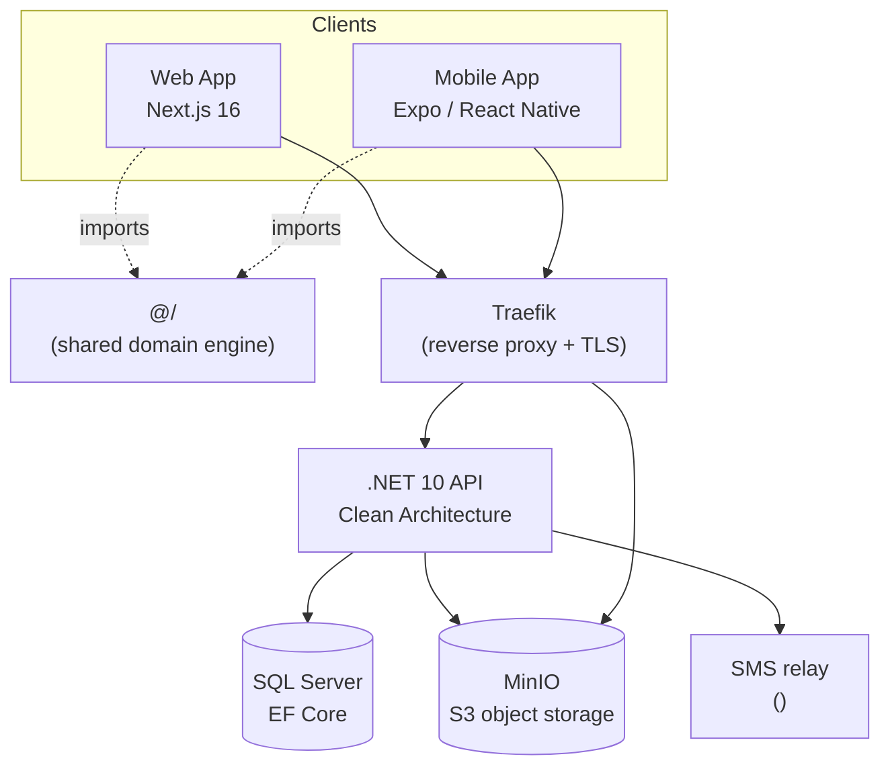
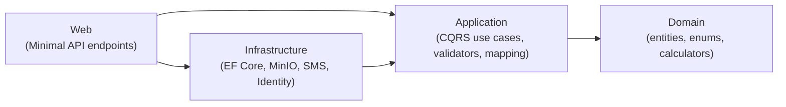
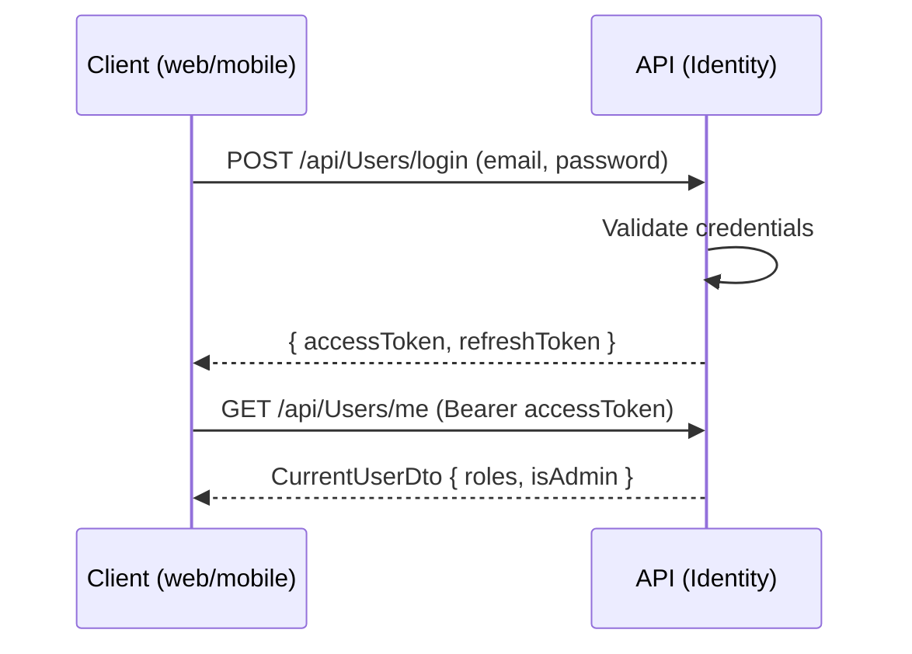
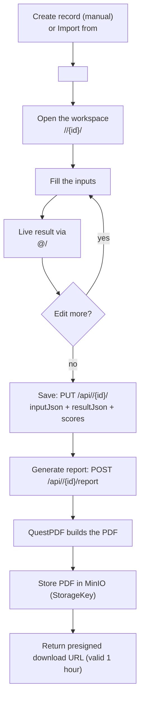

# Diagram Guide — authoring the Mermaid diagrams

How to write each diagram in `html-guide.template.html` (and any other docs). Every diagram is a
**Mermaid** code block. In the HTML guide they go inside `<pre class="mermaid">...</pre>`; in a
Markdown file use a fenced block tagged `mermaid`. The snippets below are the reference project
(Mabhas19) versions — copy one, then replace the `<PLACEHOLDER>` tokens and edit nodes/labels.

---

## Setup (already wired in the HTML template)

The HTML template loads Mermaid and initializes it. You don't need to add anything; this is here so
you can reuse it in a standalone page:

```html
<script src="https://cdn.jsdelivr.net/npm/mermaid@11/dist/mermaid.min.js"></script>
<script>mermaid.initialize({ startOnLoad: true, theme: 'neutral' });</script>
```

Then place each diagram in:

```html
<pre class="mermaid">
  ... diagram source ...
</pre>
```

### General tips
- **One diagram per block.** Mermaid renders each `<pre class="mermaid">` independently.
- **Line breaks inside a node:** use `<br/>` (e.g. `API[".NET 10 API<br/>Clean Architecture"]`).
- **Quote any label** with spaces, slashes, parentheses, or punctuation: `A["POST /api/Users/login"]`.
- **Keep node ids short and code-like** (`WEB`, `API`, `DB`); put the human text in the `["..."]` label.
- **Test fast:** paste into the live editor at `mermaid.live`, fix syntax, then paste back.
- **Don't over-style.** The template's `.mermaid` box already gives a border, padding, and the
  `neutral` theme. Avoid inline colors so dark mode stays readable.
- **A `%%` line is a comment** inside a Mermaid block.

---

## 1. System architecture — `graph` (flowchart)

**Goal:** show the clients, the shared package, the proxy, the API, and the backing services, with
arrows for "calls" and dotted arrows for "imports". Use `graph TD` (top-down) and a `subgraph` to
group the clients.

- Solid arrow `-->` = a runtime call / dependency.
- Dotted arrow `-. label .->` = a build-time import (the shared package).
- `[(...)]` = a datastore (cylinder) shape; `["..."]` = a normal box.



**Adapt:** rename `SMS`/`PKG` if your project differs; drop `MOB` if there's no mobile app; add a
node for any extra external service the API calls (and an `API --> NEWSVC` edge).

---

## 2. Entities — `erDiagram`

**Goal:** the database model — entities, their key fields, and the relationships between them.

- **Relationship line + cardinality:** `||--o{` = one-to-many, `||--o|` = one-to-(zero-or-)one,
  `}o--o{` = many-to-many. The `||`/`o{`/`o|` crow's-foot ends read left-to-right.
- **Label the relationship** after the colon: `USER ||--o{ PROJECT : owns`.
- **Attribute block:** `ENTITY { type Name PK }`. Add `PK`/`FK` markers and a quoted comment to
  note defaults or allowed values (`enum Status "Draft/Completed"`).
- Keep it to the **key fields** — this is a map, not the full schema. Put exhaustive columns in a
  table under the diagram instead.

```mermaid
erDiagram
  USER ||--o{ <MAIN_ENTITY> : owns
  USER ||--o| SUBSCRIPTION : has
  <MAIN_ENTITY> ||--o| <CHILD_ENTITY> : has
  <CHILD_ENTITY> ||--o{ <REPORT_ENTITY> : has
  USER }o--o{ ROLE : "assigned"

  USER {
    string Id PK
    string Email
    string PhoneNumber
  }
  ROLE {
    string Name "Administrator or User"
  }
  <MAIN_ENTITY> {
    int Id PK
    string Title
    string OwnerId FK
    enum Source "Manual/External/Other"
  }
  <CHILD_ENTITY> {
    int Id PK
    string InputJson "nvarchar(max)"
    string ResultJson "nvarchar(max)"
    int TotalScore
    int MaxScore
    enum Status "Draft/Completed"
    int <MAIN_ENTITY>Id FK
  }
  <REPORT_ENTITY> {
    int Id PK
    int <CHILD_ENTITY>Id FK
    string StorageKey
    string FileName
    long Size
  }
  SUBSCRIPTION {
    int Id PK
    string UserId FK
    enum Plan "Free/Pro/Enterprise"
    int MaxProjects "default <FREE_QUOTA>"
    bool IsActive
  }
```

**Adapt:** `<MAIN_ENTITY>` = your top resource (Mabhas19: `PROJECT`), `<CHILD_ENTITY>` = the per-record
domain record (Mabhas19: `ASSESSMENT`), `<REPORT_ENTITY>` = the generated artifact (Mabhas19:
`ASSESSMENT_REPORT`). Keep `USER`, `ROLE`, `SUBSCRIPTION` — they're part of the blueprint.

---

## 3. Clean Architecture layers — `graph LR`

**Goal:** show the four backend layers and that **dependencies point inward** (Web/Infrastructure ->
Application -> Domain). Left-to-right (`LR`) reads naturally as "outer depends on inner".

- Every arrow means "depends on / references".
- Domain has **no outgoing arrows** (it depends on nothing).



**Adapt:** this is structural and rarely changes. Only edit the parenthetical examples to match the
concrete pieces your Infrastructure layer implements.

---

## 4. Auth flows — `sequenceDiagram`

**Goal:** one sequence per sign-in method, showing the messages between the client, the API, and any
helper (OTP cache, SMS relay, Google, the token validator). All three end with the API returning
`{ accessToken, refreshToken }`.

- Declare each actor once: `participant C as Client`.
- `A->>B: msg` = a call/message; `A-->>B: msg` = the response (dashed).
- `A->>A: note` = an internal step (validate, create user, sign in).
- Keep messages to the **real HTTP calls and the key internal steps** — don't narrate every line of
  code.

**Password login:**



**Mobile OTP (request + verify):**

```mermaid
sequenceDiagram
  participant C as Client
  participant A as API
  participant O as OtpService (cache)
  participant S as SMS relay
  C->>A: POST /api/Auth/otp/request (phoneNumber)
  A->>O: Generate N-digit code, store key otp:{phone} (TTL)
  A->>S: SendAsync(phone, "code: NNNN")
  S-->>C: SMS delivered to phone
  C->>A: POST /api/Auth/otp/verify (phone, code)
  A->>O: FixedTimeEquals(code); delete on match
  A->>A: Create user if new; SignInAsync (Bearer)
  A-->>C: { accessToken, refreshToken }
```

**Google ID-token:**

```mermaid
sequenceDiagram
  participant C as Client
  participant G as Google Identity
  participant A as API
  participant V as GoogleTokenValidator
  C->>G: User signs in with Google
  G-->>C: idToken
  C->>A: POST /api/Auth/google (idToken)
  A->>V: ValidateAsync(idToken)
  V-->>A: GoogleUserInfo { sub, email, name }
  A->>A: Create user if new; SignInAsync (Bearer)
  A-->>C: { accessToken, refreshToken }
```

**Adapt:** if you drop a sign-in method, delete its diagram. If you add one (e.g. a different OAuth
provider), copy the Google sequence and swap the provider/validator participants.

---

## 5. Domain workflow — `flowchart`

**Goal:** the end-to-end happy path of the core feature, from creating a record to a stored PDF,
including the live loop while the user edits.

- `flowchart TD` (top-down) reads as a process.
- `{...}` = a **decision** node; label its outgoing edges (`-- yes -->`, `-- no -->`).
- Use the edge label to carry the HTTP call (`PUT /api/.../assessment`) so the diagram doubles as a
  cheat-sheet.



**Adapt:** replace the inputs/steps with your domain's stages. Keep the **save -> generate -> store
-> presigned URL** tail; that's the blueprint's persistence + report pattern.

---

## 6. Deployment — `flowchart LR` with subgraphs

**Goal:** show the image-transfer pipeline (build where the registry is reachable -> save/gzip ->
transfer -> load on the server) and how Traefik fronts the three domains. Use `subgraph` to separate
the build machine from the server.

- Group with `subgraph Name ... end`.
- Datastores as cylinders `[(...)]`; domains as plain boxes feeding into Traefik.
- Keep the **restricted-network note in prose** (a `.warn` box), not in the diagram.

```mermaid
flowchart LR
  subgraph Build machine (registry reachable)
    B1["Build Dockerfile.api"] --> B2["docker save | gzip"]
    B3["Build Dockerfile.web"] --> B2
  end
  B2 --> T["Transfer via pscp / rsync"]
  T --> L["docker load on server"]
  subgraph Server <SERVER_IP>
    L --> API["<PROJECT_NAME_LC>-api:deploy"]
    L --> WEBI["<PROJECT_NAME_LC>-web:deploy"]
    L --> DB[(SQL Server)]
    M["Pull minio<br/>via <REGISTRY_MIRROR>"] --> S3[(minio)]
    TR["Existing Traefik<br/>(external network, <CERT_RESOLVER> TLS)"]
    TR --> WEBI
    TR --> API
    TR --> S3
  end
  D1["<WEB_DOMAIN>"] --> TR
  D2["<API_DOMAIN>"] --> TR
  D3["<S3_DOMAIN>"] --> TR
```

**Adapt:** if the target network is open (no blocked registry), collapse the build-machine subgraph
into a single "push to registry -> `docker compose pull`" node and drop the `<REGISTRY_MIRROR>` node.
If you run your own proxy instead of an existing Traefik, rename `TR` and note the cert source.

---

## Quick reference: which diagram type for what

| You want to show | Mermaid type | Direction | Section in HTML guide |
|------------------|--------------|-----------|------------------------|
| Boxes-and-arrows system map | `graph` | `TD` | 3. System Architecture |
| Database entities + relations | `erDiagram` | — | 5. Domain Entities |
| Layer dependencies | `graph` | `LR` | 6. Backend |
| A request/response conversation over time | `sequenceDiagram` | — | 9. Authentication |
| A process / decision flow | `flowchart` | `TD` | 12. Domain Workflow |
| Build + deploy pipeline | `flowchart` | `LR` | 15. Deployment |

> *All snippets above are the reference project **Mabhas19** versions with `<PLACEHOLDER>` tokens
> swapped in for project-specific names. The originals (fully filled) are in
> `docs/mabhas19-guide.html`.*
